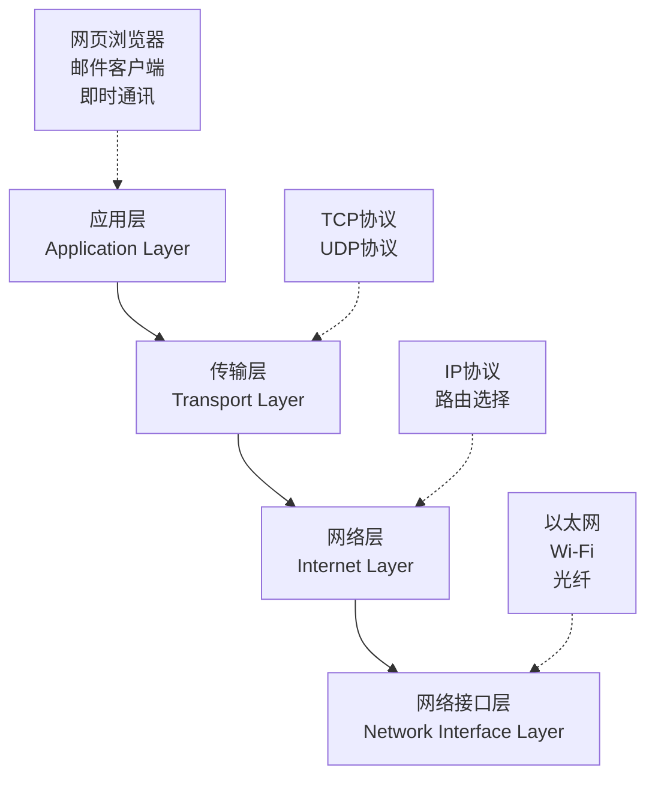

# TCP/IP四层网络

想象一下寄信的过程：你写好信件，装进信封，写上地址，投入邮筒，然后邮政系统会处理分拣、运输、投递等各个环节，最终将信件送达收件人手中。网络中的数据传输也有着类似的分工协作机制，这就是TCP/IP四层网络模型。

## 什么是TCP/IP四层模型

TCP/IP四层模型是现代互联网的基础架构，它将复杂的网络通信过程分解为四个相对独立又相互协作的层次。就像一个高效的工厂流水线，每一层都有自己明确的职责，同时又为上下层提供服务。



这四个层次从上到下分别是：应用层、传输层、网络层和网络接口层。每一层都专注于解决特定的问题，通过层层递进的方式，最终实现了跨越全球的可靠通信。

## 应用层：用户直接接触的窗口

应用层是最贴近用户的一层，这里运行着我们日常使用的各种网络应用程序。当你用浏览器访问网页、发送电子邮件、或者使用微信聊天时，这些操作都发生在应用层。

应用层的主要职责包括：
- **提供用户界面**：让普通用户能够方便地使用网络服务
- **定义数据格式**：规定不同应用之间如何交换信息
- **处理业务逻辑**：实现具体的应用功能

比如，当你在浏览器中输入网址时，浏览器会根据HTTP协议的规则，将你的请求格式化成服务器能够理解的形式。这个过程就像你用标准的格式填写快递单一样，确保信息能被正确处理。

## 传输层：数据传输的质量保证

如果说应用层关注的是"发送什么内容"，那么传输层关注的就是"如何可靠地传输"。传输层就像快递公司的客服部门，负责确保包裹能够完整、准确地送达目的地。

传输层的核心功能有：
- **建立连接**：在发送方和接收方之间建立通信通道
- **错误检测与纠正**：发现并处理传输过程中的数据损坏
- **流量控制**：防止发送方发送数据过快而压垮接收方
- **数据重组**：将大文件拆分成小包进行传输，到达后重新组装

传输层主要使用两种协议：TCP和UDP。TCP就像挂号信服务，保证数据的可靠传输；UDP则像普通平信，传输速度快但不保证送达。

## 网络层：数据的导航系统

网络层解决的是"如何找到目的地"的问题。在复杂的互联网环境中，数据包需要经过多个网络设备才能到达目标，网络层就像GPS导航系统，为每个数据包规划最佳路径。

网络层的主要职责：
- **逻辑地址分配**：给网络中的每台设备分配唯一的IP地址
- **路径选择**：在众多可能的路径中选择最优路线
- **数据包转发**：将数据包从一个网络节点传递到下一个节点

你可以把IP地址想象成快递单上的收件地址，而路由器就像各个城市的快递分拣中心，根据地址信息将包裹转发到正确的方向。

## 网络接口层：物理世界的桥梁

网络接口层是TCP/IP模型的最底层，它负责将数字信号转换为物理信号，并通过具体的传输媒介（如网线、Wi-Fi信号、光纤等）进行实际的数据传输。

这一层的主要功能包括：
- **物理连接管理**：建立和维护设备间的物理连接
- **数据帧封装**：将网络层传来的数据包装成适合物理传输的格式
- **错误检测**：在物理传输层面检测和处理传输错误
- **介质访问控制**：协调多个设备对同一传输介质的使用

就像快递员需要选择步行、骑车还是开车来投递包裹一样，网络接口层要根据实际的网络环境选择合适的传输方式。

## 四层协作：数据传输的完整流程

让我们通过一个具体例子来看看四层是如何协作的。假设你要发送一封电子邮件：

```mermaid
sequenceDiagram
    participant App as 应用层<br/>(邮件客户端)
    participant Trans as 传输层<br/>(TCP)
    participant Net as 网络层<br/>(IP)
    participant Link as 网络接口层<br/>(以太网)

    App->>Trans: 发送邮件内容
    Trans->>Net: 添加TCP头部，确保可靠传输
    Net->>Link: 添加IP头部，指定目标地址
    Link->>Link: 添加以太网头部，进行物理传输

    Note over App,Link: 数据向下层层封装

    Link->>Net: 接收并解析以太网帧
    Net->>Trans: 解析IP包，交给传输层
    Trans->>App: 验证数据完整性后交给应用层

    Note over App,Link: 数据向上层层解析
```

1. **应用层**：邮件客户端将你的邮件内容按照SMTP协议格式化
2. **传输层**：TCP协议为邮件数据添加序号和校验信息，确保传输可靠
3. **网络层**：IP协议添加源地址和目标地址，让数据包知道去哪里
4. **网络接口层**：以太网协议将数据转换为电信号，通过网线传输

接收方则按相反的顺序处理：先由网络接口层接收物理信号，然后逐层向上解析，最终在应用层呈现完整的邮件内容。

## 层次化设计的优势

TCP/IP四层模型的层次化设计带来了诸多优势：

**模块化**：每一层都可以独立开发和更新，不会影响其他层的工作。比如，Wi-Fi技术的升级不会影响网页浏览的体验。

**标准化**：每一层都有明确的接口标准，使得不同厂商的设备能够互联互通。

**灵活性**：可以根据实际需求选择不同层的具体实现。比如，同样是传输层，可以选择可靠的TCP或高效的UDP。

**可扩展性**：新技术可以在相应层次引入，而不需要重新设计整个网络架构。

这种设计思想不仅在网络领域取得了巨大成功，也被广泛应用于软件架构、组织管理等其他领域。理解TCP/IP四层模型，不仅能帮助我们更好地理解网络工作原理，也能培养我们的系统化思维能力。

---

*本文档为《网络101》系列的一部分*
