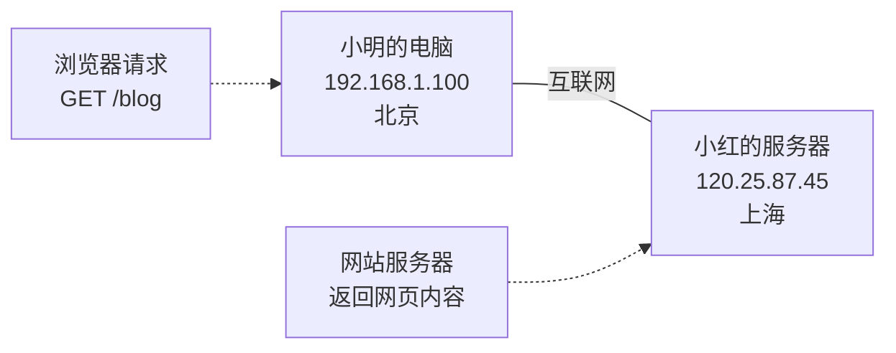
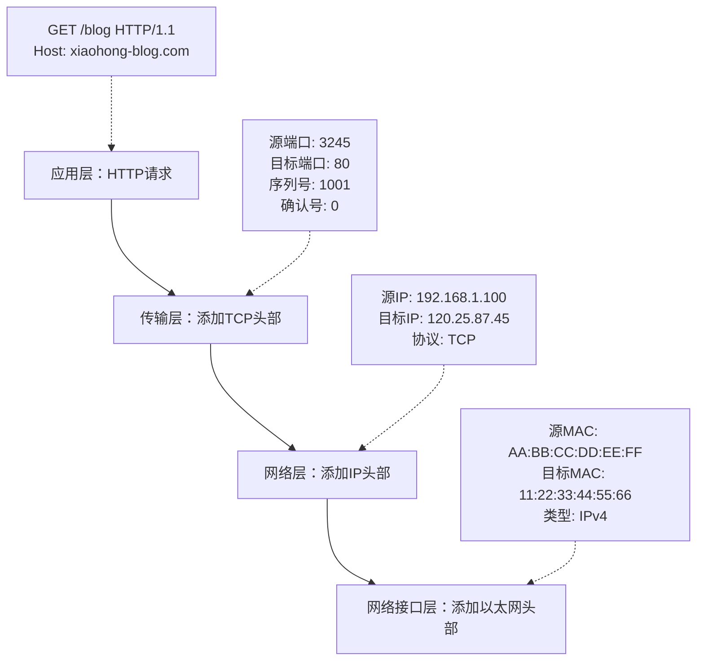
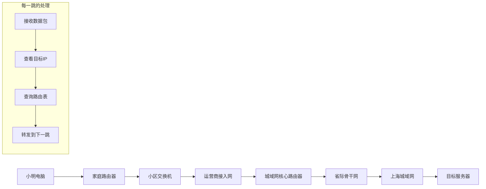
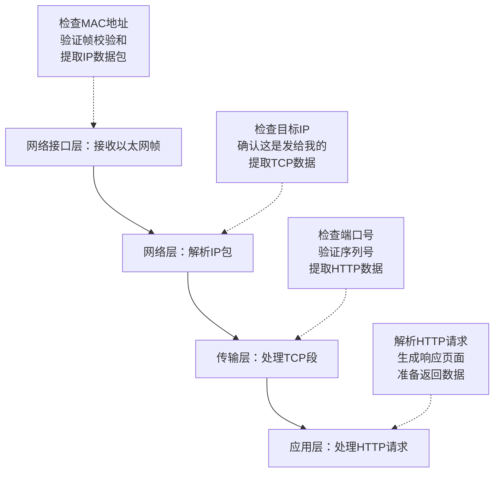
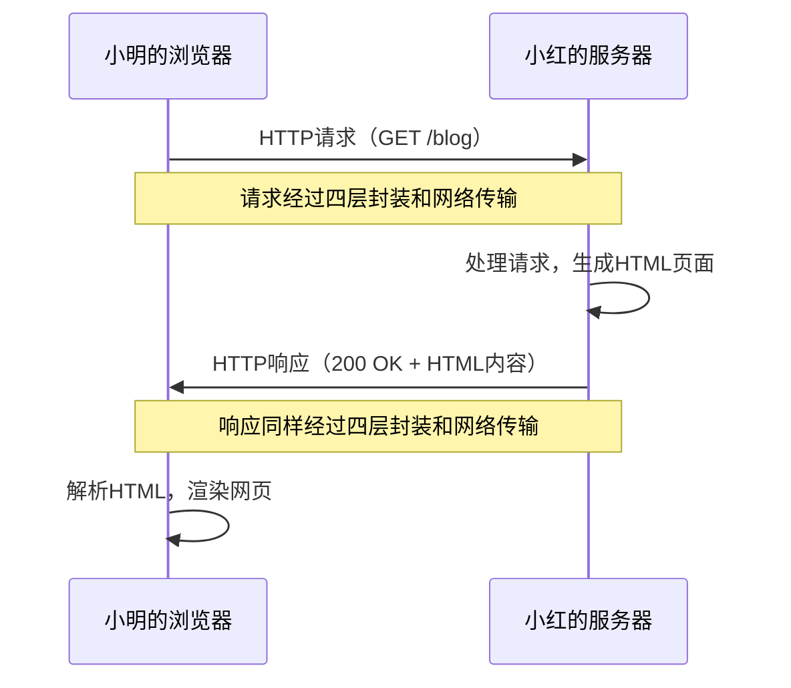

# 两台计算机互连

理论模型虽然清晰，但真正理解网络通信的最好方式是看一个实际的例子。让我们跟随小明和小红两台计算机，观察它们是如何通过TCP/IP四层模型完成一次完整的网页访问的。

## 通信场景设置

小明在北京的家中，想要访问小红在上海的服务器上的个人博客。这看似简单的操作背后，实际上涉及了复杂的网络通信过程。

**设备信息：**
- 小明的计算机：IP地址 192.168.1.100（北京）
- 小红的服务器：IP地址 120.25.87.45（上海）
- 访问目标：小红的个人博客 http://xiaohong-blog.com



这次通信需要经过家庭路由器、城域网、骨干网络等多个网络设备，跨越上千公里的距离。让我们看看TCP/IP四层模型是如何让这个看似不可能的任务变得稳定可靠的。

## 通信准备：建立连接之前

在真正开始传输数据之前，小明的计算机需要做一些准备工作：

### 域名解析

小明在浏览器中输入 `http://xiaohong-blog.com`，但计算机并不知道这个域名对应哪个IP地址。应用层首先会发起DNS查询：

1. **本地查询**：先检查本地缓存中是否有这个域名的记录
2. **递归查询**：如果没有，则向DNS服务器发起查询请求
3. **获得结果**：最终得到目标服务器的IP地址：120.25.87.45

### 路由规划

网络层开始工作，它发现目标IP地址120.25.87.45不在本地网络（192.168.1.0/24），因此需要通过网关（路由器）转发。计算机会：

1. 查看路由表，确定数据包应该发送给默认网关
2. 使用ARP协议获取网关的MAC地址
3. 准备将数据包发送到路由器进行转发

## 数据发送：层层封装的旅程

现在让我们详细观察数据是如何从小明的计算机一层层封装，最终发送到网络中的：



### 第一层：应用层处理

浏览器根据HTTP协议构建请求消息：
```
GET /blog HTTP/1.1
Host: xiaohong-blog.com
User-Agent: Mozilla/5.0...
Accept: text/html,application/xhtml+xml...
```

这个HTTP请求包含了服务器需要知道的所有信息：要访问哪个页面，客户端支持什么格式，等等。

### 第二层：传输层封装

TCP协议接收到HTTP请求后，开始添加传输层头部：

- **源端口**：3245（系统随机分配给浏览器的端口）
- **目标端口**：80（HTTP服务的标准端口）
- **序列号**：1001（用于数据排序和重传）
- **标志位**：SYN（表示这是连接建立请求）
- **校验和**：用于检测传输错误

由于这是第一次通信，TCP还需要先建立连接，这就是著名的"三次握手"过程。

### 第三层：网络层路由

IP协议添加网络层头部信息：

- **版本**：IPv4
- **源IP地址**：192.168.1.100
- **目标IP地址**：120.25.87.45
- **协议类型**：TCP（告诉接收方这是TCP数据）
- **生存时间（TTL）**：64（防止数据包在网络中无限循环）

### 第四层：网络接口层传输

以太网协议添加最后一层封装：

- **目标MAC地址**：路由器的MAC地址（因为要先发给路由器）
- **源MAC地址**：小明电脑网卡的MAC地址
- **类型**：0x0800（表示这是IPv4数据包）
- **帧校验序列（FCS）**：用于检测物理传输错误

现在，原本简单的HTTP请求已经被层层包装，变成了一个完整的以太网帧，准备在物理网络中传输。

## 网络传输：跨越千里的接力

数据包离开小明的计算机后，开始了漫长的网络旅程：



### 路由器的工作过程

每当数据包到达一个路由器时，会发生这样的处理：

1. **接收数据包**：网络接口层接收以太网帧
2. **解封到网络层**：去除以太网头部，提取IP数据包
3. **路由决策**：查看目标IP地址120.25.87.45，在路由表中查找最佳路径
4. **TTL递减**：将生存时间减1，防止无限循环
5. **重新封装**：添加新的以太网头部，设置下一跳的MAC地址
6. **转发数据包**：将数据包发送到下一个网络设备

这个过程在每一个路由器上重复，就像接力赛一样，每个路由器都将数据包向目标更近一步。

## 数据接收：层层解封的过程

当数据包终于到达小红的服务器时，接收过程正好与发送过程相反：



### 逐层解析过程

**网络接口层**：网卡接收到电信号，转换为数字数据，检查以太网帧的完整性。

**网络层**：IP协议检查目标地址，确认这个数据包确实是发给本机的，然后提取TCP数据段。

**传输层**：TCP协议检查端口号（80），确认这是给Web服务器的请求，验证数据完整性，如果一切正常，将HTTP数据传递给应用层。

**应用层**：Web服务器（如Apache或Nginx）解析HTTP请求，理解客户端想要访问/blog页面，然后生成相应的HTML响应。

## 响应返回：完整的往返通信

服务器处理完请求后，会按照同样的四层模型将响应发送回小明的计算机：



整个过程中，每一层都在发挥自己的作用：

- **应用层**确保数据格式正确
- **传输层**保证数据完整可靠
- **网络层**负责路径选择和地址寻找
- **网络接口层**处理实际的物理传输

## 实际案例：一次网页访问的时间线

让我们用实际的时间数据来看看这个过程有多快：

| 时间点 | 事件 | 用时 |
|--------|------|------|
| 0ms | 用户输入网址，按下回车 | - |
| 5ms | DNS查询完成，获得IP地址 | 5ms |
| 8ms | TCP三次握手完成，建立连接 | 3ms |
| 10ms | HTTP请求发送完毕 | 2ms |
| 30ms | 数据包到达上海服务器 | 20ms |
| 35ms | 服务器处理请求，生成响应 | 5ms |
| 55ms | HTTP响应到达北京 | 20ms |
| 60ms | 浏览器开始渲染页面 | 5ms |

整个过程在60毫秒内完成，用户几乎感觉不到延迟。这背后是TCP/IP四层模型的精密协作，以及全球网络基础设施的强大支撑。

## 故障处理：网络的自愈能力

网络通信中难免会遇到问题，TCP/IP四层模型的设计也考虑了各种故障情况：

**数据包丢失**：传输层的TCP协议会检测到丢失的数据包，自动重新发送。

**路径阻塞**：网络层会动态调整路由，寻找新的传输路径。

**硬件故障**：网络接口层可以检测到物理连接问题，提醒上层协议尝试其他连接方式。

这种分层设计使得网络具有了强大的容错能力和自适应性。

## 小结

通过小明和小红的这个例子，我们看到了TCP/IP四层模型是如何在实际中工作的。每一层都有明确的职责，相互配合完成了看似简单实则复杂的网络通信任务。

这种分层设计的优雅之处在于：无论你是在家里连Wi-Fi，还是在公司接网线，无论目标服务器在隔壁还是在地球另一端，通信的基本流程都是一样的。理解了这个基本模式，你就掌握了网络世界的运行规律。

在接下来的学习中，我们将深入探讨每一层的具体协议和技术细节，但请记住这个完整的通信图景——它是理解所有网络知识的基础。

---

*本文档为《网络101》系列的一部分*
