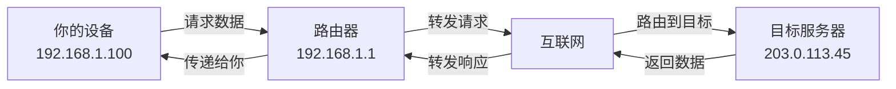

# IP地址是什么

在网络世界中，IP地址就像是我们现实生活中的家庭住址，是标识网络设备身份的重要信息。没有IP地址，设备就无法在网络中进行通信。那么，IP地址究竟是什么？它是如何工作的？让我们一起探索这个网络通信的基础。

## IP地址的定义与作用

IP地址（Internet Protocol Address）是互联网协议地址的缩写，它是分配给网络中每个设备的唯一标识符。当设备连接到网络时，无论是计算机、手机、智能家居设备还是服务器，都需要一个IP地址来进行身份识别和数据传输。

IP地址的主要作用有两个：
1. **标识网络中的设备**：就像我们的身份证号码一样，每个IP地址在网络中都是唯一的（在特定网络范围内）
2. **定位设备位置**：帮助数据在网络中找到正确的传输路径

## IPv4地址的格式

目前广泛使用的IP地址有两种版本：IPv4和IPv6。我们先从最常见的IPv4开始了解。

IPv4地址由32位二进制数组成，通常表示为四个十进制数（每个字节），中间用点分隔，例如：`192.168.1.1`。这种表示方法称为"点分十进制"。

每个十进制数的范围是0到255，因为8位二进制数的最大值是255（2^8 - 1）。例如，IP地址`192.168.1.1`对应的二进制形式是：

```
11000000.10101000.00000001.00000001
```

## IPv6地址的格式

随着互联网的快速发展，IPv4地址逐渐面临耗尽的问题。为了解决这个问题，IPv6应运而生。IPv6地址由128位二进制数组成，采用冒分十六进制表示法，分为8组，每组4个十六进制数，例如：`2001:0db8:85a3:0000:0000:8a2e:0370:7334`。

IPv6的地址空间非常庞大，理论上可以提供约3.4×10^38个地址，足以满足未来数十年甚至上百年的互联网发展需求。

## IP地址的类比

为了更好地理解IP地址的作用，我们可以将其类比为现实生活中的邮政系统：

- **IP地址**：相当于收件人的详细地址（包括街道、门牌号等）
- **子网掩码**：类似于城市分区，帮助确定地址的网络部分和主机部分
- **网关**：相当于当地的邮政中心，负责转发不同网络之间的邮件

## IP地址在通信中的作用

当你在浏览器中输入一个网址时，你的设备需要知道目标服务器的IP地址才能建立连接。这个过程就像你寄信时需要知道对方的地址一样。数据从你的设备发出，经过一系列网络设备的转发，最终到达目标IP地址对应的设备。



## 总结

IP地址是网络通信的基础，它为每个连接到网络的设备提供了唯一的身份标识。无论是我们日常使用的IPv4地址，还是未来将广泛应用的IPv6地址，理解它们的基本概念和工作原理，都是深入学习网络知识的第一步。在下一节中，我们将探讨IP地址的分类，以及为什么我们家里的IP地址通常以192.168开头。