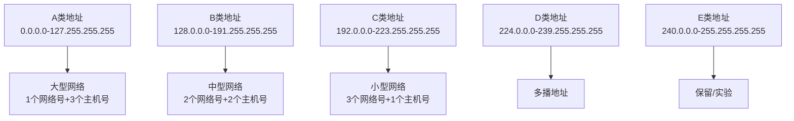
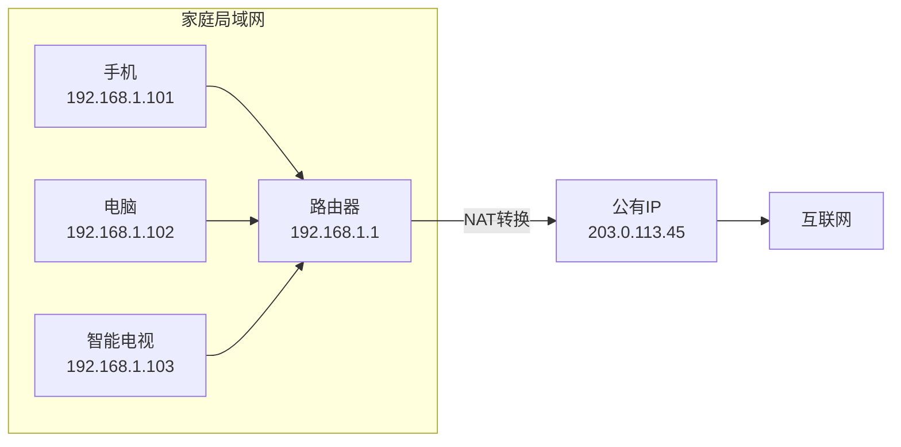

# IP地址的分类

IP地址不仅仅是一串数字，它的设计包含了精心的结构和分类体系。了解IP地址的分类，能帮助我们理解为什么家里的网络设备总是以192.168开头，以及这些地址如何在互联网中运作。让我们深入探讨IP地址的分类原理。

## IPv4地址的分类体系

早期的互联网设计者将IPv4地址分为五大类（A、B、C、D、E），这种分类方式主要基于地址的网络部分和主机部分的划分。这种设计既考虑了不同规模网络的需求，也为路由选择提供了便利。

### A类地址

A类地址是为大型网络设计的，其特点是：
- 第1个字节为网络号，后3个字节为主机号
- 第1位固定为0，因此范围从1.0.0.0到126.255.255.255
- 可容纳约1600万台主机
- 主要分配给拥有大量主机的大型机构（如早期的互联网主干网和大型公司）

### B类地址

B类地址适用于中型网络，其特点是：
- 前2个字节为网络号，后2个字节为主机号
- 前2位固定为10，范围从128.0.0.0到191.255.255.255
- 每个网络可容纳约65,000台主机
- 主要用于中等规模的组织和公司

### C类地址

C类地址是最常见的地址类型，适用于小型网络：
- 前3个字节为网络号，最后1个字节为主机号
- 前3位固定为110，范围从192.0.0.0到223.255.255.255
- 每个网络最多可容纳254台主机
- 广泛用于家庭、小型办公室和学校等场景

### D类和E类地址

- **D类地址**：前4位固定为1110，范围从224.0.0.0到239.255.255.255，用于多播通信
- **E类地址**：前4位固定为1111，范围从240.0.0.0到255.255.255.255，保留用于实验和研究

## 公有IP与私有IP地址

IP地址最重要的分类方式不是A、B、C类，而是公有IP和私有IP的区别，这直接解释了为什么我们家里的IP地址都是192.168开头的。

### 公有IP地址

公有IP地址（Public IP）是在互联网上全球唯一的IP地址，由互联网服务提供商（ISP）分配。这些地址可以直接在互联网上路由，用于标识互联网上的设备。

例如，当你访问www.google.com时，你的设备会连接到谷歌服务器的公有IP地址。

### 私有IP地址

私有IP地址（Private IP）是保留用于内部网络的地址，不会在互联网上路由。这些地址仅在局域网内部使用，不同局域网可以使用相同的私有IP地址而不会冲突。

IANA（互联网号码分配机构）保留了以下范围作为私有IP地址：
- **10.0.0.0到10.255.255.255**（A类私有地址，单个网络）
- **172.16.0.0到172.31.255.255**（B类私有地址，16个连续网络）
- **192.168.0.0到192.168.255.255**（C类私有地址，256个连续网络）

我们家里的网络设备通常使用192.168.x.x系列地址，这是C类私有地址的一部分。

## 为什么需要私有IP地址？

私有IP地址的设计是为了解决公有IP地址短缺的问题。如果每个家庭的每台设备都需要一个唯一的公有IP地址，IPv4的42亿个地址早就耗尽了。

通过使用私有IP地址，一个家庭或公司的所有设备只需共享一个或少量公有IP地址，大大节省了宝贵的公有IP资源。当内部设备需要访问互联网时，路由器通过NAT（网络地址转换）技术将私有IP地址转换为公有IP地址。

## 192.168.x.x的特别之处

192.168.x.x地址段之所以在家庭网络中如此常见，有以下几个原因：

1. **C类地址特性**：适合小型网络，支持最多254台设备，足够大多数家庭使用
2. **技术规范推荐**：路由器厂商通常默认使用这个网段，降低了用户配置难度
3. **避免冲突**：由于是私有地址，不同家庭使用相同的网段也不会导致互联网上的冲突
4. **易于记忆**：相比10.x.x.x或172.16.x.x，192.168.x.x格式更易于普通用户记忆和配置

## 总结

IP地址的分类体系是互联网发展的产物，从早期的A、B、C类划分到现在广泛使用的公有/私有IP区分，都体现了对网络资源的合理规划。私有IP地址，特别是192.168.x.x系列，为家庭和小型网络提供了经济高效的解决方案，同时也为我们理解网络地址转换（NAT）等关键技术奠定了基础。在下一节中，我们将深入探讨IPv4地址耗尽的问题以及应对策略。