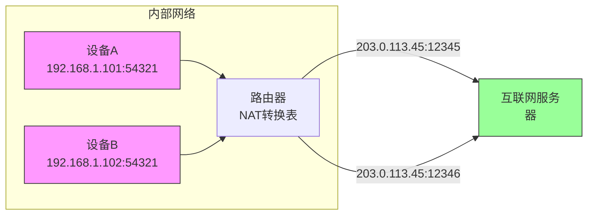
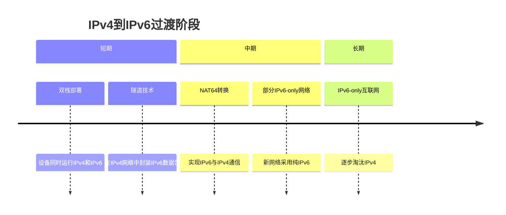

# IP地址不够用了吗

互联网的快速发展带来了一个严峻的问题：IP地址不够用了。这个问题不仅影响了互联网的进一步扩张，也催生了许多创新的技术解决方案。让我们深入探讨IP地址短缺的原因以及业界是如何应对的。

## IPv4地址耗尽的危机

IPv4采用32位地址长度，理论上可以提供约42亿个IP地址。这个数字在互联网早期似乎是无穷无尽的，但随着智能手机、物联网设备、云计算和5G技术的普及，IP地址需求呈爆炸式增长。

### 为什么42亿个地址还不够用？

1. **地址分配不均**：早期互联网分配地址时没有预见今天的需求，导致大量地址被浪费（例如，某些机构被分配了数百万个地址但只使用了其中一小部分）
2. **设备数量爆炸**：全球联网设备已超过500亿台，远超IPv4地址容量
3. **每个用户多设备**：现代人平均拥有多台联网设备（手机、电脑、平板、智能家居等）
4. **物联网发展**：智能手表、冰箱、汽车等都需要IP地址

IANA（互联网号码分配机构）在2011年就已分配完最后一批IPv4地址给区域注册机构。到2020年，大多数地区的IPv4地址池已基本耗尽。

## 应对地址短缺的临时解决方案

在IPv6全面部署之前，业界采用了多种临时措施来缓解IPv4地址压力：

### 网络地址转换（NAT）

NAT技术允许多个设备共享一个公有IP地址，这是家庭和企业网络最常用的解决方案，也是我们家里设备使用192.168开头地址的根本原因。

NAT的工作原理是在路由器上维护一个转换表，记录内部私有IP地址与外部公有IP地址及端口的对应关系：

NAT转换表示例：
| 内部IP:端口      | 外部IP:端口        | 目标IP:端口       |
|-----------------|-------------------|------------------|
| 192.168.1.101:80 | 203.0.113.45:12345 | 203.0.113.100:80 |
| 192.168.1.102:80 | 203.0.113.45:12346 | 203.0.113.100:80 |

### CIDR（无类别域间路由）

CIDR（Classless Inter-Domain Routing）通过取消A、B、C类地址的严格划分，允许更灵活地分配地址块，减少了地址浪费。CIDR使用斜线记法表示网络前缀长度，如`192.168.1.0/24`表示前24位为网络号。

### DHCP动态地址分配

DHCP（动态主机配置协议）允许路由器动态分配IP地址，只在设备连接网络时分配地址，设备断开后回收地址，提高了地址利用率。

## 长期解决方案：IPv6

虽然上述技术缓解了IPv4地址压力，但终极解决方案是迁移到IPv6。IPv6采用128位地址长度，提供了约3.4×10^38个地址，足以让地球上的每一粒沙子都拥有数万亿个IP地址。

### IPv6的优势

1. **巨大的地址空间**：彻底解决地址短缺问题
2. **简化的报头**：提高路由效率
3. **内置安全性**：支持IPsec加密
4. **即插即用**：无需DHCP服务器
5. **更好的QoS支持**：优化实时通信

### IPv6地址表示

IPv6地址由8组16进制数组成，例如：`2001:0db8:85a3:0000:0000:8a2e:0370:7334`。为简化表示，可以省略前导零，并将连续的零组用`::`表示一次，例如：`2001:db8:85a3::8a2e:370:7334`。

### IPv4到IPv6的过渡

由于直接切换到IPv6成本高昂，业界采用了渐进式过渡策略：

1. **双栈技术**：设备同时支持IPv4和IPv6
2. **隧道技术**：在IPv4网络中传输IPv6数据包
3. **NAT64**：实现IPv6与IPv4之间的通信

## IPv6的现状与未来

截至2025年，全球已有超过50%的网络流量通过IPv6传输，主要互联网服务提供商和大型网站都已支持IPv6。然而，完全过渡到IPv6仍需要时间，特别是对于老旧设备和复杂网络基础设施。

家庭网络中，虽然大多数现代路由器已支持IPv6，但ISP通常仍默认使用IPv4+NAT模式。随着物联网设备的普及，家庭网络将逐渐过渡到原生IPv6。

## 总结

IP地址短缺问题推动了网络技术的创新发展，从NAT、CIDR到最终的IPv6，每一种解决方案都反映了互联网应对挑战的智慧。虽然IPv4在短期内仍将继续存在，但IPv6是未来的必然趋势。理解这些技术不仅帮助我们认识网络的现状，也为迎接全连接时代做好准备。