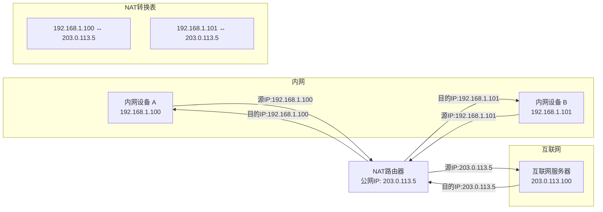

# NAT的工作原理

## 什么是NAT？

NAT（网络地址转换，Network Address Translation）是一种在IP网络中常用的技术，它允许一个网络中的多台设备通过共享一个或多个公共IP地址来访问互联网。简单来说，NAT就像是你家的"门牌号转换器"，让多个房间（内网设备）共用一个大门牌号（公网IP地址）。

## NAT为什么会出现？

NAT技术的出现主要是为了解决IPv4地址资源不足的问题。IPv4采用32位地址格式，理论上最多只能提供约43亿个IP地址。随着互联网设备的爆炸式增长，IP地址很快就变得不够用了。NAT技术允许一个组织或家庭内部的多台设备共享一个或少量公网IP地址，大大缓解了IP地址短缺的问题。

## NAT的工作原理

NAT通常部署在家庭或企业网络的路由器上，它的工作过程可以简单描述为：

1. 当内网设备要访问互联网时，会将数据包发送到路由器
2. 路由器将数据包中的源IP地址（内网IP）替换为自己的公网IP地址
3. 同时，路由器会在内部维护一个NAT转换表，记录内网IP与公网IP的对应关系
4. 当互联网上的服务器返回响应时，路由器根据NAT转换表将目的IP地址转换为对应的内网IP地址，并将数据包转发给相应的内网设备

## NAT转换过程示意图

## NAT的优缺点

**优点：**
- 节省公网IP地址资源
- 提高内网设备的安全性，隐藏内网结构
- 简化网络管理，内网可以自由规划IP地址

**缺点：**
- 破坏了IP协议的端到端特性
- 部分网络应用（如P2P通信）需要特殊处理才能穿透NAT
- 可能导致网络延迟增加

NAT技术虽然解决了IP地址不足的问题，但随着互联网的持续发展，IPv6的普及才是解决IP地址短缺的根本方案。不过在IPv6全面部署之前，NAT仍然是网络中不可或缺的重要技术。

---

*本文档为《网络101》系列的一部分*
