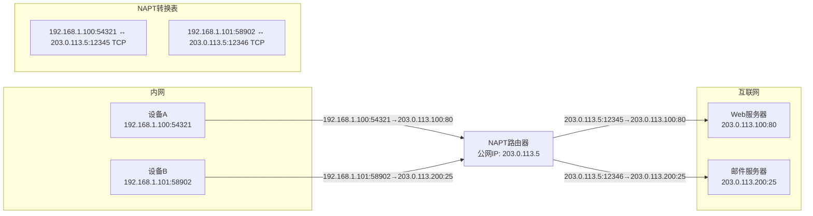

# NAPT的工作原理

## 从NAT到NAPT

在了解了基本的NAT技术后，你可能会问：如果一个家庭或公司的多台设备都使用同一个公网IP地址访问互联网，路由器如何知道应该将返回的数据包发送给哪台内网设备呢？

答案就是NAPT（网络地址端口转换，Network Address Port Translation），它是NAT的一种扩展形式，不仅转换IP地址，还会转换传输层的端口号，从而能够区分不同的内网设备和连接。

## NAPT的工作原理

NAPT在基本NAT的基础上增加了端口转换功能，其工作过程如下：

1. 内网设备发送数据包到路由器时，源IP是内网IP，源端口是随机生成的端口号
2. 路由器接收数据包后，将源IP替换为公网IP，同时为该连接分配一个新的端口号
3. 路由器在NAPT转换表中记录：内网IP:端口 → 公网IP:端口 的对应关系
4. 当互联网服务器返回响应时，路由器根据目的端口号查询NAPT转换表，找到对应的内网IP和端口，然后转发数据包

## NAPT转换表

NAPT转换表是实现端口转换的核心，它记录了完整的连接信息。一个典型的NAPT转换表条目包含：

- 内网IP地址
- 内网端口号
- 公网IP地址
- 公网端口号
- 协议类型（TCP/UDP）
- 连接状态和超时时间

## NAPT转换过程示意图

## NAPT的应用场景

NAPT是目前最常用的NAT类型，广泛应用于：

1. 家庭路由器：让多台家庭设备共享一个公网IP上网
2. 企业网络：保护内部网络，同时节省公网IP地址
3. Wi-Fi热点：让多个用户通过一个公网IP访问互联网

## NAPT的局限性

虽然NAPT非常实用，但也有一些局限性：

- 无法同时让多个内网设备使用相同的公网端口访问同一台服务器
- 某些使用固定端口的应用可能需要手动配置端口转发
- 会破坏IP协议的端到端特性，使某些P2P应用难以直接通信

理解NAPT的工作原理，有助于我们更好地排查网络连接问题，特别是当某些应用无法正常访问互联网时，很可能与NAPT的端口转换机制有关。

---

*本文档为《网络101》系列的一部分*
