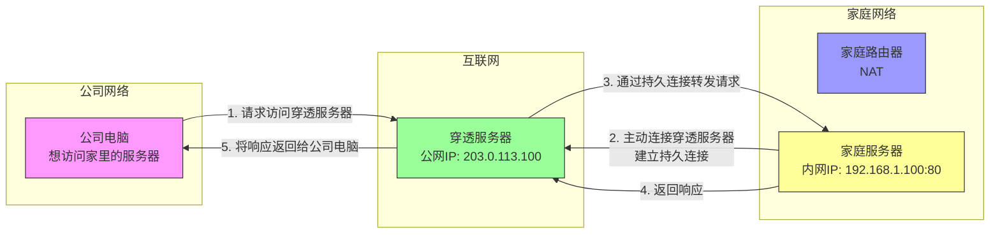

# 内网穿透是什么

## 从一个实际问题说起

小明在家里搭建了一个个人网站，在自己的电脑上架设了Web服务器。当他在家里用内网IP访问时，网站可以正常打开。但是当他在公司想访问家里的网站时，却发现无法连接。这是为什么呢？

答案就是NAT的"保护"作用——它阻止了外部网络主动访问内网设备。而要解决这个问题，就需要用到内网穿透技术。

## 什么是内网穿透？

内网穿透（NAT穿透）是一种网络技术，它允许外部网络的设备访问位于NAT后面的内网设备或服务。简单来说，内网穿透就像是在你家的"大门"上开了一个"专用通道"，让特定的外部访问能够直接到达内部的某个房间。

## 内网穿透的工作原理

内网穿透通常需要一台拥有公网IP的中间服务器作为"桥梁"，其基本工作流程如下：

1. 内网设备主动连接到公网的穿透服务器，建立一个持久连接
2. 当外部设备想要访问内网服务时，先连接到穿透服务器
3. 穿透服务器通过之前建立的持久连接，将请求转发给内网设备
4. 内网设备的响应通过同样的路径返回给外部设备

## 常见的内网穿透实现方式

### 1. 端口映射（Port Forwarding）

这是最基础的内网穿透方式，需要在路由器上手动配置：
- 指定公网端口和内网IP:端口的对应关系
- 当外部访问公网IP:端口时，路由器自动转发到指定的内网设备

### 2. UPnP/DLNA

即插即用的内网穿透协议：
- 内网设备可以自动请求路由器打开特定端口
- 无需手动配置，但安全性较低

### 3. 第三方穿透服务

如花生壳、ngrok、frp等服务：
- 无需公网IP，通过服务商提供的中转服务器实现穿透
- 配置简单，适用于个人用户和小型应用

### 4. P2P穿透

高级穿透技术，如STUN、TURN、ICE等：
- 尝试在两个NAT后面的设备之间建立直接连接
- 连接建立后无需中转服务器，速度更快
- 常用于视频通话、文件共享等P2P应用

## 内网穿透示意图

## 内网穿透的应用场景

内网穿透技术在很多场景中都非常有用：

- 远程访问家里的NAS存储或个人服务器
- 搭建个人网站或开发测试环境
- 远程控制家里的电脑或智能设备
- P2P文件共享、视频会议等实时通信应用
- IoT设备的远程监控和管理

## 内网穿透的安全考量

使用内网穿透时需要注意安全问题：

- 只开放必要的端口和服务
- 使用强密码和加密通信
- 限制访问来源IP
- 定期更新穿透工具和服务器
- 避免将敏感服务暴露到公网

内网穿透技术打破了NAT带来的网络隔离，为我们提供了更多网络应用的可能性，但同时也需要我们更加注重网络安全防护。

---

*本文档为《网络101》系列的一部分*
