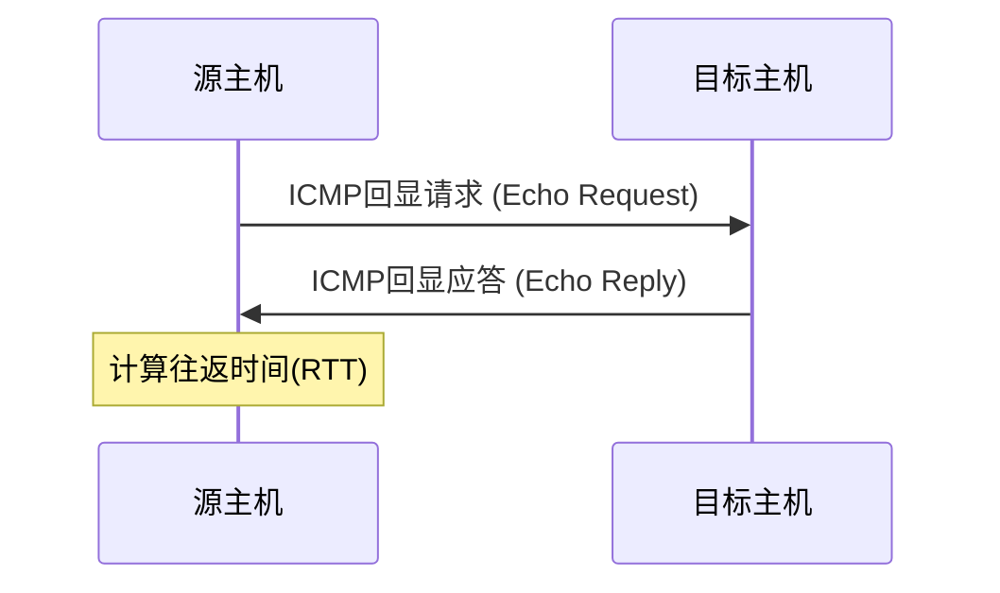

# ICMP是什么

# ICMP是什么

ICMP（Internet控制消息协议）是TCP/IP协议族中的一个重要成员，它主要用于在IP网络中发送控制消息和诊断信息。与我们熟悉的TCP和UDP不同，ICMP并不传输用户数据，而是专注于网络层的故障报告和状态查询。

## ICMP的诞生背景与设计初衷

在互联网的早期发展阶段，工程师们面临一个棘手的问题：当数据在网络中传输失败时，如何有效地诊断问题所在？为了解决这个问题，ICMP协议于1981年在RFC 792中被正式定义。

ICMP的设计初衷可以用一个比喻来理解：如果把IP协议比作寄送包裹的基础服务，那么ICMP就像是包裹的'回执系统'——它不负责传递包裹本身，但会在包裹无法送达或出现异常时，向寄件人发送通知。

## ICMP的主要功能

ICMP协议主要承担以下几类功能：

### 1. 网络诊断与测试
这是ICMP最广为人知的应用。我们常用的ping命令就是基于ICMP实现的，它通过发送回显请求报文（Echo Request）和接收回显应答报文（Echo Reply）来测试网络连通性。

### 2. 错误报告
当IP数据包无法到达目标主机时，路由器会发送ICMP错误消息给源主机。例如：
- 目标不可达（Destination Unreachable）
- 超时（Time Exceeded）
- 参数问题（Parameter Problem）

### 3. 路由控制与路径MTU发现
ICMP还参与一些网络优化机制，如路径MTU（最大传输单元）发现，通过'需要分片但DF位已置位'的ICMP消息来确定数据传输的最佳大小。

## ICMP与ping命令的关系

很多人误以为ping是一个协议，实际上它只是一个使用ICMP协议的应用程序。ping利用ICMP的回显请求和回显应答报文来工作：

当我们执行`ping www.example.com`时，实际上是在发送ICMP回显请求报文到目标主机，并等待其返回回显应答报文。

## ICMP的安全考量

尽管ICMP主要用于诊断和控制，但它也可能被滥用于网络攻击，如ICMP泛洪攻击（Ping Flood）或利用ICMP重定向进行中间人攻击。因此，在一些安全敏感的网络环境中，管理员可能会限制ICMP流量，这也是为什么有时ping不通但网络服务仍然可用的原因之一。

理解ICMP协议是网络故障排查的基础，但我们也需要认识到它的局限性，不能单纯依靠ping命令来判断网络是否可用。

---

*本文档为《网络101》系列的一部分*
