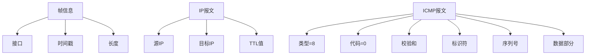

# ICMP抓包

# ICMP抓包

通过抓包工具分析ICMP报文是理解网络通信和诊断网络问题的有效方法。本节将介绍如何使用Wireshark捕获和分析ICMP报文，以及如何通过抓包结果解读网络状况。

## 准备工作

要进行ICMP抓包，你需要：
1. 安装Wireshark或其他网络抓包工具
2. 具有网络抓包权限
3. 目标网络的基本了解

## 使用Wireshark捕获ICMP报文的步骤

### 1. 启动Wireshark并选择网络接口

打开Wireshark后，从接口列表中选择你要监控的网络接口（通常是连接到互联网的接口，如Wi-Fi或以太网）。

### 2. 设置ICMP过滤规则

在Wireshark的过滤栏中输入`icmp`并按Enter，这样只会显示ICMP相关的报文：

```
icmp
```

### 3. 发起ping请求

打开命令提示符或终端，执行ping命令：

```bash
ping www.example.com -c 4  # Linux/macOS
ping www.example.com -n 4  # Windows
```

### 4. 停止捕获并分析结果

ping命令完成后，停止Wireshark捕获。你应该能看到类似以下的ICMP报文序列：

```mermaid
graph LR
    A[Echo Request] --> B[Echo Reply]
    C[Echo Request] --> D[Echo Reply]
    E[Echo Request] --> F[Echo Reply]
    G[Echo Request] --> H[Echo Reply]
    Note over A,H: 通常4个请求-应答对
```

## 解读ICMP抓包结果

### 典型的ping抓包结果

一个完整的ping过程抓包结果应包含：
- 4个Echo Request报文（类型8）
- 4个Echo Reply报文（类型0）

每个请求-应答对应该一一对应，通过标识符和序列号关联。

### 详细的ICMP报文信息

选择一个Echo Request报文，查看其详细信息：



### 常见的ICMP抓包异常情况

1. **只有请求没有应答**：可能目标主机不可达、防火墙阻止ICMP或网络存在问题
2. **应答延迟过大**：网络拥塞或路由跳数过多
3. **请求或应答丢失**：网络不稳定或存在丢包
4. **错误类型的ICMP报文**：如目标不可达（类型3）或超时（类型11）

## 高级ICMP抓包技巧

### 1. 过滤特定类型的ICMP报文

```
icmp.type == 8  # 只显示Echo Request
icmp.type == 0  # 只显示Echo Reply
icmp.type == 3  # 只显示目标不可达
```

### 2. 关联请求和应答报文

使用以下显示过滤器可以将请求和应答报文配对显示：

```
icmp.identifier == 0x1234  # 替换为实际的标识符值
```

### 3. 分析ICMP路径MTU发现

捕获路径MTU发现过程：

```
icmp.type == 3 and icmp.code == 4  # 只显示需要分片的ICMP消息
```

## 抓包分析实战案例

假设我们ping一个主机时出现丢包，通过抓包发现：

```mermaid
graph LR
    A[Echo Request] --> B[Echo Reply]
    C[Echo Request] --> D[无应答]
    E[Echo Request] --> F[Echo Reply]
    G[Echo Request] --> H[Echo Reply]
    Note over C,D: 第二个请求丢失
```

这种间歇性丢包可能表明网络存在轻微拥塞或链路不稳定，而非目标主机完全不可达。

通过ICMP抓包，我们可以更准确地判断网络问题的性质和位置，而不是简单地依赖ping命令的成功与否来判断网络可用性。

---

*本文档为《网络101》系列的一部分*
