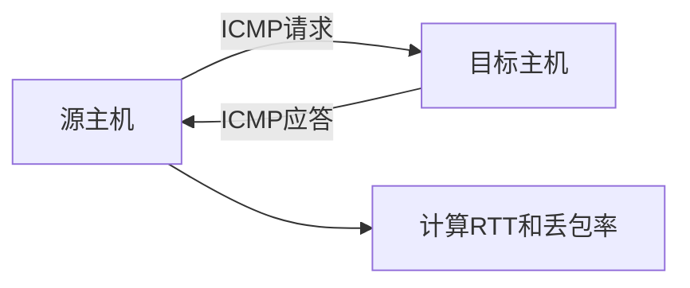

# 小结

# 小结

本章深入探讨了ICMP协议及其在网络诊断中的应用，重点解释了为什么ping命令的结果不能作为判断网络可用性的唯一标准。以下是本章的核心要点总结：

## ICMP协议的核心作用

ICMP（Internet控制消息协议）是TCP/IP协议族中的重要成员，主要用于网络层的控制消息和诊断信息传输。它不传输用户数据，而是专注于：
- 网络连通性测试（如ping命令）
- 错误报告（如目标不可达）
- 网络控制（如路由重定向）

## ping命令的工作原理

ping命令利用ICMP的回显请求（类型8）和回显应答（类型0）报文工作：
- 源主机发送ICMP回显请求报文
- 目标主机返回ICMP回显应答报文
- 源主机计算往返时间(RTT)并判断网络连通性

## ping不通≠网络不可用的原因

ping命令失败并不一定意味着网络服务不可用，主要原因包括：

1. **ICMP被过滤**：许多服务器和防火墙默认阻止ICMP报文
2. **网络策略限制**：部分网络管理员禁用ICMP以提高安全性
3. **应用层可达但网络层不可达**：特殊网络架构可能导致这种情况
4. **ICMP优先级低**：网络拥塞时ICMP报文可能被优先丢弃

## 正确的网络故障排查方法

当ping命令失败时，应采用以下更全面的排查方法：

1. **多工具验证**：结合traceroute、telnet、curl等工具进行测试
2. **应用层测试**：直接访问目标服务（如网页、API）
3. **分段排查**：从本地网络开始，逐步向外排查
4. **抓包分析**：使用Wireshark等工具捕获实际网络流量
5. **考虑网络策略**：了解目标网络是否有ICMP限制

## 实际应用建议

1. **不要依赖单一工具**：网络诊断应综合多种工具的结果
2. **理解网络环境**：了解目标网络的安全策略和架构
3. **区分网络层和应用层**：ICMP故障不代表应用服务故障
4. **关注业务可用性**：最终应关注实际业务是否可用，而非工具测试结果

## 关键结论

ICMP协议和ping命令是网络诊断的重要工具，但它们有其局限性。在实际网络故障排查中，我们需要：
- 理解ICMP的工作原理和报文结构
- 认识到ICMP与IP协议的密切关系
- 掌握抓包工具分析ICMP通信的方法
- 综合多种信息来源判断网络状况

记住：网络的复杂性意味着没有任何单一工具可以提供完整的网络视图。作为网络诊断者，我们需要结合技术知识和实际工具，全面分析网络问题，才能做出准确判断。

---

*本文档为《网络101》系列的一部分*
