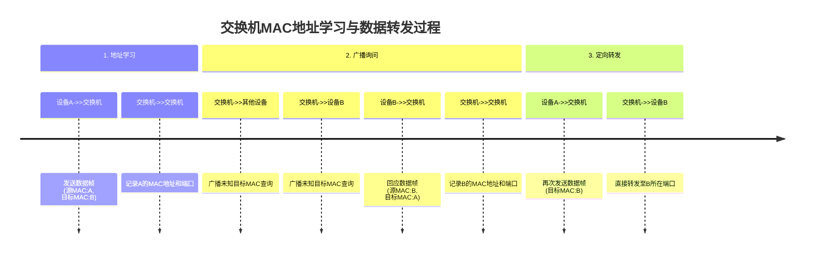

# 2.4.2 什么是交换机？

交换机是现代网络中的关键连接设备，它能够智能地在多台设备之间传输数据。想象交换机就像一个拥有"记忆力"的智能邮差，它不仅能准确传递信息，还能记住每个收件人的位置，从而提高整个网络的通信效率。

## 交换机的工作原理

交换机工作在OSI模型的数据链路层，它通过学习设备的MAC地址来建立网络连接。当交换机收到数据时，它会查看数据帧中的目标MAC地址，然后只将数据发送到目标设备所在的端口，而不是像集线器那样广播到所有端口。

这个过程类似你在大型办公楼中送信：如果知道收件人的具体办公室（MAC地址），你会直接送到那个办公室，而不是把信分发给楼里的每个人。

## 交换机与集线器的区别

最核心的区别在于数据传输方式：
- 集线器：采用广播方式，将数据发送到所有连接的设备，效率低且安全性差
- 交换机：采用定向传输，只将数据发送到目标设备，减少网络拥堵

用比喻来说，集线器就像一个会议室的喇叭系统，一个人说话所有人都能听到；而交换机则像一套独立的电话系统，你可以直接与特定的人通话，不会打扰其他人。

## MAC地址表功能

交换机内部有一张MAC地址表，记录了网络中设备的MAC地址与交换机端口的对应关系。这个表是通过"学习"过程建立的：

1. 当交换机收到数据时，会记录发送设备的MAC地址和对应的端口
2. 对于未知目标地址，交换机会先广播询问
3. 收到回应后，更新MAC地址表
4. 后续再向该地址发送数据时，就可以直接发送到正确端口

MAC地址表会定期更新，自动清除长时间不活跃的记录，确保信息准确性。

## 交换机的应用场景

交换机广泛应用于各种网络环境：
- 家庭网络：现代路由器通常内置小型交换机功能
- 企业局域网：连接办公室内的电脑、打印机等设备
- 数据中心：高性能交换机用于连接大量服务器
- 校园网络：连接整个校园的计算机实验室和办公设备

通过智能管理网络流量，交换机显著提高了网络性能和安全性，是构建高效网络的基础设备。

---

*本文档为《网络101》系列的一部分*
