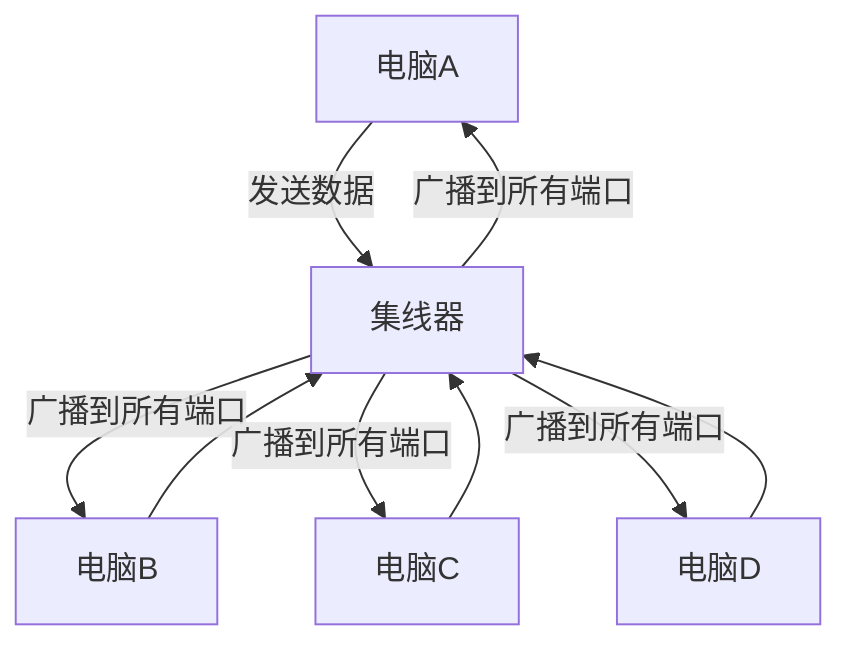
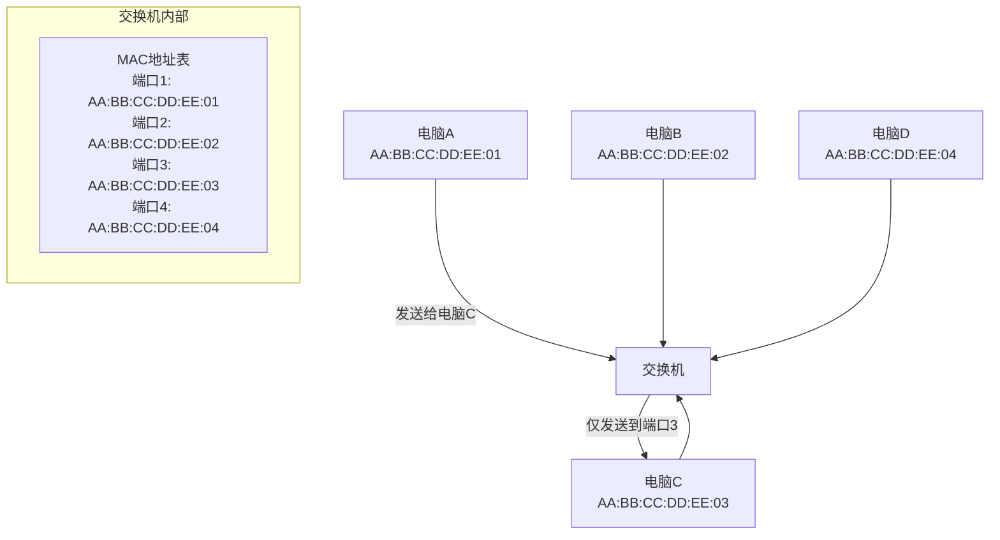
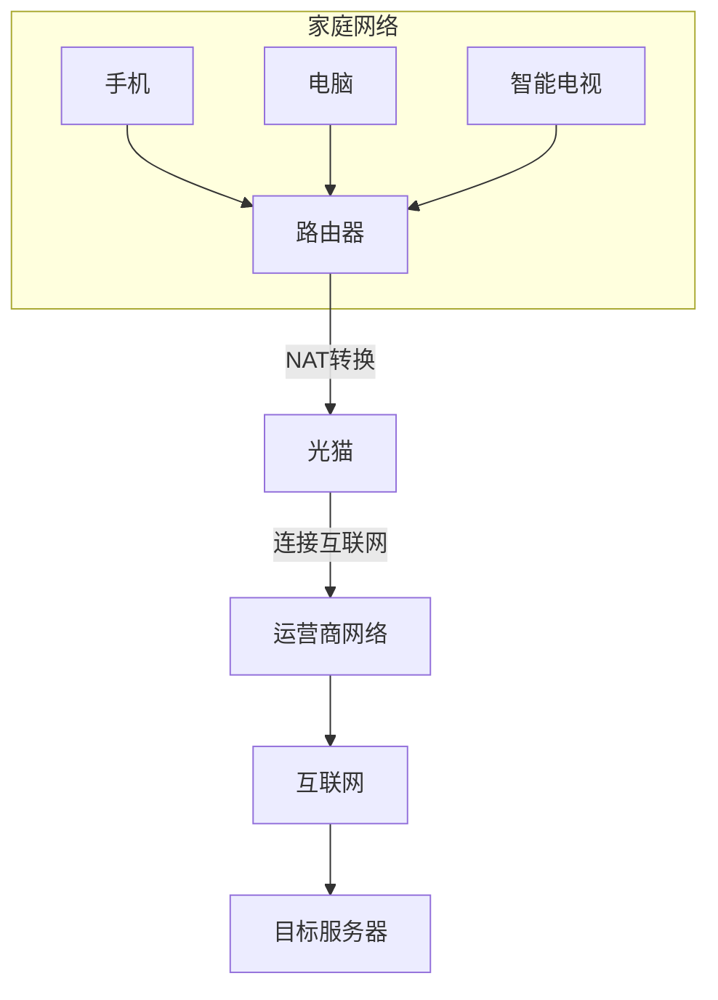
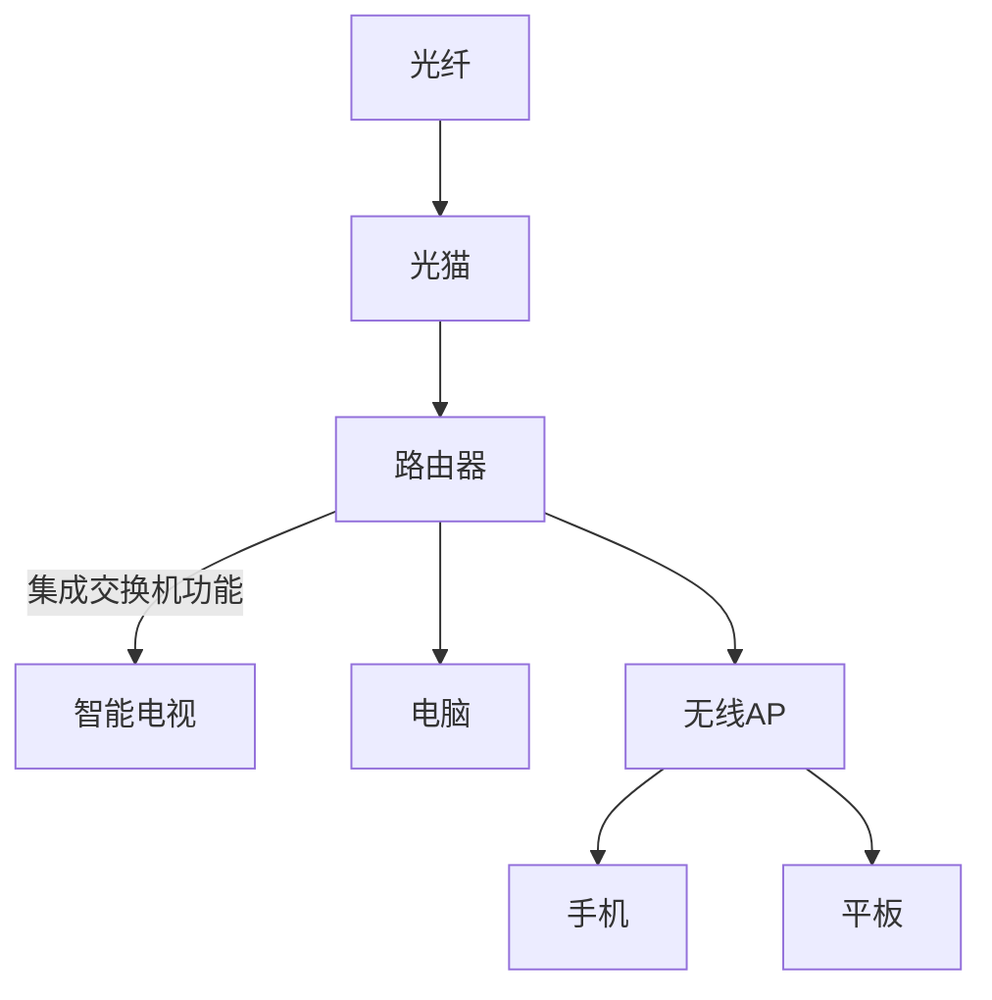

# 2.4.4 小结：路由器、集线器和交换机的区别

想象你正在构建一个城市的交通系统——集线器就像一条狭窄的乡村小路，所有车辆必须排队依次通过；交换机如同城市中的十字路口，能够智能引导车辆驶向不同方向；而路由器则像是连接城市之间的高速公路网，负责规划跨区域的最佳路线。这三种设备共同构成了网络世界的"交通基础设施"，但各自承担着不同的角色和功能。

## 一、集线器（Hub）：网络世界的"对讲机"

### 1.1 工作原理：原始的信号中转站

集线器是最简单的网络设备，工作在**物理层**（OSI模型的最底层）。它的作用就像一个"信号放大器"和"广播器"的结合体——当一台电脑通过集线器发送数据时，集线器会将这个电信号复制并发送到所有连接的端口。

### 1.2 生活类比：会议室的对讲机

想象一个会议室里，所有人都通过同一个对讲机讲话——当一个人说话时，所有人都能听到（广播），而且同一时间只能有一个人发言（共享带宽）。如果多个人同时说话，就会产生混乱（冲突域）。这就是集线器的工作方式。

### 1.3 为什么集线器正在消失？

- **带宽共享问题**：100Mbps的集线器连接4台电脑，每台平均只能获得25Mbps
- **冲突频繁**：多台设备同时发送数据会导致信号冲突
- **安全性差**：所有设备都能接收到全部数据
- **无智能处理**：完全不理解数据内容，仅做信号放大

如今集线器已基本被淘汰，只有在一些极老旧的网络或教学环境中才能见到。

## 二、交换机（Switch）：网络世界的"智能快递员"

### 2.1 工作原理：基于MAC地址的精准投递

交换机工作在**数据链路层**，它比集线器聪明得多。交换机内部有一张"MAC地址表"，记录着每个端口连接的设备MAC地址。当收到数据时，交换机会查看目标MAC地址，然后只将数据发送到目标设备所在的端口，而不是广播到所有端口。

### 2.2 生活类比：小区的智能快递柜

如果把网络数据比作包裹，交换机就像小区的智能快递柜——每个包裹（数据）都有明确的收件人地址（MAC地址），快递员（交换机）会根据地址将包裹放入对应收件人的柜子（端口），而不是像集线器那样把所有包裹都分发给每个人。

### 2.3 交换机带来的革命性变化

- **专属带宽**：每个端口都能享受全部带宽（如100Mbps交换机的每个端口都是100Mbps）
- **减少冲突**：每个端口形成独立冲突域
- **学习能力**：自动建立和更新MAC地址表
- **全双工通信**：支持同时发送和接收数据

现在家庭和企业网络中，交换机已经成为连接多台设备的标准选择。

## 三、路由器（Router）：网络世界的"国际海关"

### 3.1 工作原理：连接不同网络的"翻译官"

路由器工作在**网络层**，是连接不同网络的专业设备。它能理解IP地址，就像能看懂国际邮政编码一样，可以将数据从一个网络发送到另一个网络。家里的路由器通常有两个网络接口：一个连接互联网（WAN口），一个连接家庭设备（LAN口）。

### 3.2 生活类比：国际机场的行李转运系统

路由器就像国际机场的行李转运中心——当你的行李（数据）需要从北京（局域网）运往纽约（互联网上的目标服务器）时，转运中心（路由器）会查看目的地地址（IP地址），决定应该通过哪个航空公司（路由路径）将行李送达，并贴上相应的标签（NAT转换）。

### 3.3 路由器的核心功能

- **路由选择**：根据路由表选择最佳路径
- **网络隔离**：分隔不同网络，提高安全性
- **NAT转换**：让多台设备共享一个公网IP
- **防火墙**：过滤不安全的网络流量
- **DHCP服务器**：自动分配IP地址给设备

没有路由器，我们的家庭网络就无法连接到互联网，更无法实现跨网络通信。

## 四、三者核心区别对比

| 特性 | 集线器 | 交换机 | 路由器 |
|------|--------|--------|--------|
| 工作层次 | 物理层 | 数据链路层 | 网络层 |
| 识别地址 | 不识别任何地址 | MAC地址 | IP地址 |
| 数据转发 | 广播到所有端口 | 仅转发到目标端口 | 跨网络路由转发 |
| 带宽使用 | 所有端口共享 | 每个端口独立带宽 | 各接口独立带宽 |
| 冲突域 | 所有端口同一冲突域 | 每个端口独立冲突域 | 每个接口独立广播域 |
| 核心功能 | 信号放大和中继 | 局域网内设备互连 | 网络间连接和路由 |
| 代表应用 | 早期简单网络 | 家庭/企业局域网 | 连接局域网与互联网 |
| 智能程度 | 无智能 | 有限智能（MAC学习） | 高度智能（路由算法） |

## 五、实际应用场景解析

### 5.1 家庭网络中的典型配置

现代家庭网络通常是这样组成的：

这里的路由器通常集成了交换机功能（提供多个LAN口）和无线AP功能，但本质上它首先是一个路由器，负责连接互联网和家庭网络。

### 5.2 企业网络中的设备部署

在大型企业网络中，这三种设备可能同时存在（尽管集线器已很少见）：
- **接入层**：使用交换机连接用户电脑
- **汇聚层**：使用高性能交换机连接接入层交换机
- **核心层**：使用路由器连接不同部门或区域网络
- **边界**：使用专业路由器连接互联网

## 六、如何选择合适的网络设备？

- **只需连接2-3台设备**：普通交换机即可
- **家庭多设备上网**：带无线功能的路由器（集成交换机）
- **企业内部网络**：高性能交换机+企业级路由器
- **跨区域网络连接**：专业路由器+VPN技术
- **老旧设备兼容**：可能需要特殊配置，但不建议使用集线器

## 七、总结：构建网络的三大基石

集线器、交换机和路由器虽然都是连接网络设备的工具，但功能差异巨大：

- **集线器**是"原始的共享式连接"，已基本淘汰
- **交换机**是"智能的局域网连接"，专注于同一网络内的设备通信
- **路由器**是"网络间的连接桥梁"，实现不同网络间的数据传输

理解这三种设备的区别，就掌握了构建和维护网络的基础知识。从简单的家庭网络到复杂的企业网络，都是这三种基础设备（主要是交换机和路由器）的灵活组合和扩展。

---

*本文档为《网络101》系列的一部分*
