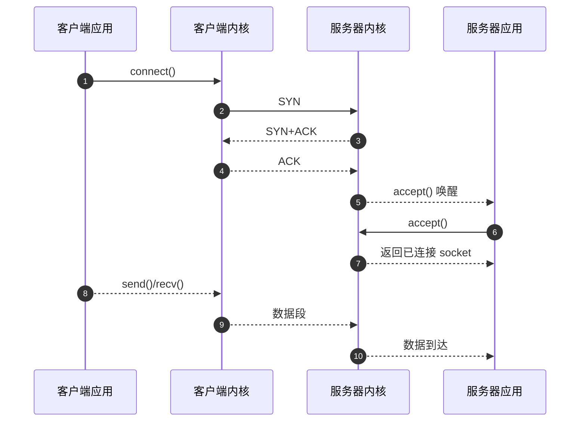

# socket如何实现网络通信

socket这个词来源于“插座”的意思，它为应用程序提供了一个标准化的“插口”，可以把数据塞进操作系统的协议栈，再由网络设备把数据送出。
为了弄清楚socket如何工作，我们从它的抽象、典型的调用顺序，再到内核中的数据流动逐层拆解。

## socket是一种怎样的抽象

- **文件描述符哲学**：在类 UNIX 操作系统中，一切皆文件。`socket()` 系统调用会在进程的文件描述符表中创建一个条目，指向内核空间的
  socket 结构体。无论是读写文件、管道还是网络，在应用层都通过 `read`/`write` 这样的调用完成，socket因此具备了统一的编程接口。
- **协议无关的封装**：在创建 socket 时指定地址族（IPv4、IPv6、本地域等）和协议类型（TCP/UDP/RAW）。对应用而言，向 socket 写入字节即可，
  至于最终是以TCP段还是UDP报文发出由内核根据类型决定，这让程序能在不关心底层细节的情况下进行通信。
- **状态机驱动**：每个 socket 在内核中都处于某个状态（LISTEN、ESTABLISHED、CLOSE_WAIT 等）。系统调用实际是在驱动状态机的
  转移，确保通信过程符合协议规范。

## 建立连接：从监听到握手

以最常见的 TCP 服务器为例，整体流程可以拆成几步：

1. **创建监听 socket**：`int listen_fd = socket(AF_INET, SOCK_STREAM, 0);`
   这一步只是申请了一个可用的socket对象，还没有与任何网络地址关联。
2. **绑定本地地址**：通过 `bind()` 告诉内核“这个socket要监听哪个IP和端口”。如果不绑定，系统会根据需要自动分配，但服务器为了让
   客户端可达，通常会显式绑定。
3. **开始监听**：`listen()` 会把 socket 从一般的主动连接状态转为监听状态，并在内核中创建一个“半连接队列”，用于保存刚完成
   SYN 握手一半的连接请求，以及一个“已完成队列”存储完成三次握手等待 `accept` 的连接。
4. **接受连接**：`accept()` 从已完成队列中取出一个条目，生成一个新的已连接 socket。注意：监听 socket 只负责排队，实际通信使用新
   返回的文件描述符。

在这个过程中，客户端调用 `connect()` 时，内核会自动发起 TCP 三次握手。应用层并不需要手写 SYN/ACK，只要调用 `connect` 等待返回，
系统就会在后台完成握手及状态维护。



## 数据发送的幕后

当我们调用 `send()` 或 `write()` 时，发生了什么？

1. **拷贝进入内核缓冲区**：应用数据首先从用户态拷贝到内核态的发送缓冲区。只要内核缓冲区还有空间，`send()` 就会返回成功，即使
   数据还没有真正离开主机。
2. **协议栈分段与封装**：内核的 TCP 模块会按照 MSS（最大报文段长度）对数据分段，添加 TCP 首部，并交给 IP 层进一步加上 IP 首部。
3. **排队等待发送**：封装好的数据放入网卡的发送队列，由驱动程序和 DMA 机制送入网卡，再由物理层发往网络。
4. **可靠性保障**：对于 TCP，内核维护发送序列号和定时器。对方回 ACK 时，内核会把已确认的数据从缓冲区删除；如果超时未确认，就会自动
   重传。应用层无需处理这些细节。

```mermaid
flowchart LR
    app[应用层 send/write]
    buf[复制到内核发送缓冲区]
    tcp[TCP 分段与封装]
    ip[IP 层加头]
    queue[驱动写入网卡队列]
    wire[物理层发往网络]
    rtx[序列号与重传定时器]

    app --> buf --> tcp --> ip --> queue --> wire
    tcp -. 可靠性监控 .-> rtx
    rtx -.> buf
```

UDP 的发送则更为直接：`sendto()` 会在 IP 层封装成 UDP 数据报后立即交给网卡，不会因为对方未收到而重传，也没有拥塞控制机制。

## 数据接收的路径

接收方向的数据流与发送方向相反：

1. 网卡把收到的帧写入内存后通知内核；
2. IP 层校验、解封装并根据端口号找到对应的 socket；
3. TCP/UDP 模块把有效负载写入 socket 的接收缓冲区；
4. 当应用调用 `recv()`、`read()` 时，数据从内核缓冲区拷贝到用户空间。如果没有数据，阻塞模式下调用会睡眠，直到有新数据或出现异常。

因此，socket 让我们用简单的函数调用，就能享受复杂协议栈提供的可靠或快速传输服务。

## 一个最小化的通信示例

下面的伪代码展示了一个最简 TCP 客户端和服务器的调用顺序：

```python
# server.py
import socket

with socket.socket(socket.AF_INET, socket.SOCK_STREAM) as server:
    server.setsockopt(socket.SOL_SOCKET, socket.SO_REUSEADDR, 1)
    server.bind(("0.0.0.0", 9000))
    server.listen()
    conn, addr = server.accept()
    with conn:
        print("connected from", addr)
        conn.sendall(b"hello")

# client.py
import socket

with socket.create_connection(("127.0.0.1", 9000)) as client:
    data = client.recv(1024)
    print(data)
```

对于 UDP，把 `SOCK_STREAM` 换成 `SOCK_DGRAM`，并使用 `sendto/recvfrom` 即可。发送和接收都不需要建立连接，但需要在每次调用时指定对方的
地址信息（或者通过 `connect()` 将目的地址固定下来）。

## socket背后的内核结构

- **文件描述符表**：每个进程都有独立的文件描述符表，表项指向内核对象。当你 `fork()` 时，子进程会复制这张表，因此可以共享同一个 socket，
  这也是多进程服务器的基础。
- **引用计数**：内核socket对象带有引用计数，只有所有引用被关闭（`close`）后，系统才会真正释放资源并发送 FIN。
- **缓冲区与选项**：`SO_SNDBUF`、`SO_RCVBUF` 控制缓冲区大小，`TCP_NODELAY`、`SO_REUSEADDR` 等套接字选项可以改变协议行为。
- **阻塞与非阻塞**：通过 `fcntl` 设置 `O_NONBLOCK` 或者使用 `select`/`poll`/`epoll`，可以让socket以事件驱动方式工作，这对于高并发
  程序尤为重要。

## 常见的编程注意事项

- `send()` 成功并不意味着对端收到了数据，只能说明数据进入了内核缓冲区。
- `recv()` 返回 0 表示对端已经优雅地关闭了连接（发送了 FIN）。
- 对 TCP 而言，同一个连接必须严格按照“先 `connect` 后 `send/recv`、最后 `close`”的顺序，否则会触发 `RST` 等异常。
- 监听 socket 与已连接 socket 的角色不同：前者负责接收新的连接，后者负责真正的数据传输。

理解这些幕后细节，才能在网络编程时写出行为可控、表现可靠的程序。

---

*本文档为《网络101》系列的一部分*
