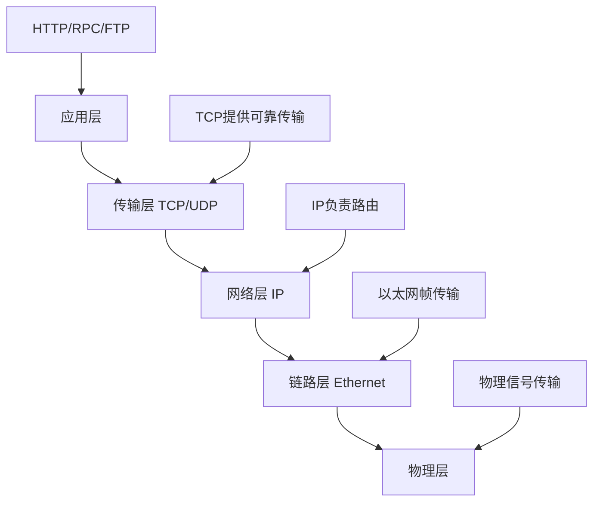

# 从TCP聊起

想要理解HTTP和RPC存在的意义，我们需要先从TCP协议说起。TCP作为传输层协议，为应用层提供了可靠的、面向连接的数据传输服务。但仅仅有TCP还不够，这就像有了一条可靠的高速公路，但我们还需要制定交通规则才能让车辆有序通行。

## TCP的核心特性

TCP（传输控制协议）是网络通信的基石之一，它为应用程序提供了以下关键特性：

**可靠性保障**：TCP通过序列号、确认应答、超时重传等机制，确保数据能够完整、有序地从发送端传输到接收端。即使网络出现丢包、乱序等问题，TCP也能自动处理并恢复。

**流量控制**：TCP使用滑动窗口机制来控制数据发送的速度，防止发送方发送数据过快而导致接收方缓冲区溢出。

**拥塞控制**：当网络出现拥塞时，TCP能够感知并主动降低发送速率，避免网络进一步恶化。

**面向连接**：TCP在数据传输前需要建立连接（三次握手），传输结束后需要关闭连接（四次挥手），这确保了通信双方的状态同步。

## TCP在网络栈中的定位

TCP位于网络协议栈的传输层，它的主要职责是在两个网络节点之间提供可靠的端到端通信。我们可以用一个简单的图来理解网络协议栈的层次结构：



从这个图可以看出，TCP虽然提供了可靠的数据传输，但它关注的是"如何可靠地传输数据"，而不是"传输什么样的数据"。TCP把应用数据看作是没有结构的字节流，它不理解数据的含义，也不知道应用程序想要如何使用这些数据。

## TCP提供的是"管道"，不是"协议"

可以把TCP想象成一根水管，它负责确保水（数据）能够从一端流到另一端，不会漏水、不会断流。但是关于在水管里流的是什么液体（什么类型的数据）、液体的温度是多少（数据的格式）、什么时候需要热水什么时候需要冷水（什么时候发送什么数据），这些都不是水管关心的问题。

同样，TCP只是提供了一个可靠的"数据管道"，但关于：
- 数据的格式是什么样的？
- 什么时候发送请求，什么时候发送响应？
- 如何区分不同的数据包？
- 出错了应该如何处理？

这些问题都需要应用层协议来解决。这就是为什么我们需要HTTP、RPC等应用层协议的根本原因。

## 为什么不能直接使用TCP？

你可能会想：既然TCP已经提供了可靠传输，我们为什么不能直接在应用程序中使用TCP呢？答案是可以的，但是会遇到很多实际问题。

想象一下，如果你要实现一个简单的聊天应用，直接使用TCP会是什么样子：

```python
# 客户端伪代码
import socket
sock = socket.socket(socket.AF_INET, socket.SOCK_STREAM)
sock.connect(('server.com', 8080))
sock.send(b'Hello, World!')  # 发送消息
response = sock.recv(1024)   # 接收响应
```

看起来很简单，但实际使用中你会发现许多问题。比如：如何知道接收到的数据是否是完整的一条消息？如果同时发送多条消息，如何区分它们？这些问题将在下一节详细讨论。

TCP为我们提供了稳固的基础，但要构建实用的网络应用，我们还需要在TCP之上建立更高层次的协议规范。这就是HTTP和RPC诞生的背景。

---

*本文档为《网络101》系列的一部分*
