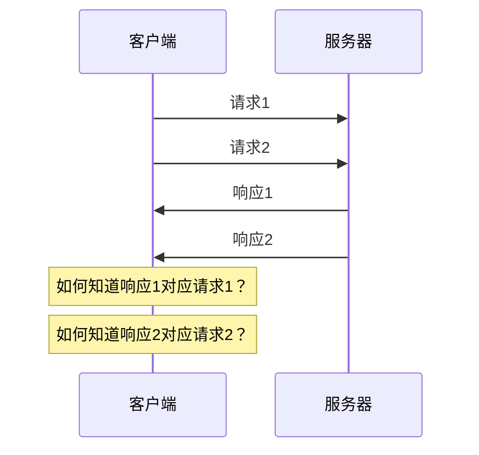

# 使用纯裸TCP会有什么问题

在上一节中，我们了解了TCP作为传输层协议提供的基础能力。现在让我们深入探讨一下，如果直接在应用程序中使用TCP，会遇到哪些实际问题。通过理解这些问题，我们就能明白为什么需要HTTP、RPC这样的应用层协议。

## 数据边界问题

TCP提供的是面向字节流的服务，这意味着TCP不会帮你区分不同的消息边界。让我们通过一个具体的例子来理解这个问题：

```python
# 发送端代码
sock.send(b'Hello')
sock.send(b'World')
sock.send(b'!')

# 接收端可能收到的情况
data1 = sock.recv(1024)  # 可能收到 b'HelloWorld!'
# 或者
data1 = sock.recv(1024)  # 可能收到 b'Hel'
data2 = sock.recv(1024)  # 可能收到 b'loWorld!'
```

从发送端的角度，我们发送了三条独立的消息：'Hello'、'World'、'!'。但是TCP会把这些数据当作连续的字节流，接收端可能一次性接收到所有数据，也可能接收到被任意分割的数据片段。

这个问题被称为"粘包"和"拆包"：
- **粘包**：多个小的数据包被合并成一个大包
- **拆包**：一个大的数据包被分割成多个小包

## 消息完整性判断

继续上面的例子，假设我们要发送一条JSON格式的消息：

```python
message = '{"type": "chat", "content": "Hello, World!", "timestamp": 1234567890}'
sock.send(message.encode())
```

接收端怎么知道收到的数据是一个完整的JSON呢？如果只收到一半数据：

```json
{"type": "chat", "content": "Hello, Wor
```

这显然不是一个有效的JSON。接收端需要某种机制来判断消息是否接收完整。

## 协议版本和兼容性

假设我们的聊天应用要升级，新版本需要在消息中增加一个"用户ID"字段。如果直接使用TCP，我们就面临着协议兼容性的问题：

```python
# 旧版本消息格式
old_message = '{"type": "chat", "content": "Hello"}'

# 新版本消息格式
new_message = '{"type": "chat", "content": "Hello", "user_id": 123}'
```

旧版本的客户端收到新格式的消息可能会解析出错，新版本的服务器也不知道如何处理旧格式的消息。

## 错误处理和状态管理

TCP只能告诉你连接是否正常，但不能告诉你应用层的操作是否成功。比如：

```python
sock.send(b'login:username:password')
response = sock.recv(1024)
# response里收到什么？登录成功还是失败？
# 如果失败，失败的原因是什么？
```

没有标准化的错误处理机制，每个应用都需要自己定义成功、失败的表示方法。

## 并发和多路复用

如果要在同一个TCP连接上处理多个并发请求，问题会变得更加复杂：



客户端需要某种机制来匹配请求和响应，比如给每个请求分配一个唯一的ID。

## 实际解决方案的复杂性

为了解决上述问题，开发者通常会采用以下方案：

**1. 添加消息长度前缀**
```python
def send_message(sock, message):
    data = message.encode()
    length = len(data)
    sock.send(length.to_bytes(4, 'big'))  # 先发送4字节长度
    sock.send(data)  # 再发送实际数据

def recv_message(sock):
    length_bytes = sock.recv(4)  # 先接收长度
    length = int.from_bytes(length_bytes, 'big')
    return sock.recv(length).decode()  # 根据长度接收消息
```

**2. 使用特殊分隔符**
```python
def send_message(sock, message):
    sock.send((message + '\n').encode())

def recv_message(sock):
    buffer = b''
    while b'\n' not in buffer:
        buffer += sock.recv(1)
    return buffer[:-1].decode()
```

**3. 定义消息格式**
```python
import json

def send_request(sock, request_id, method, params):
    message = {
        'id': request_id,
        'method': method,
        'params': params
    }
    send_message(sock, json.dumps(message))
```

这些解决方案虽然可行，但每个应用都需要重新实现一遍，容易出错且效率低下。更糟糕的是，不同应用之间无法互操作，因为它们使用了不同的自定义协议。

## 标准化的必要性

想象一下，如果每个网站都使用自己定义的协议来传输网页数据，那么浏览器就需要支持成千上万种不同的协议。这显然是不现实的。

这就是为什么我们需要标准化的应用层协议的原因：
- **统一的消息格式**：所有人都遵循相同的规范
- **标准化的错误处理**：有明确的成功/失败表示方法
- **版本兼容性机制**：能够优雅地处理协议升级
- **互操作性**：不同的客户端和服务器可以相互通信

HTTP和RPC就是这样的标准化协议，它们在TCP的基础上解决了上述所有问题，让开发者可以专注于业务逻辑，而不是底层的通信细节。

在下一节中，我们将详细了解HTTP和RPC各自是如何解决这些问题的，以及它们的设计思想有什么不同。

---

*本文档为《网络101》系列的一部分*
