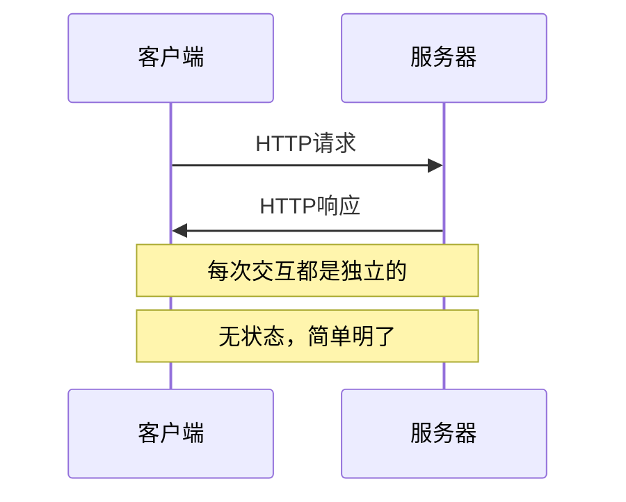
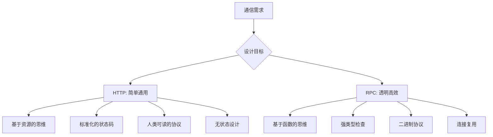
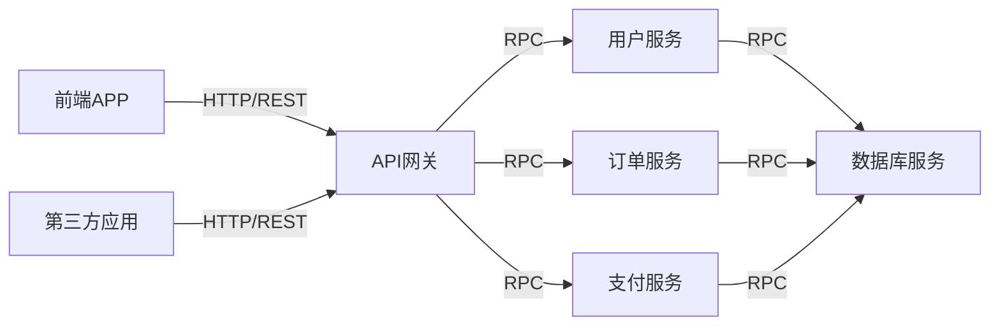

# HTTP和RPC

现在我们已经理解了直接使用TCP面临的种种挑战，让我们来看看HTTP和RPC是如何解决这些问题的，以及它们各自的设计哲学有什么不同。

## HTTP的设计哲学：简单与通用

HTTP（超文本传输协议）诞生于1990年代初期，最初是为了在Web浏览器和服务器之间传输HTML文档而设计的。HTTP的设计哲学可以用四个词来概括：**简单、通用、无状态、可扩展**。

### HTTP如何解决TCP的问题

让我们看看HTTP是如何优雅地解决前面提到的TCP问题的：

**1. 消息边界问题**
```http
GET /api/users HTTP/1.1
Host: example.com
Content-Length: 0

```

HTTP使用明确的消息格式：每个请求都有请求行、请求头和请求体。通过`Content-Length`头部字段明确指定消息体的长度，接收方就知道需要读取多少字节。

**2. 错误处理**
```http
HTTP/1.1 404 Not Found
Content-Type: application/json
Content-Length: 45

{"error": "User not found", "code": "USER_404"}
```

HTTP定义了标准的状态码体系：2xx表示成功，4xx表示客户端错误，5xx表示服务器错误。每个状态码都有明确的含义，开发者无需自己定义错误处理机制。

**3. 协议版本管理**
```http
GET /api/users HTTP/1.1   # HTTP版本在请求行中明确指定
```

HTTP在协议层面就考虑了版本管理，从HTTP/0.9到HTTP/3，每个版本都有明确的标识。

### HTTP的核心特性

**无状态性**：每个HTTP请求都是独立的，服务器不会保存客户端的状态信息。这大大简化了服务器的设计，也提高了系统的可扩展性。

**基于文本的协议**：HTTP的头部信息都是人类可读的文本，这让调试变得非常容易。你可以直接用telnet连接服务器发送HTTP请求。

**请求-响应模式**：HTTP采用了简单的请求-响应模式，客户端发送请求，服务器返回响应，通信结束。



## RPC的设计哲学：透明与高效

RPC（远程过程调用）的设计哲学完全不同。它的核心目标是让**远程调用就像本地函数调用一样简单**。RPC关注的是：**透明性、类型安全、高性能**。

### RPC如何解决问题

**1. 接口定义**
```protobuf
service UserService {
  rpc GetUser(GetUserRequest) returns (GetUserResponse);
  rpc CreateUser(CreateUserRequest) returns (CreateUserResponse);
}

message GetUserRequest {
  int64 user_id = 1;
}

message GetUserResponse {
  User user = 1;
  string error_message = 2;
}
```

RPC通常使用接口描述语言（IDL）来定义服务接口。这样可以自动生成客户端和服务端的代码，确保类型安全。

**2. 透明的远程调用**
```python
# 客户端代码看起来就像在调用本地函数
user_service = UserServiceClient('server.com:8080')
response = user_service.GetUser(user_id=123)
if response.user:
    print(f"用户名: {response.user.name}")
```

从开发者的角度来看，调用远程服务就像调用本地函数一样，不需要关心网络传输的细节。

### HTTP vs RPC：设计思想对比



## 适用场景分析

### HTTP适合的场景

**Web应用和API**：HTTP天生就是为Web设计的，用于构建RESTful API非常合适。

```http
GET /api/users/123        # 获取用户
POST /api/users           # 创建用户
PUT /api/users/123        # 更新用户
DELETE /api/users/123     # 删除用户
```

**跨语言、跨平台集成**：由于HTTP是标准协议，任何语言、任何平台都能很好地支持。

**简单的请求-响应场景**：当你的业务逻辑相对简单，不需要复杂的交互时，HTTP是很好的选择。

### RPC适合的场景

**微服务内部通信**：在同一个公司内部的服务之间，RPC提供了更好的开发体验和性能。

```python
# 服务A调用服务B
order_service = OrderServiceClient()
result = order_service.CreateOrder(
    user_id=123,
    product_id=456,
    quantity=2
)
```

**高性能要求**：RPC协议（如gRPC）使用二进制编码，性能通常比HTTP+JSON更好。

**复杂的业务逻辑**：当需要频繁的服务间调用时，RPC的编程模型更加直观。

## 性能和复杂度对比

| 维度 | HTTP | RPC |
|------|------|-----|
| 学习成本 | 低，人人都懂HTTP | 中等，需要学习具体的RPC框架 |
| 开发效率 | 中等，需要手动处理序列化 | 高，代码自动生成 |
| 性能 | 中等，文本协议有开销 | 高，二进制协议效率更好 |
| 调试难度 | 低，可以直接查看HTTP报文 | 中等，二进制协议不易读 |
| 生态支持 | 最广泛，任何语言都支持 | 中等，主流语言都有支持 |
| 版本兼容性 | 灵活，但需要手动管理 | 强，IDL提供了版本管理机制 |

## 实际项目中的选择策略

在实际项目中，HTTP和RPC往往不是非此即彼的关系，而是各有用途：

**对外API使用HTTP**：
- 提供给第三方开发者的API
- 移动端APP的后端API
- Web前端的后端API

**内部服务使用RPC**：
- 微服务之间的调用
- 高频率的服务间通信
- 需要强类型检查的场景



HTTP和RPC都是优秀的协议，它们解决了直接使用TCP的种种问题，但采用了不同的设计理念。HTTP注重简单和通用性，RPC注重透明性和性能。理解它们的差异，有助于我们在实际项目中做出正确的技术选择。

---

*本文档为《网络101》系列的一部分*
