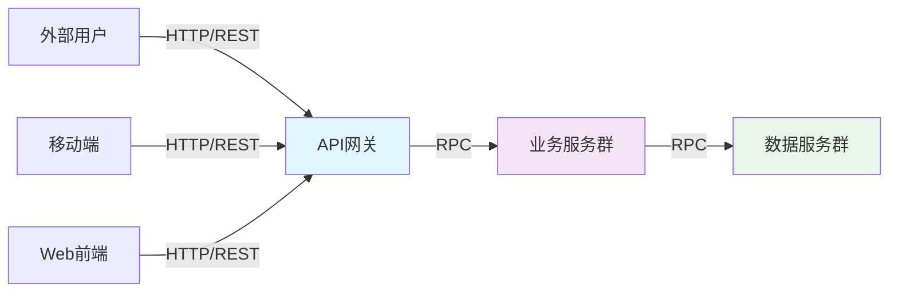

# 小结

通过本节的学习，我们深入探讨了"既然有HTTP，为什么还要有RPC"这个问题。让我们回顾一下这个问题的核心要点和重要结论。

## 核心问题的本质

这个问题的本质并不是HTTP和RPC的技术对比，而是反映了网络通信中一个更深层的思考：**为什么需要应用层协议？**

我们从TCP说起，发现TCP虽然提供了可靠的数据传输，但它只是一个"管道"，不能解决应用层面临的实际问题：
- 消息边界识别
- 错误处理和状态管理
- 协议版本兼容性
- 并发请求的管理
- 标准化的数据格式

这些问题促成了应用层协议的诞生，HTTP和RPC都是解决这些问题的不同方案。

## 设计哲学的差异

HTTP和RPC代表了两种截然不同的设计思想：

**HTTP的设计哲学：简单优雅**
- 基于资源的抽象思维
- 无状态的请求-响应模式
- 人类可读的文本协议
- 标准化的状态码体系
- 强调通用性和互操作性

**RPC的设计哲学：透明高效**
- 基于函数调用的抽象思维
- 远程调用的本地化体验
- 高效的二进制协议
- 强类型的接口定义
- 强调开发效率和性能

## 技术选择的指导原则

在实际项目中，选择HTTP还是RPC应该基于具体的业务需求和技术环境：

### 选择HTTP的情况
- **对外开放的API**：第三方集成、移动端后台、Web前端API
- **跨语言、跨平台的场景**：需要最大的兼容性和互操作性
- **简单的业务逻辑**：请求-响应模式能够很好地满足需求
- **调试和运维友好**：文本协议便于问题排查

### 选择RPC的情况
- **内部服务通信**：微服务架构中的服务间调用
- **高性能要求**：需要更好的传输效率和更低的延迟
- **复杂的业务逻辑**：频繁的服务间调用，需要强类型检查
- **开发效率优先**：自动代码生成，减少手动编码工作

## 现代架构中的协作关系

在现代分布式系统中，HTTP和RPC往往不是竞争关系，而是协作关系：

这种架构模式已经成为业界的事实标准：
- **对外使用HTTP**：保证最大的兼容性和易用性
- **内部使用RPC**：追求更好的性能和开发体验

## 学习和成长的启示

通过深入理解HTTP和RPC的设计思想，我们可以得到一些重要启示：

**技术选择没有银弹**：每种技术都有其适用场景和局限性。正确的做法是理解技术的本质，根据具体需求做出选择。

**设计思想比具体技术更重要**：HTTP的简单性和RPC的透明性都是优秀的设计理念，这些思想可以指导我们设计其他系统。

**向后兼容性的重要性**：HTTP之所以能够从1990年代延续至今，很大程度上得益于其良好的向后兼容性设计。

**标准化的价值**：无论是HTTP的状态码体系，还是RPC的IDL机制，标准化都极大地提高了开发效率和系统互操作性。

## 展望未来

随着技术的发展，HTTP和RPC也在不断演进：
- HTTP/3带来了更好的性能和更低的延迟
- gRPC等现代RPC框架提供了更丰富的功能
- GraphQL等新技术在某种程度上融合了HTTP和RPC的优势

但无论技术如何发展，理解底层的设计思想和原理始终是最重要的。掌握了这些基础知识，我们就能够在技术变化的浪潮中保持方向感，做出正确的技术决策。

通过本节的学习，我们不仅回答了"为什么有了HTTP还要有RPC"这个问题，更重要的是建立起了对网络通信协议选择的系统性思考框架。这个框架将帮助我们在面对未来的新技术时，能够快速理解其设计思想，准确评估其适用场景。

---

*本文档为《网络101》系列的一部分*
