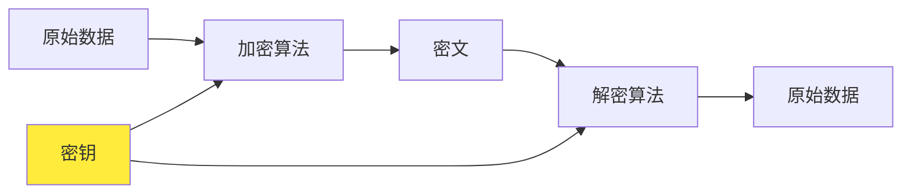
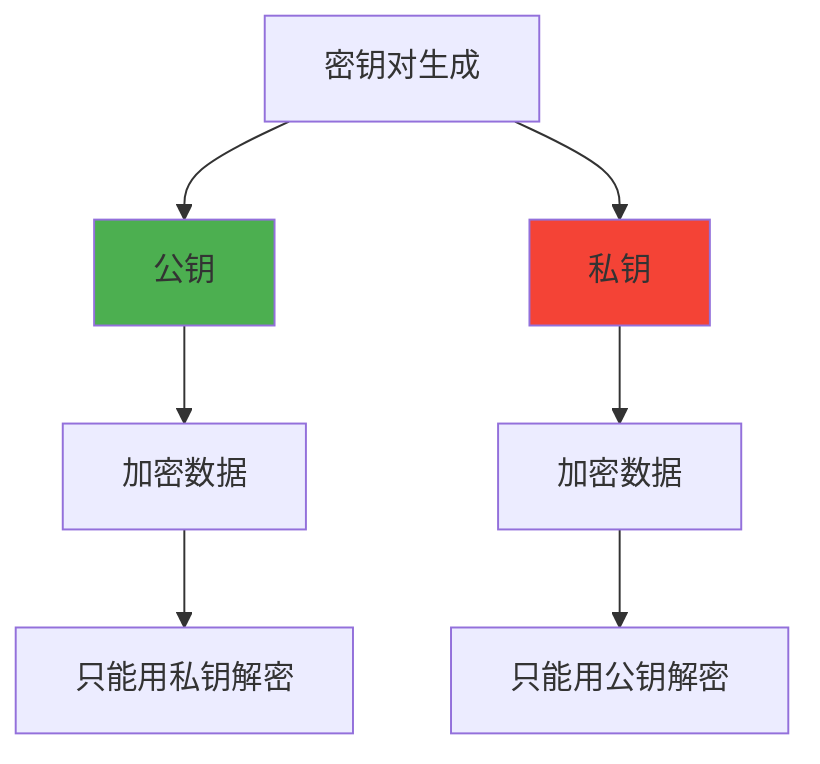

# 对称加密和非对称加密

要理解HTTPS中公钥加密的奥秘，我们首先需要搞清楚两种基本的加密方式：对称加密和非对称加密。这两种加密方式就像是两把不同的锁，各有各的用途和特点。

## 对称加密：一把钥匙开一把锁

### 基本原理

对称加密是最直观的加密方式，就像我们日常生活中使用的门锁一样。你用一把钥匙锁门，就必须用同一把钥匙开门。

在对称加密中，加密和解密使用的是同一把"钥匙"（称为密钥）。发送方用这把钥匙把数据加密成看不懂的密文，接收方用同样的钥匙把密文解密回原始数据。

### 常见的对称加密算法

- **AES（高级加密标准）**：目前最流行的对称加密算法，安全性高、速度快
- **DES（数据加密标准）**：较老的算法，现在已经不够安全
- **3DES**：DES的改进版本，但速度较慢

### 对称加密的优缺点

**优点：**
- 速度快：加密解密过程简单高效
- 占用资源少：计算量小，适合大量数据加密

**缺点：**
- 密钥分配问题：如何安全地把密钥传给对方？
- 密钥管理复杂：每对通信者都需要一个独特的密钥

想象一下，如果你要给100个朋友发送加密信息，用对称加密就需要100把不同的钥匙，而且还要想办法安全地把每把钥匙交给对应的朋友。这就很麻烦了。

## 非对称加密：一对钥匙的巧妙设计

### 基本原理

非对称加密就像是一把神奇的锁，它有两把钥匙：一把叫公钥（Public Key），一把叫私钥（Private Key）。这两把钥匙有一个有趣的性质：用其中一把加密的内容，只能用另一把来解密。

### 两种使用模式

**模式一：公钥加密，私钥解密**
- 这是我们通常说的"加密"用法
- 任何人都可以用公钥加密信息发给私钥持有者
- 只有私钥持有者能解密这些信息

**模式二：私钥加密，公钥解密**
- 这实际上是"数字签名"的概念
- 私钥持有者用私钥"签名"，其他人用公钥验证签名
- 这证明了信息确实来自私钥持有者

### 房门钥匙的比喻

我们可以把非对称加密想象成一个特殊的房门系统：

1. **公钥就像是邮箱投递口**：任何人都可以往里投信（加密），但取信需要特殊权限
2. **私钥就像是房主的钥匙**：只有房主能打开门取信（解密）

这样，如果你想给房主发秘密信息，你可以：
1. 找到房主的邮箱投递口（获取公钥）
2. 把信放进特殊的密封袋（用公钥加密）
3. 投进邮箱（发送密文）
4. 只有房主能用自己的钥匙取出并阅读（用私钥解密）

## 两种加密方式的对比

| 特性 | 对称加密 | 非对称加密 |
|------|---------|------------|
| 密钥数量 | 1个密钥 | 2个密钥（一对） |
| 加密速度 | 快 | 慢 |
| 密钥分配 | 困难 | 容易 |
| 适用场景 | 大量数据加密 | 少量数据加密、数字签名 |
| 典型算法 | AES、DES | RSA、ECC |

## 为什么需要两种加密方式？

这就像工具箱里需要不同的工具一样：

- **对称加密**像电钻，效率高，适合大工程（大量数据加密）
- **非对称加密**像精密螺丝刀，虽然慢但能解决特殊问题（密钥分配、身份验证）

单独使用任何一种都有局限性：
- 只用对称加密：密钥分配是大问题
- 只用非对称加密：速度太慢，不实用

## 现实中的应用

在HTTPS中，这两种加密方式都会用到，它们各司其职：

1. **非对称加密**负责解决密钥分配问题和身份认证
2. **对称加密**负责实际的数据传输加密

这种搭配就像接力赛一样，非对称加密跑第一棒（建立安全连接），对称加密跑后面的长距离（传输大量数据）。

理解了这两种加密方式的特点和用途，我们就为理解HTTPS的工作原理打下了坚实的基础。在下一节中，我们将看到HTTPS是如何巧妙地结合这两种加密方式来保护我们的网络通信的。

---

*本文档为《网络101》系列的一部分*
