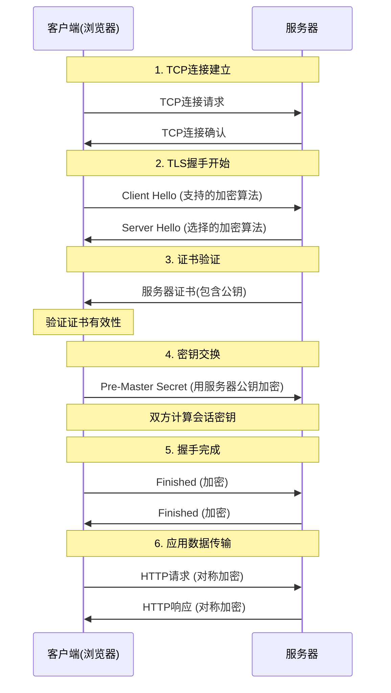
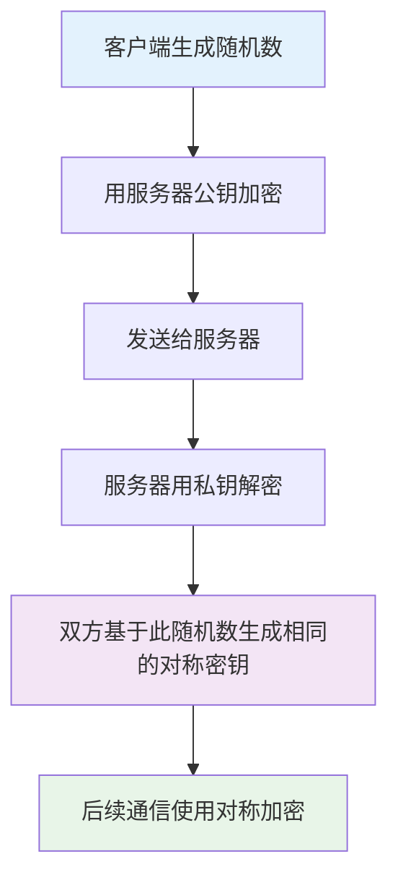
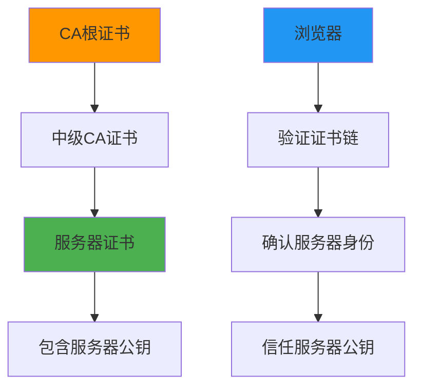
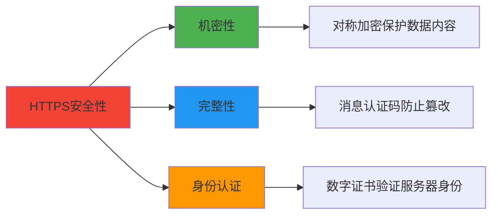

# HTTPS的加密原理

现在我们已经理解了对称加密和非对称加密的基本概念，让我们来看看HTTPS是如何巧妙地运用这两种加密技术来保护我们的网络通信的。这个过程就像一场精心编排的舞蹈，每个步骤都有其特定的作用。

## HTTPS连接建立的完整过程

当你在浏览器中访问一个HTTPS网站时，背后发生了一系列复杂但精密的步骤。我们来详细看看这个过程：

## 核心问题的答案：为什么公钥加密的内容不能用公钥解密？

这个问题的答案其实隐藏在上面的流程图中。让我们仔细分析：

### 第一个关键点：谁在用公钥加密？

在HTTPS握手过程中，**是客户端用服务器的公钥加密信息**，而不是相反。具体来说：

1. **服务器发送证书**：证书里包含服务器的公钥
2. **客户端验证证书**：确认这确实是目标服务器的公钥
3. **客户端用公钥加密**：客户端生成一个随机数（Pre-Master Secret），用服务器的公钥加密后发送
4. **服务器用私钥解密**：只有服务器有对应的私钥，能够解密这个随机数

### 第二个关键点：加密的内容是什么？

公钥加密的并不是我们平时传输的网页数据，而是一个**用来生成对称密钥的种子**（Pre-Master Secret）。这个设计非常巧妙：

## 混合加密的智慧设计

HTTPS采用的是"混合加密"方案，这种设计充分发挥了两种加密方式的优势：

### 阶段一：非对称加密（握手阶段）

**用途：** 安全地交换对称密钥
**特点：** 慢但安全
**过程：**
1. 服务器证书验证（确保身份）
2. 密钥交换（安全传输对称密钥的材料）

### 阶段二：对称加密（数据传输阶段）

**用途：** 加密实际的HTTP数据
**特点：** 快速高效
**过程：**
1. 使用握手阶段协商的对称密钥
2. 加密所有HTTP请求和响应

## 数字证书的关键作用

你可能会问：我怎么知道收到的公钥确实是服务器的，而不是中间人伪造的？这就是数字证书系统要解决的问题。

数字证书就像是一个身份证，由可信的第三方（证书颁发机构CA）来担保。当你收到一个证书时，你可以：

1. **验证证书的签名**：确认它确实是CA签发的
2. **检查证书的有效期**：确认它没有过期
3. **验证域名匹配**：确认证书确实是为当前访问的网站签发的

## 常见误解的澄清

### 误解一："HTTPS用公钥加密所有数据"

**事实：** HTTPS只在握手阶段用公钥加密密钥交换信息，实际数据传输使用对称加密。

### 误解二："公钥加密的数据任何人都能解密"

**事实：** 公钥加密的数据只能用对应的私钥解密，而私钥只有服务器拥有。

### 误解三："HTTPS很慢因为一直在用非对称加密"

**事实：** 非对称加密只在连接建立时使用，数据传输使用高效的对称加密。

## HTTPS安全性的三大支柱

1. **机密性（Confidentiality）**：通过加密确保数据不被窃听
2. **完整性（Integrity）**：通过消息认证码确保数据不被篡改
3. **身份认证（Authentication）**：通过数字证书确保连接到正确的服务器

## 实际示例：访问银行网站

让我们通过一个具体例子来理解整个过程：

1. **你访问银行网站**：浏览器发起HTTPS连接
2. **银行发送证书**：包含银行的公钥，由知名CA签发
3. **浏览器验证证书**：确认这确实是你要访问的银行
4. **密钥协商**：浏览器和银行服务器协商出一个只有它们知道的对称密钥
5. **安全通信**：所有的转账、查询等操作都用这个对称密钥加密

## 为什么这种设计如此巧妙？

1. **解决了密钥分配问题**：不需要事先共享密钥
2. **兼顾了安全性和效率**：握手时用非对称加密保证安全，数据传输时用对称加密保证效率
3. **提供了身份验证**：通过证书系统确保连接到正确的服务器
4. **支持前向安全性**：每次连接使用不同的会话密钥

现在你应该明白了，"公钥加密的内容为什么不能用公钥解密"这个问题本身就是基于对HTTPS工作机制的误解。在HTTPS中，公钥加密的内容确实不能用公钥解密——它只能用对应的私钥解密，而私钥只有服务器拥有。这正是HTTPS安全性的基础。

---

*本文档为《网络101》系列的一部分*
