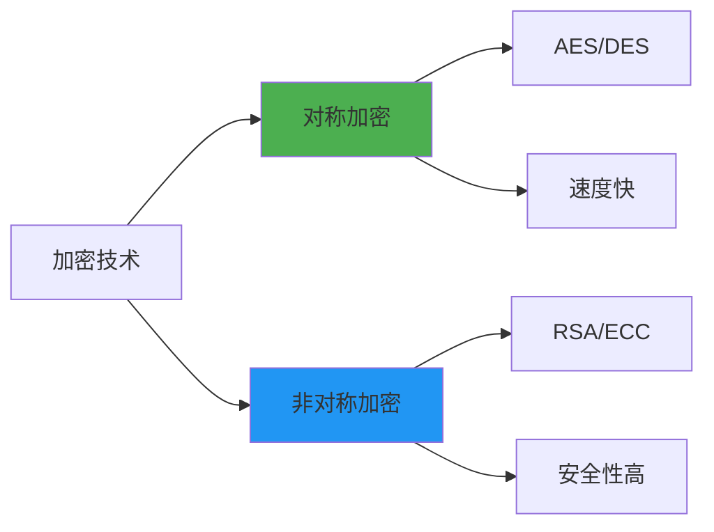
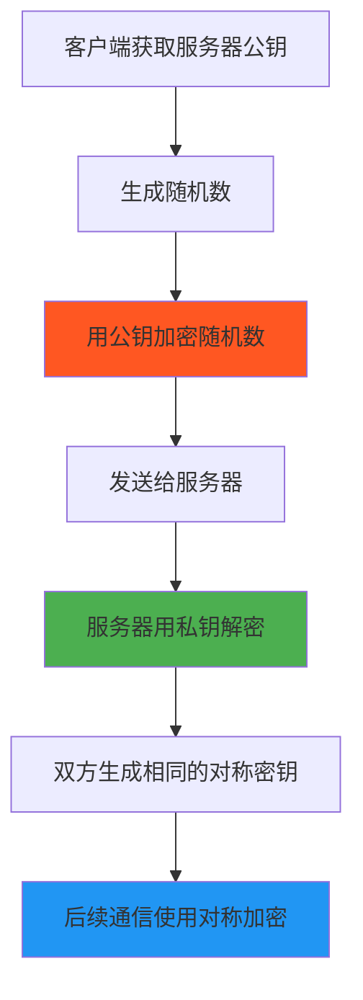

# 小结

通过本节的学习，我们深入探讨了HTTPS加密机制的奥秘，彻底解答了"公钥加密的内容为什么不能用公钥解密"这个看似矛盾的问题。让我们来回顾一下核心要点。

## 关键概念回顾

### 加密方式的本质区别

我们了解了两种基本的加密方式：

**对称加密**：一把钥匙开一把锁
- 优势：速度快，效率高
- 劣势：密钥分配困难

**非对称加密**：一对钥匙的巧妙配合
- 优势：解决密钥分配问题，支持数字签名
- 劣势：计算复杂，速度较慢

### HTTPS的混合加密智慧

HTTPS并不是简单地使用某一种加密方式，而是巧妙地结合了两者的优势：

1. **握手阶段**：使用非对称加密解决密钥分配和身份认证问题
2. **数据传输阶段**：使用对称加密保证传输效率

这种设计就像接力赛跑，各种技术在最合适的时机发挥各自的优势。

## 核心问题的答案

回到我们最初的问题："HTTPS里公钥加密的内容，为什么不能用公钥解密？"

现在我们知道了答案：

### 误解的根源

这个问题本身基于一个误解——认为HTTPS用公钥加密所有数据。实际上：

- **公钥加密的内容**：只是密钥交换过程中的随机数（Pre-Master Secret）
- **加密的主体**：是客户端，而不是服务器
- **解密的主体**：是服务器，使用它独有的私钥
- **真正的数据加密**：使用协商好的对称密钥进行

### 正确的理解

**关键理解**：公钥加密的内容确实不能用公钥解密，它只能用对应的私钥解密。这正是非对称加密安全性的基础，也是HTTPS能够保证安全通信的核心原因。

## HTTPS安全性的三重保障

通过学习，我们明白了HTTPS提供了全方位的安全保护：

| 安全属性 | 实现方式 | 保护目标 |
|---------|----------|----------|
| **机密性** | 对称加密 | 防止数据被窃听 |
| **完整性** | 消息认证码 | 防止数据被篡改 |
| **身份认证** | 数字证书 | 确保服务器身份 |

这三重保障缺一不可，共同构建了一个安全可靠的通信环境。

## 实践意义

理解HTTPS的工作原理具有重要的实践价值：

### 对开发者的意义

- **正确配置HTTPS服务**：知道证书的重要性和配置要点
- **理解性能优化**：明白握手开销和长连接的价值
- **安全编程实践**：避免在HTTPS连接中引入安全漏洞

### 对普通用户的意义

- **识别安全连接**：理解浏览器地址栏小锁图标的含义
- **防范网络攻击**：能够识别证书警告等安全提示
- **保护隐私数据**：知道何时使用HTTPS进行敏感信息传输

## 常见误解的纠正

通过本节学习，我们纠正了几个常见的误解：

❌ **错误认知**：HTTPS用公钥加密所有数据
✅ **正确理解**：公钥只用于密钥交换，数据传输使用对称加密

❌ **错误认知**：公钥加密的数据任何人都能解密
✅ **正确理解**：公钥加密的数据只能用私钥解密

❌ **错误认知**：HTTPS很慢是因为一直在用非对称加密
✅ **正确理解**：非对称加密只在握手时使用，数据传输高效

## 进一步学习的方向

如果您对网络安全有更深入的兴趣，可以继续学习：

1. **TLS协议的版本演进**：从SSL到TLS 1.3的改进历程
2. **密码学算法详解**：RSA、ECC、AES等算法的数学原理
3. **PKI体系结构**：公钥基础设施的完整架构
4. **网络安全攻击与防护**：中间人攻击、重放攻击等的防护机制

## 总结思考

HTTPS的设计体现了工程学的智慧：

- **没有完美的单一解决方案**：每种技术都有其适用场景
- **组合优于单一**：混合使用不同技术可以扬长避短
- **安全是系统工程**：需要从多个维度综合考虑
- **标准化的重要性**：统一的协议使全球互联网能够安全互通

通过理解HTTPS的工作原理，我们不仅解答了最初的疑问，更重要的是建立了对网络安全的系统性认知。这种理解将帮助我们在数字时代更好地保护自己的信息安全，也为进一步学习网络安全知识打下了坚实的基础。

网络安全是一个持续发展的领域，新的威胁和新的防护技术不断涌现。但是，掌握了这些基本原理，我们就有了理解和适应新技术的基础。正如这句话所说："授人以鱼不如授人以渔"——理解原理比记住结论更重要。

---

*本文档为《网络101》系列的一部分*
