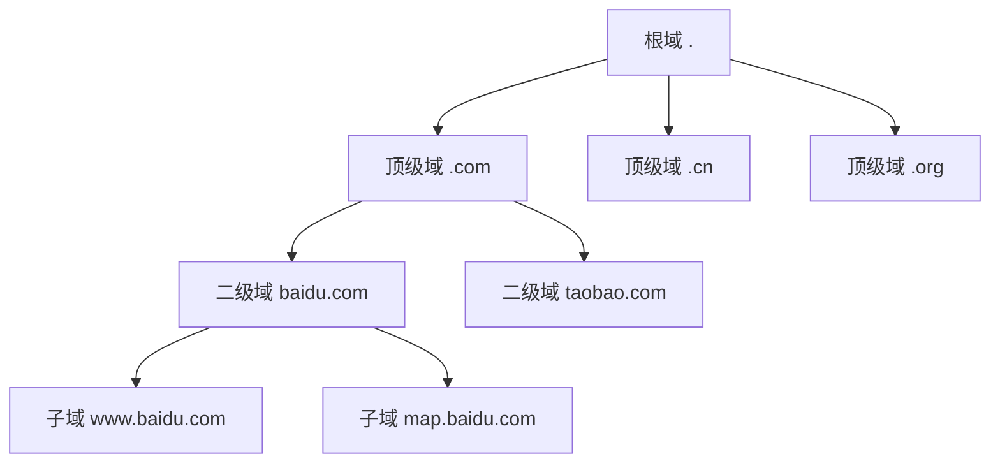

# 为什么要有DNS

想象一下，如果你要给朋友打电话，但电话系统要求你记住每个人的电话号码，而不能使用通讯录中的姓名。当你想联系张三时，你必须记住他的手机号码是13912345678；想联系李四时，你得记住15987654321。更糟糕的是，如果张三换了新手机号，你必须重新记忆新号码。

这正是早期互联网面临的问题。

## 早期互联网的"数字时代"

在DNS诞生之前，互联网上的计算机只能通过IP地址进行通信。如果你想访问一个网站，你必须记住类似`104.16.132.229`这样的数字串。对于少数几台计算机来说，这或许还能勉强应付，但随着互联网的快速发展，这种方式很快就变得不切实际。

想象一下，如果你想访问：
- 百度，你需要记住`39.156.66.10`
- 淘宝，你需要记住`140.205.94.189`
- 微信网页版，你需要记住`101.91.37.2`

这显然是不现实的。人类的大脑更善于记忆有意义的词汇，而不是毫无规律的数字串。

## hosts文件的局限性

最初，工程师们想出了一个简单的解决方案：在每台计算机上维护一个名为`hosts`的文件，这个文件记录了域名和IP地址的对应关系。就像这样：

```
104.16.132.229  www.example.com
39.156.66.10   www.baidu.com
140.205.94.189 www.taobao.com
```

这个方案在早期确实起到了作用。但随着互联网的爆炸式增长，问题开始暴露：

**1. 同步噩梦**
当网站更换服务器IP地址时，全世界所有的hosts文件都需要更新。这在没有自动化工具的年代几乎是不可能完成的任务。

**2. 存储限制**
随着网站数量从几百个增长到几千个、几万个，hosts文件变得越来越庞大，严重影响系统性能。

**3. 管理混乱**
没有统一的管理机制，不同机构可能为同一个网站分配不同的名称，造成混乱。

**4. 扩展性差**
这种集中式的管理方式无法支撑互联网的指数级增长。

## DNS的革命性设计

1983年，Paul Mockapetris提出了DNS（Domain Name System，域名系统）的概念，这是一个革命性的解决方案。DNS的核心思想可以用一个简单的类比来理解：

就像现实世界中的地址系统一样，我们不需要一个全球统一的地址管理员。相反，我们有：
- 国家管理省份
- 省份管理城市
- 城市管理街道
- 街道管理门牌号

DNS采用了类似的分层管理结构：



## DNS解决的核心问题

**1. 人机交互友好**
用户可以使用容易记忆的域名如`www.baidu.com`，而不需要记住复杂的IP地址。

**2. 分布式管理**
每个域的管理员只需要负责自己域下的解析，不需要了解全球所有的域名信息。

**3. 动态更新**
当服务器IP地址发生变化时，只需要更新DNS记录，用户无需感知。

**4. 负载均衡**
一个域名可以对应多个IP地址，实现流量分发和容错。

**5. 高可用性**
通过多级缓存和冗余设计，确保即使部分服务器故障，域名解析服务仍能正常工作。

## 类比理解DNS的价值

DNS就像是互联网的"黄页电话簿"，但它比传统电话簿更智能：

**传统电话簿的局限性：**
- 信息更新慢，一年才印刷一次
- 查找效率低，需要翻页查找
- 无法处理重名问题
- 占用大量物理空间

**DNS的优势：**
- 实时更新，信息变化立即生效
- 查找速度快，几毫秒内完成解析
- 支持别名和多IP映射
- 分布式存储，不占用本地空间

## 现代互联网离不开DNS

今天，DNS已经成为互联网最基础的服务之一。每当你：
- 在浏览器中输入网址
- 发送电子邮件
- 使用手机APP
- 观看在线视频

背后都有DNS在默默工作。据统计，全球每天有数万亿次DNS查询，如果没有DNS，现代互联网将无法正常运行。

DNS的诞生不仅解决了地址记忆的问题，更重要的是为互联网的可扩展性奠定了基础。它证明了分布式系统设计的巧妙，至今仍然是各种分布式系统设计的典型范例。

---

*本文档为《网络101》系列的一部分*
