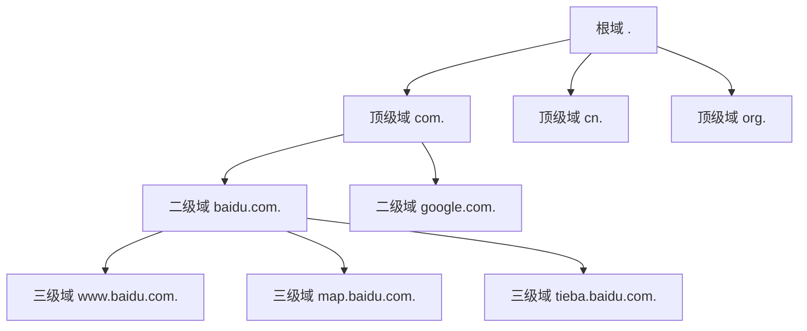

# URL的层次结构

当我们在浏览器地址栏输入`https://www.baidu.com`时，你是否思考过这个看似简单的字符串背后蕴含的设计智慧？URL（Uniform Resource Locator，统一资源定位符）的层次结构体现了DNS系统最精妙的设计理念之一。

## 理解域名的阅读顺序

让我们从一个有趣的观察开始：域名的阅读顺序与我们的习惯恰恰相反。

以`mail.google.com`为例：
- 我们从左到右阅读：mail → google → com
- 但DNS系统从右到左解析：com → google → mail

这就像中文地址"北京市朝阳区建国门外大街"和英文地址的差异：
- 中文地址：从大到小（国家→省市→区县→街道）
- 英文地址：从小到大（门牌号→街道→城市→国家）

DNS采用了类似英文地址的层次结构，但在显示时保持了人类的阅读习惯。

## 域名的完整形式

你知道吗？我们平时看到的域名实际上是"简写"形式。每个域名的完整形式应该以点号（.）结尾：

```
简写形式：www.baidu.com
完整形式：www.baidu.com.
```

最后的这个点代表"根域"，它是整个DNS树的起点。大多数浏览器和应用程序会自动为我们添加这个点，所以我们平时看不到它。

## DNS的树状层次结构

DNS的设计灵感来源于文件系统的目录结构。让我们通过类比来理解：

**文件系统路径：**
```
/home/user/documents/file.txt
```

**DNS域名：**
```
www.baidu.com.
```

两者都是树状结构，但表示方向相反：



## 各层级的含义和作用

### 1. 根域（Root Domain）
- 符号：`.`
- 作用：DNS树的起点，由IANA管理
- 全球只有13个根域名服务器（逻辑上，物理上通过任播技术有数百个）

### 2. 顶级域名（Top-Level Domain, TLD）
- 常见类型：
  - **通用顶级域名（gTLD）**：.com、.org、.net、.edu等
  - **国家顶级域名（ccTLD）**：.cn、.us、.jp、.uk等
  - **新通用顶级域名**：.tech、.cloud、.app等

### 3. 二级域名（Second-Level Domain）
- 示例：baidu.com中的"baidu"
- 这是组织或个人可以注册的最高级别域名
- 通常代表公司名称、组织名称或个人品牌

### 4. 子域名（Subdomain）
- 示例：www.baidu.com中的"www"
- 由二级域名的所有者自由创建和管理
- 常见用途：
  - `www`：万维网服务
  - `mail`：邮件服务
  - `ftp`：文件传输服务
  - `api`：应用程序接口

## 分层管理的智慧

DNS的分层结构实现了管理权限的巧妙分配：

**1. 责任分离**
```
根域 → 管理顶级域名服务器
.com → 管理所有.com域名的注册
baidu.com → 管理所有baidu.com的子域名
```

**2. 扩展性**
每一层只需要知道下一层的信息，不需要了解整个树的全貌。这使得系统可以无限扩展。

**3. 容错性**
如果某个层级的服务器出现故障，不会影响其他层级的正常工作。

## 实际案例分析

让我们分析几个实际的域名结构：

### 案例1：大型互联网公司
```
主站：www.google.com
邮箱：mail.google.com
地图：maps.google.com
翻译：translate.google.com
云服务：cloud.google.com
```

Google通过子域名清晰地组织不同的服务，用户很容易记忆和区分。

### 案例2：教育机构
```
主站：www.tsinghua.edu.cn
邮箱：mail.tsinghua.edu.cn
图书馆：lib.tsinghua.edu.cn
学生系统：student.tsinghua.edu.cn
```

教育机构通常使用`.edu`域名，体现了其教育性质。

### 案例3：内容分发网络
```
静态资源：static.example.com
图片服务：img.example.com
API接口：api.example.com
用户上传：upload.example.com
```

这种设计有助于负载均衡和内容分发优化。

## 层次结构的优势

**1. 记忆友好**
层次化的命名让用户更容易猜测和记忆URL。例如，如果你知道`www.baidu.com`，你很可能猜到地图服务是`map.baidu.com`。

**2. 管理便利**
每个组织只需要管理自己的域名空间，不需要协调全球资源。

**3. 性能优化**
通过子域名可以实现：
- 负载均衡
- 内容分发网络（CDN）部署
- 服务隔离

**4. 安全隔离**
不同子域名可以部署在不同的服务器上，实现安全隔离。

## 现代发展趋势

随着互联网的发展，域名层次结构也在演进：

**1. 更多顶级域名**
ICANN不断开放新的顶级域名，如`.app`、`.cloud`、`.ai`等，给组织更多选择。

**2. 国际化域名**
支持非英文字符的域名，如中文域名`北京.中国`。

**3. 移动优化**
许多公司开始使用`m.example.com`这样的移动专用子域名。

DNS的层次结构设计不仅解决了技术问题，更体现了系统设计的哲学思想：通过合理的分层和责任分配，创建了一个既简单又强大的系统。这种设计思想在现代分布式系统中得到了广泛应用，值得我们深入学习和借鉴。

---

*本文档为《网络101》系列的一部分*
