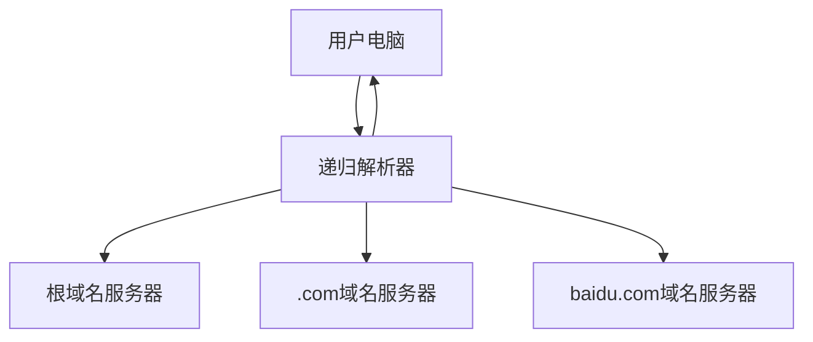
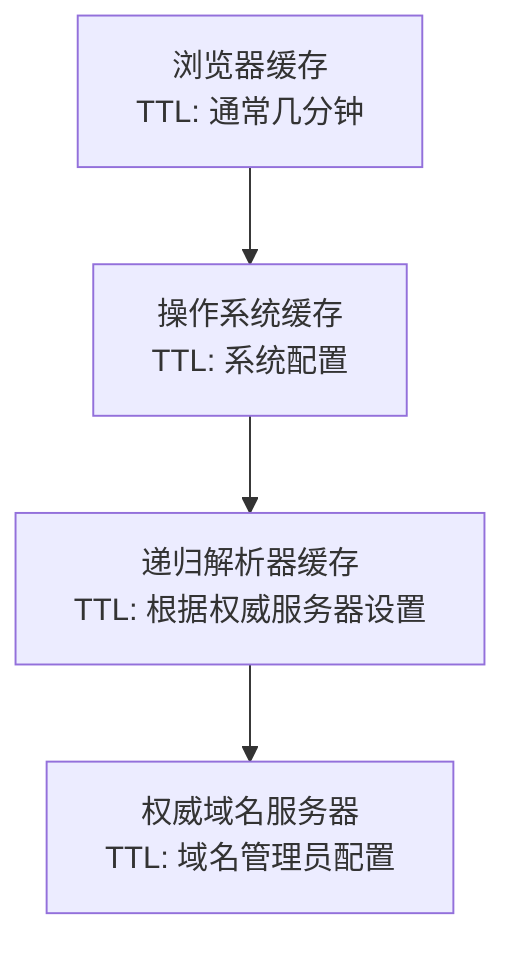

# DNS的原理

当你在浏览器中输入`www.baidu.com`并按下回车键的那一刻，一个精妙的分布式查询过程就开始了。在短短几十毫秒内，你的计算机要经历一个涉及全球多台服务器的"寻宝游戏"，最终找到百度服务器的IP地址。

让我们深入了解这个被誉为"互联网最成功的分布式系统"的工作原理。

## DNS查询的完整旅程

想象DNS查询就像问路：你想去某个地方，但不知道具体地址，于是你一层层地询问，每个人都给你指向更具体的下一个询问对象。

### 第一步：浏览器的智慧缓存

当你输入域名时，浏览器首先会检查自己的DNS缓存：

```
浏览器缓存 → 是否有www.baidu.com的记录？
↓
如果有 → 直接使用IP地址
如果没有 → 继续下一步
```

这就像你的通讯录，如果里面有朋友的电话，你就不需要再去查黄页了。

### 第二步：操作系统的本地缓存

如果浏览器缓存没有找到，请求会传递给操作系统：

```
操作系统 → 检查系统DNS缓存
↓
检查hosts文件
↓
如果没有找到 → 发送请求给配置的DNS服务器
```

hosts文件就像你手写的小纸条，记录了一些特殊的"私人通讯录"。

### 第三步：递归查询的开始

接下来，请求到达了你配置的DNS服务器（通常是你的ISP提供的，比如8.8.8.8）。这个服务器被称为"递归解析器"。

递归解析器就像一个勤劳的代理人，它会代替你完成整个查询过程：



## 递归查询vs迭代查询

DNS查询有两种模式，理解它们的区别很重要：

### 递归查询（Recursive Query）
**特点：**"我要的是最终答案"

```
用户 → 递归解析器："请告诉我www.baidu.com的IP地址"
递归解析器 → 用户："好的，IP地址是39.156.66.10"
```

递归解析器承担了所有查找工作，用户只需要等待最终结果。

### 迭代查询（Iterative Query）
**特点：**"请告诉我下一步该问谁"

```
递归解析器 → 根域名服务器："www.baidu.com在哪里？"
根域名服务器 → 递归解析器："我不知道，但你可以问.com域名服务器"

递归解析器 → .com域名服务器："www.baidu.com在哪里？"
.com域名服务器 → 递归解析器："我不知道，但你可以问baidu.com域名服务器"

递归解析器 → baidu.com域名服务器："www.baidu.com在哪里？"
baidu.com域名服务器 → 递归解析器："IP地址是39.156.66.10"
```

## 详细的查询过程

让我们跟随一个完整的DNS查询过程：

### 步骤1：查询根域名服务器
```
递归解析器 → 根域名服务器（13个之一）
问题："www.baidu.com.在哪里？"
回答："我管理顶级域名，.com域名由这些服务器管理：[.com服务器列表]"
```

根域名服务器就像国际电话总机，它知道每个国家区号对应的下级总机。

### 步骤2：查询顶级域名服务器
```
递归解析器 → .com顶级域名服务器
问题："www.baidu.com.在哪里？"
回答："我管理.com域名，baidu.com由这些服务器管理：[baidu.com授权服务器列表]"
```

顶级域名服务器就像省级电话总机，知道每个城市的电话服务商。

### 步骤3：查询权威域名服务器
```
递归解析器 → baidu.com权威域名服务器
问题："www.baidu.com.的IP地址是什么？"
回答："www.baidu.com.的IP地址是39.156.66.10"
```

权威域名服务器就像城市电话总机，掌握着该城市所有电话号码的具体信息。

## DNS记录类型

DNS不仅仅解析IP地址，它支持多种记录类型：

### A记录
将域名映射到IPv4地址
```
www.baidu.com → 39.156.66.10
```

### AAAA记录
将域名映射到IPv6地址
```
www.baidu.com → 2400:da00:2::29
```

### CNAME记录
创建域名别名
```
blog.example.com → www.example.com
```

### MX记录
指定邮件服务器
```
example.com → mail.example.com (优先级10)
```

### NS记录
指定权威域名服务器
```
baidu.com → ns1.baidu.com
```

### TXT记录
存储文本信息（常用于验证）
```
example.com → "v=spf1 include:_spf.google.com ~all"
```

## 缓存机制的精妙设计

DNS的性能秘密在于其多层缓存系统：

### TTL（Time To Live）机制
每个DNS记录都有一个TTL值，告诉缓存系统该记录的有效期：

```
www.baidu.com. 300 IN A 39.156.66.10
                ↑
              TTL=300秒
```

这就像食品的保质期，过期后就需要重新查询。

### 缓存层级


### 缓存的优势
1. **减少查询延迟**：本地缓存的响应时间几乎为零
2. **降低网络负载**：减少对权威服务器的查询
3. **提高可用性**：即使权威服务器暂时不可用，缓存仍能提供服务

## 负载均衡的智慧

DNS还承担着负载均衡的重要角色：

### 轮询（Round Robin）
```
www.example.com → 192.168.1.1
www.example.com → 192.168.1.2
www.example.com → 192.168.1.3
```

每次查询返回不同的IP地址，实现流量分发。

### 地理位置智能解析
```
北京用户查询 → 返回北京服务器IP
上海用户查询 → 返回上海服务器IP
```

这是现代CDN的基础技术。

## 容错设计

DNS系统的高可用性来自多重保障：

### 1. 服务器冗余
- 根域名服务器：13个（物理上有数百个镜像）
- 顶级域名服务器：每个TLD有多台
- 权威域名服务器：通常配置多台

### 2. 任播（Anycast）技术
多台服务器使用相同IP地址，用户的请求会自动路由到最近的服务器。

### 3. 故障转移
如果主服务器不响应，会自动查询备用服务器。

## 现代DNS的优化

### 1. DNS over HTTPS (DoH)
传统DNS查询是明文的，DoH加密了查询内容：
```
传统DNS：问题和答案都是明文
DoH：通过HTTPS加密传输
```

### 2. DNS over TLS (DoT)
类似DoH，但使用TLS协议直接加密DNS流量。

### 3. 预解析技术
浏览器会预先解析可能访问的域名，加速页面加载。

DNS的设计体现了分布式系统的核心原则：分层管理、缓存优化、冗余备份和负载均衡。正是这些精妙的设计，让我们能够在几十毫秒内完成从域名到IP地址的转换，支撑起了整个现代互联网的运行。

---

*本文档为《网络101》系列的一部分*
