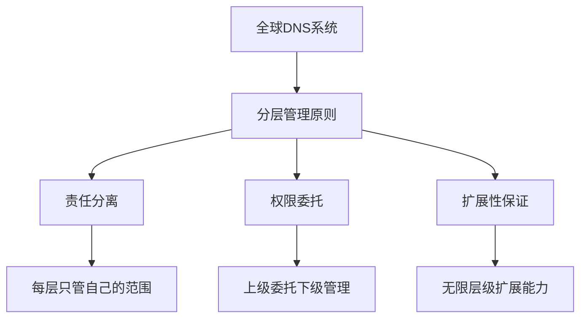

# DNS优秀设计的小结

通过本章对DNS系统的深入学习，我们探索了这个被誉为"互联网最成功的分布式系统"的设计精髓。让我们回顾和总结DNS中那些值得学习的优秀设计理念。

## DNS设计的核心价值

### 1. 分层分治的系统架构

DNS最重要的贡献是证明了**分层管理**在大规模分布式系统中的有效性：



**设计智慧：**
- **局部性原理**：每个管理员只需要了解自己管辖的域名空间
- **委托机制**：上级域只需要知道下级域的管理者，不需要了解具体内容
- **责任清晰**：每个层级都有明确的管理范围和责任边界

### 2. 多层缓存的性能优化

DNS的缓存体系是现代分布式系统缓存设计的典型范例：

**缓存层级：**
```
浏览器缓存 → 系统缓存 → 递归解析器缓存 → 权威服务器
     ↓           ↓            ↓              ↓
   毫秒级      秒级        分钟级          源数据
```

**设计原则：**
- **就近原则**：越靠近用户的缓存，访问速度越快
- **TTL机制**：合理的过期时间平衡了性能和数据一致性
- **分级缓存**：不同层级的缓存承担不同的性能责任

### 3. 容错与高可用设计

DNS系统的稳定性来源于多重保障机制：

**冗余设计：**
- 根域名服务器：13个逻辑服务器，数百个物理镜像
- 任播技术：用户自动连接到最近的服务器
- 多服务器配置：每个域都配置多台权威服务器

**故障处理：**
- 自动重试机制
- 备用服务器切换
- 降级服务策略

## 从DNS学到的系统设计原则

### 1. 简约而不简单

DNS协议本身非常简单，但这种简单性带来了：
- **易于实现**：各种编程语言都有DNS库
- **易于调试**：问题容易定位和解决
- **易于扩展**：新的记录类型可以轻松添加

**启示：**复杂的系统功能可以通过简单的基础协议来实现。

### 2. 分而治之的思想

DNS将一个全球性的问题分解为无数个局部问题：
- **空间分治**：按照域名层级划分管理范围
- **时间分治**：通过缓存将查询分散到不同时间
- **责任分治**：每个参与者只承担有限的责任

**启示：**面对复杂系统时，合理的分解策略是成功的关键。

### 3. 渐进式演进能力

DNS系统从1983年设计至今，能够不断演进：
- **向后兼容**：新功能不影响旧系统
- **渐进部署**：新特性可以逐步推广
- **标准化过程**：通过RFC规范保证互操作性

**现代演进示例：**
- IPv6支持（AAAA记录）
- 安全扩展（DNSSEC）
- 加密传输（DoH/DoT）
- 国际化域名（IDN）

## 现代系统设计的借鉴价值

### 1. 微服务架构设计

DNS的分层思想直接影响了微服务架构：
```
DNS层级     ↔     微服务层级
根域        ↔     API网关
顶级域      ↔     业务域服务
二级域      ↔     具体微服务
子域        ↔     服务实例
```

### 2. 分布式缓存系统

现代缓存系统（如Redis Cluster、CDN）都借鉴了DNS的缓存设计：
- **多级缓存**：L1、L2、L3缓存体系
- **TTL管理**：缓存过期策略
- **一致性处理**：缓存更新机制

### 3. 负载均衡系统

DNS的负载均衡思想影响了现代负载均衡器：
- **轮询算法**：DNS轮询 → 负载均衡轮询
- **地理位置感知**：GeoDNS → 智能路由
- **健康检查**：DNS故障转移 → 服务健康检查

## 面向未来的思考

### 1. 边缘计算时代的DNS

随着边缘计算的发展，DNS系统也在演进：
- **边缘DNS服务器**：更接近用户的解析服务
- **智能调度**：基于实时网络状况的智能解析
- **服务发现集成**：DNS与容器编排系统的深度集成

### 2. 安全与隐私保护

现代DNS面临新的挑战：
- **隐私保护**：DoH/DoT防止DNS查询被监听
- **安全认证**：DNSSEC防止DNS劫持
- **威胁检测**：基于DNS的网络安全监控

### 3. 物联网时代的挑战

随着物联网设备的普及，DNS需要应对：
- **大规模设备注册**：数十亿设备的域名管理
- **动态地址分配**：移动设备的动态DNS更新
- **轻量级实现**：资源受限设备的简化DNS

## 学习价值总结

通过学习DNS的优秀设计，我们获得了宝贵的系统设计经验：

**技术层面：**
- 分布式系统的架构设计方法
- 缓存系统的设计原则
- 容错和高可用的实现策略
- 协议设计的简约性原则

**思维层面：**
- 分而治之的问题解决思路
- 系统演进的渐进式方法
- 标准化与互操作性的重要性
- 简单性与强大功能的平衡

**实践层面：**
- 网络问题的诊断和解决方法
- 性能优化的系统性思考
- 安全防护的多层次设计
- 运维监控的关键指标

## 结语

DNS系统的成功不是偶然的，它体现了优秀系统设计的核心理念：

**"伟大的系统都是简单的"** - DNS用最简单的协议解决了最复杂的问题
**"分而治之是王道"** - 通过合理分层将全球问题变成无数局部问题
**"缓存是性能的灵魂"** - 多级缓存体系支撑了全球互联网的高性能访问
**"冗余带来可靠性"** - 多重备份机制保证了系统的稳定运行

这些设计思想超越了DNS本身，成为了现代分布式系统设计的指导原则。作为技术人员，深入理解DNS的设计精髓，将帮助我们在构建自己的系统时做出更好的架构决策。

DNS不仅仅是一个域名解析系统，更是分布式系统设计的教科书。它的成功经验值得我们反复学习和思考，在面对新的技术挑战时，这些经典的设计思想仍然具有重要的指导意义。

---

*本文档为《网络101》系列的一部分*
