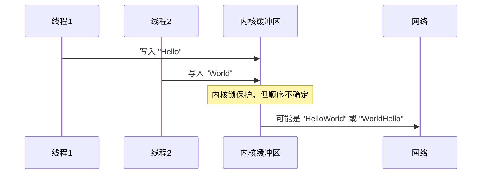

# 5.1.1 写TCP socket是线程安全的吗

在多线程编程中，socket的线程安全性是一个经常被问到的问题。特别是当多个线程同时向同一个TCP socket写入数据时，会发生什么情况呢？

## 内核层面的保护机制

从内核的角度来看，TCP socket的写操作确实是线程安全的。当多个线程同时调用send()或write()函数向同一个socket写入数据时，内核会通过锁机制来保护socket的发送缓冲区，确保数据不会出现竞态条件导致的混乱。

这意味着，即使两个线程同时写入数据，内核也会保证：
- 数据不会丢失
- 数据不会损坏
- 每次写入操作都是原子性的

## 数据顺序的不确定性

虽然内核保证了数据的完整性，但这并不意味着数据的顺序是可预测的。当多个线程同时写入时，数据在发送缓冲区中的排列顺序取决于线程调度的时机。

## 应用层面的考虑

尽管内核提供了基础的线程安全保证，但在应用层面，我们通常需要更精确的控制：

**消息边界问题**：TCP是流式协议，多个线程的写入可能会导致消息边界模糊。比如线程A写入"Hello"，线程B写入"World"，接收端可能收到"HellWorld"这样的混合数据。

**业务逻辑一致性**：即使数据完整传输，但顺序的不确定性可能破坏业务逻辑。比如先发送用户登录信息，再发送操作指令，如果顺序颠倒就会出现问题。

## 最佳实践建议

在实际开发中，建议采用以下策略：

**单线程写入**：让一个专门的线程负责所有的socket写操作，其他线程通过队列或管道将数据传递给写入线程。

**应用层同步**：如果必须多线程写入，在应用层使用互斥锁或其他同步机制来控制写入顺序。

**消息封装**：将每次写入的数据封装成完整的消息包，包含长度信息和边界标识，避免消息混合的问题。

总的来说，TCP socket的写操作在内核层面是线程安全的，但为了保证应用的正确性和可预测性，我们通常需要在应用层面添加额外的同步控制。

---

*本文档为《网络101》系列的一部分*
