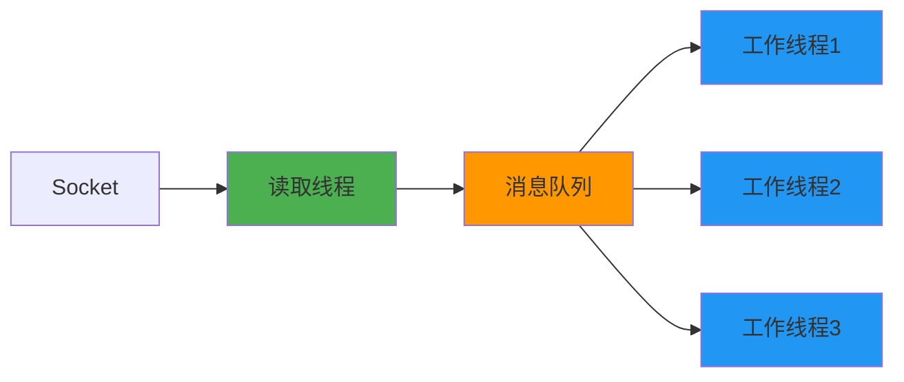

# 5.1.2 读TCP socket是线程安全的吗

相比写操作，TCP socket的读操作在多线程环境下面临着更复杂的情况。让我们深入了解多个线程同时从同一个socket读取数据时会发生什么。

## 内核的读取机制

当多个线程同时调用recv()或read()函数从同一个TCP socket读取数据时，内核同样会通过锁机制来保护socket的接收缓冲区。这确保了：
- 不会有数据损坏
- 每个字节只会被一个线程读取到
- 读取操作本身是原子性的

## 数据分配的不可预测性

虽然内核保证了数据的完整性，但数据在多个线程间的分配是不可预测的。这可能导致一些意想不到的问题。

```mermaid
graph TD
    A[接收缓冲区: "Hello World"] --> B{多线程读取}
    B --> C[线程1可能读到: "Hel"]
    B --> D[线程2可能读到: "lo Wor"]
    B --> E[线程3可能读到: "ld"]
    
    style A fill:#e1f5fe
    style C fill:#fff3e0
    style D fill:#fff3e0
    style E fill:#fff3e0
```

## 消息完整性的挑战

TCP是流式协议，数据以字节流的形式传输。当多个线程同时读取时，一个完整的消息可能被分散到不同的线程中，导致：

**消息分片**：原本应该作为一个整体处理的消息被拆分到多个线程，每个线程只能看到消息的一部分。

**处理复杂性**：应用程序需要额外的机制来重新组装这些消息片段，增加了程序的复杂性。

**时序问题**：不同线程处理消息片段的速度不同，可能导致消息处理的时序混乱。

## 实际应用中的问题

在实际应用中，多线程读取TCP socket通常会带来以下问题：

**协议解析困难**：如果应用层协议依赖于特定的消息格式，消息被分片后很难正确解析。

**状态管理复杂**：每个线程需要维护自己的解析状态，但又需要与其他线程协调，增加了状态管理的复杂性。

**性能问题**：虽然多线程读取看起来能提高并发性，但实际上由于锁竞争和数据重组的开销，性能提升往往有限。

## 推荐的解决方案

基于以上分析，在实际开发中建议采用以下策略：

**单线程读取模式**：使用一个专门的线程负责从socket读取数据，然后将完整的消息分发给其他工作线程处理。这是最常见也是最可靠的模式。

**消息队列解耦**：读取线程将数据放入消息队列，工作线程从队列中获取完整的消息进行处理，实现读取和处理的解耦。

**连接池模式**：如果需要处理大量并发连接，使用连接池，每个连接由单独的线程处理，避免多线程共享同一个socket。



总结来说，虽然TCP socket的读操作在内核层面是线程安全的，但多线程读取会带来消息完整性和处理复杂性的问题。在实际应用中，单线程读取配合消息队列的模式是更好的选择。

---

*本文档为《网络101》系列的一部分*
