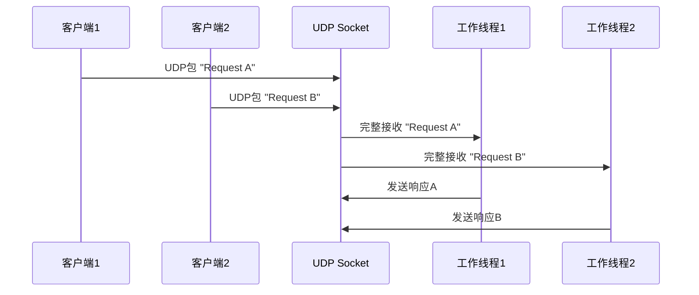

# 5.1.3 读写UDP socket是线程安全的吗

UDP socket的线程安全性与TCP有着显著的不同。由于UDP是无连接的数据报协议，它的并发特性呈现出独特的行为模式。

## UDP的基本特性

UDP是面向数据报的协议，每次发送和接收的都是完整的数据包。这个特性对线程安全性有着重要影响：
- 每个UDP数据包都是独立的
- 没有连接状态需要维护
- 数据包要么完整接收，要么完全丢失

## 写UDP socket的线程安全性

从内核角度来看，多个线程同时向UDP socket写入数据是安全的。内核会确保：

**数据包完整性**：每个sendto()调用产生的数据包都是完整的，不会出现多个线程的数据混合在一个UDP包中的情况。

**原子性操作**：每次sendto()调用都是原子性的，要么整个数据包发送成功，要么整个操作失败。

```mermaid
graph TD
    A[线程1: sendto("Hello")] --> C[UDP数据包1: "Hello"]
    B[线程2: sendto("World")] --> D[UDP数据包2: "World"]
    
    C --> E[网络]
    D --> E
    
    style C fill:#4caf50
    style D fill:#4caf50
    style E fill:#2196f3
```

这与TCP不同，TCP中多线程写入可能导致数据在字节级别上的交错，而UDP保证了数据包级别的完整性。

## 读UDP socket的线程安全性

UDP socket的读操作同样具有良好的线程安全特性：

**数据包边界保持**：每次recvfrom()调用都会读取一个完整的UDP数据包，不会出现TCP那样的消息分片问题。

**独立接收**：多个线程可以同时从UDP socket读取数据，每个线程都会获得完整的数据包。

**先到先得**：当多个线程同时等待数据时，最先调用recvfrom()的线程会获得下一个到达的数据包。

## 实际应用中的优势

UDP的这些特性在多线程环境下带来了一些优势：

**简化的消息处理**：由于每个数据包都是完整的，不需要复杂的消息重组逻辑。

**天然的负载均衡**：多个工作线程可以同时从同一个UDP socket读取数据，实现简单的负载均衡。

**减少同步开销**：相比TCP，UDP的多线程处理需要更少的同步机制。



## 需要注意的问题

尽管UDP在多线程环境下表现良好，但仍有一些需要注意的地方：

**数据包丢失**：UDP不保证数据包的可靠传输，在高并发场景下可能出现丢包。

**顺序问题**：虽然每个数据包都是完整的，但多线程处理可能改变数据包的处理顺序。

**缓冲区溢出**：如果接收速度跟不上发送速度，可能导致内核缓冲区溢出，造成数据包丢失。

## 最佳实践

在使用UDP socket进行多线程编程时，建议：

**合理设置缓冲区大小**：根据应用需求调整socket接收缓冲区大小，避免因缓冲区不足导致的丢包。

**实现重传机制**：在应用层实现必要的重传和确认机制，弥补UDP不可靠传输的不足。

**监控丢包情况**：定期检查socket统计信息，监控丢包率，及时调整系统参数。

**考虑数据包大小**：避免发送过大的UDP数据包，减少IP分片的可能性。

总的来说，UDP socket在多线程环境下的表现比TCP更加友好，其数据包边界的天然特性使得多线程处理变得相对简单。但同时也要注意UDP协议本身的限制，在应用层做好相应的补偿措施。

---

*本文档为《网络101》系列的一部分*
