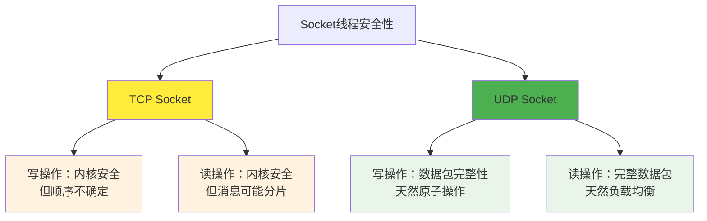

# 5.1.4 小结

通过前面几节的分析，我们深入了解了socket在多线程环境下的行为特性。让我们总结一下关键要点和实践建议。

## 核心发现

**内核层面的保护**：无论是TCP还是UDP socket，内核都提供了基础的线程安全保证。多个线程同时操作同一个socket时，不会出现数据损坏或内存错误。

**协议差异的影响**：TCP作为流式协议和UDP作为数据报协议，在多线程环境下表现出不同的特性。UDP的数据包边界特性使其在并发处理上更加友好。

**应用层复杂性**：虽然内核提供了基础保护，但应用层仍需要处理消息完整性、顺序性和业务逻辑一致性等问题。

## 线程安全性对比

## 实践建议总结

**TCP Socket的最佳实践**：
- 采用单线程读写模式，避免消息分片和顺序问题
- 使用消息队列实现读写线程与工作线程的解耦
- 在应用层实现消息边界和完整性检查
- 如需多线程操作，在应用层添加同步控制

**UDP Socket的最佳实践**：
- 可以安全地使用多线程读写，利用其天然的数据包边界特性
- 注意处理UDP协议本身的不可靠性，实现必要的重传机制
- 合理设置缓冲区大小，监控丢包情况
- 考虑数据包大小限制，避免IP分片

## 架构设计考虑

在设计网络应用架构时，应该根据具体需求选择合适的并发模型：

**高吞吐量场景**：对于需要处理大量连接的服务器，建议使用单线程事件循环配合异步I/O，避免多线程的复杂性。

**计算密集型场景**：如果每个请求需要大量计算，可以采用单线程网络I/O配合多线程工作池的模式。

**实时性要求高的场景**：UDP的多线程处理模式可能更适合需要快速响应的应用。

## 性能与复杂性的权衡

多线程socket编程需要在性能和复杂性之间找到平衡：

**性能考虑**：多线程并不总是意味着更好的性能，锁竞争和上下文切换的开销可能抵消并发带来的好处。

**复杂性管理**：随着线程数量的增加，程序的复杂性会显著上升，调试和维护的难度也会增加。

**可扩展性规划**：在设计初期就要考虑系统的扩展性，选择能够随着负载增长而平滑扩展的架构。

## 总结

Socket的线程安全性是一个多层次的问题。内核提供了基础的数据完整性保证，但应用层需要根据具体的协议特性和业务需求来设计合适的并发策略。

理解这些特性有助于我们在实际开发中做出明智的架构选择，既能充分利用多核处理器的能力，又能保持代码的简洁性和可维护性。记住，最好的并发策略往往不是最复杂的，而是最适合具体应用场景的。

---

*本文档为《网络101》系列的一部分*
