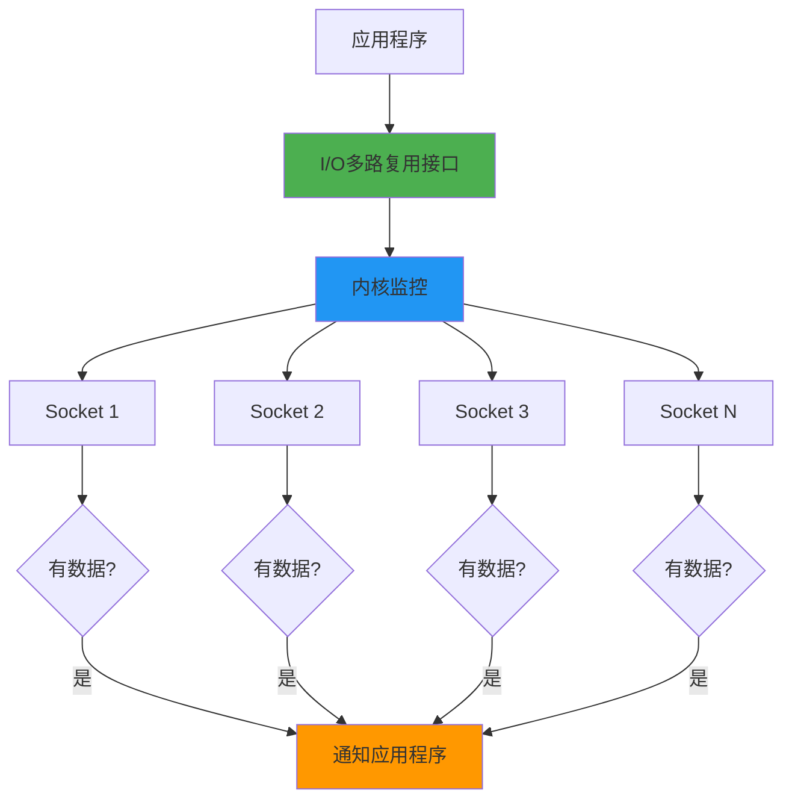
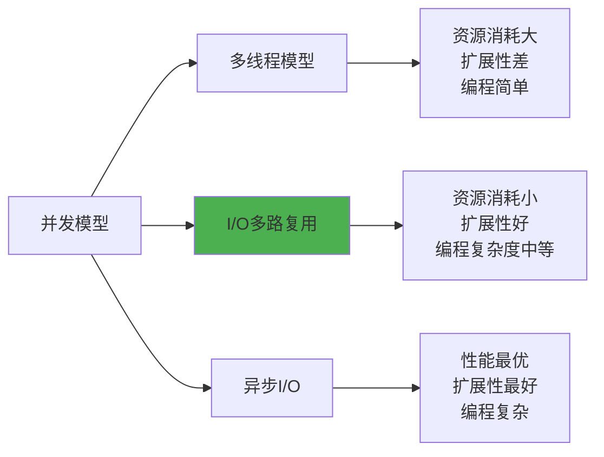

# 5.2.1 I/O多路复用

想象一下，如果你是一个餐厅的服务员，需要同时照顾100桌客人。传统的做法是为每桌客人安排一个专门的服务员，但这样需要100个服务员。而I/O多路复用就像是一个超级服务员，能够同时关注所有桌子，哪桌有需求就立即过去服务。

## 传统I/O模型的局限

在早期的网络编程中，处理多个客户端连接通常有两种方式：

**阻塞I/O + 多进程/多线程**：为每个连接创建一个进程或线程。这种方式简单直观，但存在明显问题：
- 系统资源消耗巨大，每个线程需要几MB的内存
- 上下文切换开销随连接数增长而急剧增加
- 系统能支持的并发连接数受到严重限制

**非阻塞I/O + 轮询**：不断轮询所有socket检查是否有数据。这种方式避免了多线程问题，但带来了新的困扰：
- CPU使用率极高，大量时间浪费在无效轮询上
- 响应延迟不可控，取决于轮询周期

## I/O多路复用的核心思想

I/O多路复用解决了上述问题，其核心思想是：**让内核来监控多个文件描述符，当其中任何一个准备好进行I/O操作时，就通知应用程序**。

这种方式的优势显而易见：
- 单个线程可以处理大量连接
- 只有在真正有I/O事件时才会被唤醒
- 避免了无效的轮询和上下文切换

## 事件驱动的编程模型

I/O多路复用本质上是一种事件驱动的编程模型。应用程序不再主动去检查每个连接的状态，而是被动地等待内核通知有哪些连接准备好了。

这种模型特别适合处理大量并发连接，因为：
- 大部分时间连接都是空闲的
- 只有少数连接在特定时刻有I/O活动
- 程序只需要处理真正活跃的连接

## 适用场景分析

I/O多路复用特别适合以下场景：

**高并发服务器**：需要同时处理成千上万个客户端连接的服务器，如Web服务器、游戏服务器等。

**I/O密集型应用**：大部分时间都在等待I/O操作完成的应用，如代理服务器、聊天服务器等。

**实时性要求高的系统**：需要快速响应客户端请求的系统，如交易系统、监控系统等。

## 与其他模型的对比

相比多线程模型，I/O多路复用在资源使用和扩展性方面有明显优势。相比异步I/O，它的编程复杂度更低，更容易理解和实现。

## 实际应用中的考虑

在实际应用中使用I/O多路复用时，需要考虑以下因素：

**事件处理的及时性**：每个事件的处理时间不能太长，否则会影响其他连接的响应速度。

**内存管理**：虽然不需要为每个连接创建线程，但仍需要为每个连接维护相应的状态信息。

**错误处理**：需要妥善处理连接断开、网络异常等各种错误情况。

**负载均衡**：在多核系统上，可能需要考虑如何在多个进程或线程间分配连接。

I/O多路复用为高并发网络编程提供了一个优雅的解决方案。它让我们能够用较少的系统资源处理大量的并发连接，这正是现代互联网应用能够支持海量用户的关键技术之一。理解这个概念，是深入学习select、poll、epoll等具体技术的基础。

---

*本文档为《网络101》系列的一部分*
