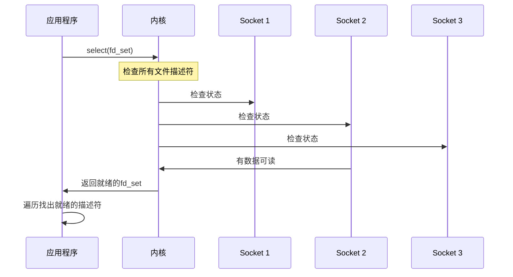
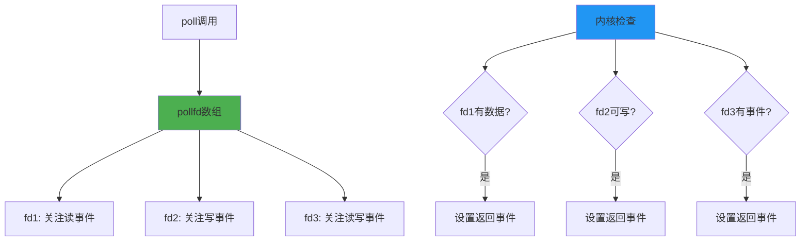
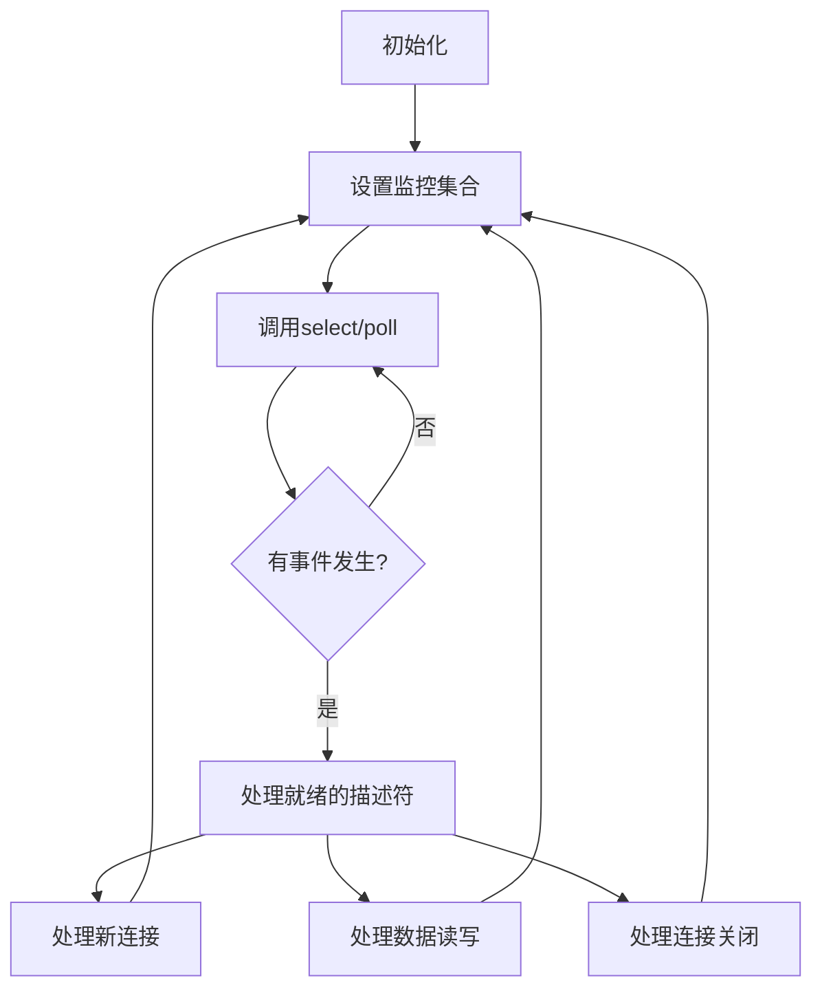

# 5.2.2 select和poll

select和poll是I/O多路复用的两个经典实现，它们为现代高并发网络编程奠定了基础。虽然现在有了更高效的epoll，但理解select和poll的工作原理对于深入掌握I/O多路复用仍然很有价值。

## select的工作机制

select是最早的I/O多路复用接口，它的基本思想是让内核检查多个文件描述符的状态，并在有I/O事件发生时返回。

**基本工作流程**：
1. 应用程序将需要监控的文件描述符放入集合中
2. 调用select函数，将控制权交给内核
3. 内核检查所有文件描述符的状态
4. 当有文件描述符准备好时，select返回
5. 应用程序遍历文件描述符集合，找出准备好的描述符

## select的局限性

尽管select开创了I/O多路复用的先河，但它存在一些明显的局限：

**文件描述符数量限制**：select能监控的文件描述符数量有上限，通常是1024个。这个限制来自于fd_set的实现方式。

**性能随描述符数量线性下降**：每次调用select都需要将文件描述符集合从用户空间复制到内核空间，然后内核遍历所有描述符检查状态。

**需要重复设置监控集合**：每次select返回后，需要重新设置要监控的文件描述符集合。

**无法直接获知哪个描述符就绪**：select只告诉你有描述符就绪了，但不告诉你具体是哪个，需要应用程序自己遍历查找。

## poll的改进

poll是对select的改进，它解决了select的一些问题：

**突破数量限制**：poll使用动态数组而不是固定大小的位图，理论上可以监控任意数量的文件描述符。

**更清晰的接口**：poll使用结构体数组，每个结构体包含文件描述符、关注的事件和返回的事件，接口更加清晰。

**避免重复设置**：poll不会修改输入参数，避免了每次调用前重新设置的麻烦。

## 性能特征对比

虽然poll解决了select的一些问题，但两者在性能上仍有相似的特征：

**时间复杂度**：都是O(n)，其中n是监控的文件描述符数量。每次调用都需要遍历所有描述符。

**系统调用开销**：每次调用都需要在用户空间和内核空间之间复制数据，开销随描述符数量增长。

**适用场景**：都适合监控少量到中等数量的文件描述符，通常在几百个以内性能还可以接受。

## 实际应用考虑

在实际应用中，select和poll虽然有局限性，但在某些场景下仍然有用：

**跨平台兼容性**：select几乎在所有Unix-like系统上都可用，poll的支持也很广泛。

**简单场景**：对于连接数不多的应用，select和poll的简单性可能比复杂的epoll更合适。

**学习和理解**：作为I/O多路复用的基础实现，理解它们有助于更好地掌握相关概念。

## 编程模式

使用select和poll的典型编程模式是事件循环：

这种事件循环模式成为了后续所有I/O多路复用技术的基础模板。

## 历史意义和发展

select和poll在网络编程历史上具有重要意义：

**奠定基础**：它们确立了I/O多路复用的基本概念和编程模式。

**推动发展**：它们的局限性推动了更高效技术的发展，如epoll、kqueue等。

**广泛应用**：许多经典的网络服务器和框架都基于这些技术构建。

虽然现在有了更高效的替代方案，但select和poll仍然是理解I/O多路复用不可或缺的基础知识。它们简单直观的设计思路，为我们理解更复杂的技术提供了很好的起点。

---

*本文档为《网络101》系列的一部分*
