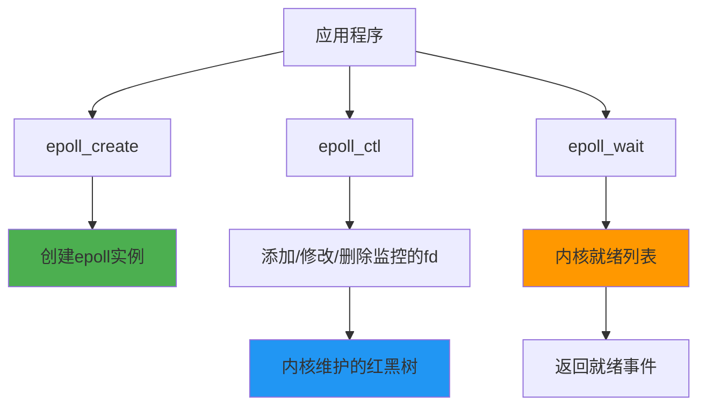
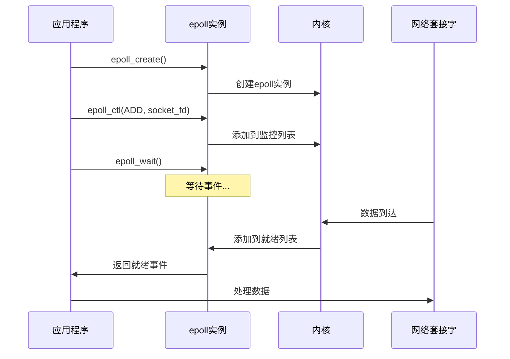
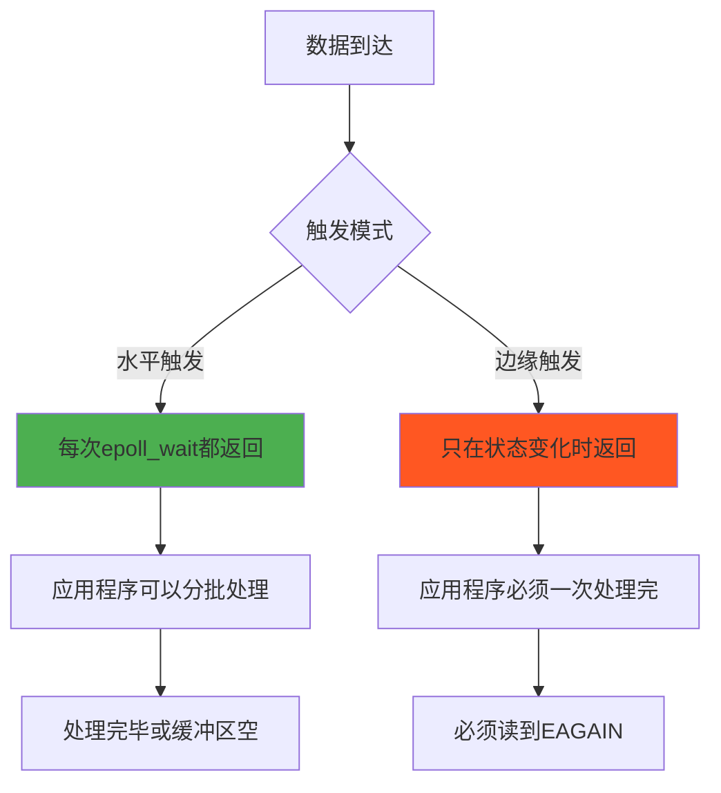
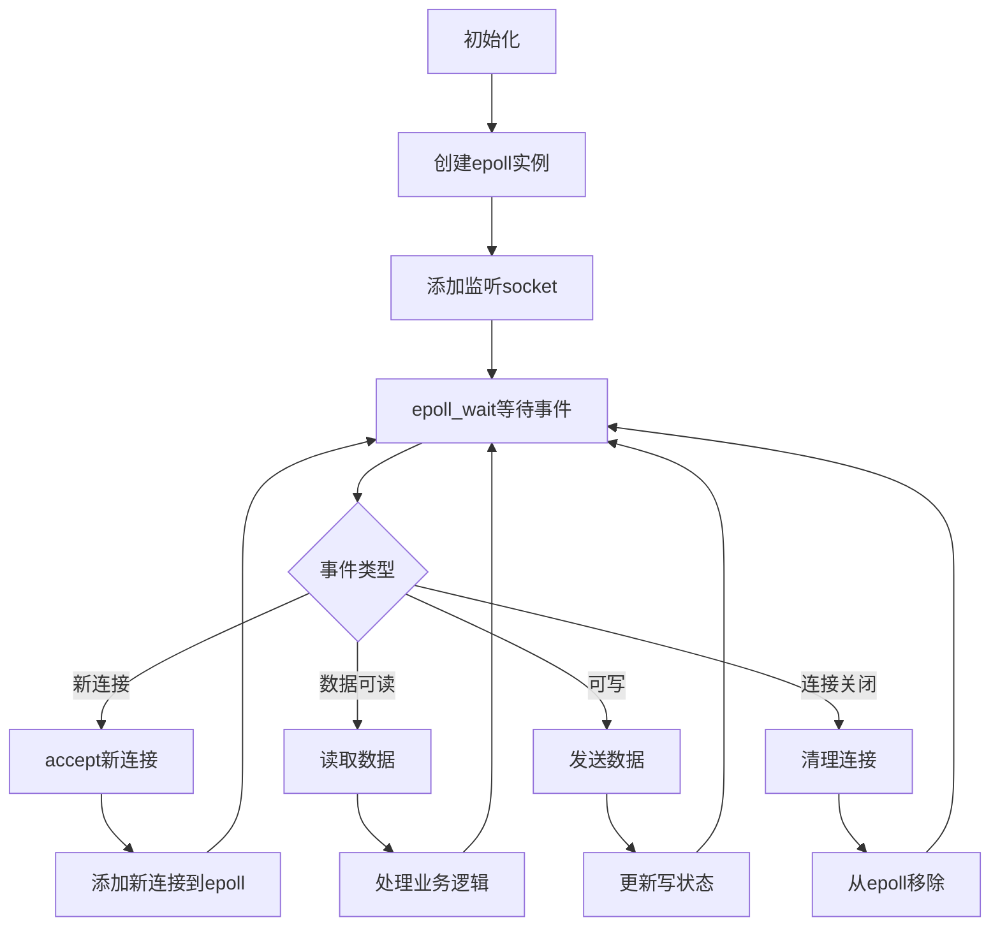

# 5.2.3 epoll

epoll是Linux系统上最高效的I/O多路复用机制，它解决了select和poll的性能瓶颈，成为了现代高并发服务器的核心技术。理解epoll的工作原理，对于构建高性能网络应用至关重要。

## epoll的核心创新

epoll相比select和poll有三个关键创新：

**事件驱动而非轮询**：epoll不需要每次都遍历所有文件描述符，而是由内核主动通知哪些描述符有事件发生。

**内核维护就绪列表**：内核维护一个就绪事件列表，应用程序只需要处理这个列表中的事件。

**避免重复拷贝**：文件描述符集合在内核中维护，避免了每次系统调用时的数据拷贝。

## epoll的工作机制

epoll的工作分为三个阶段：

**创建epoll实例**：通过epoll_create创建一个epoll文件描述符，内核为此分配相应的数据结构。

**管理监控列表**：通过epoll_ctl添加、修改或删除要监控的文件描述符和事件类型。

**等待事件发生**：通过epoll_wait等待事件，内核返回就绪的事件列表。

## 两种触发模式

epoll支持两种事件触发模式，这是它的一个重要特性：

**水平触发（Level Triggered, LT）**：这是默认模式，只要文件描述符处于就绪状态，epoll_wait就会返回该事件。即使应用程序没有完全处理完数据，下次调用epoll_wait时仍会返回该事件。

**边缘触发（Edge Triggered, ET）**：只有当文件描述符的状态发生变化时，epoll_wait才会返回该事件。应用程序必须一次性处理完所有可用数据，否则可能错过事件。

## 性能优势分析

epoll的性能优势主要体现在几个方面：

**时间复杂度优化**：epoll_wait的时间复杂度是O(1)，而select和poll是O(n)。这意味着监控的文件描述符数量增加时，epoll的性能不会线性下降。

**内存使用效率**：epoll在内核中使用红黑树管理文件描述符，内存使用更加高效。

**系统调用开销降低**：避免了每次调用时在用户空间和内核空间之间拷贝大量数据。

**事件通知机制**：采用回调机制，当文件描述符就绪时，内核主动将其加入就绪列表。

## 适用场景和限制

epoll特别适合以下场景：

**高并发服务器**：能够高效处理成千上万的并发连接。

**长连接应用**：如聊天服务器、游戏服务器等需要维持大量长连接的应用。

**I/O密集型应用**：频繁进行网络I/O操作的应用。

但epoll也有一些限制：

**平台限制**：epoll是Linux特有的，不能跨平台使用。

**学习成本**：相比select和poll，epoll的概念和使用方式更复杂。

**边缘触发的复杂性**：ET模式虽然性能更好，但编程复杂度更高，容易出错。

## 实际应用模式

使用epoll的典型应用模式：

## 与其他技术的对比

epoll在Linux生态中的地位类似于其他平台的高性能I/O机制：

**kqueue（FreeBSD/macOS）**：功能类似epoll，但API不同。

**IOCP（Windows）**：Windows的异步I/O机制，概念上有所不同。

**io_uring（新Linux）**：Linux的新一代异步I/O接口，性能更强。

## 编程注意事项

使用epoll时需要注意几个关键点：

**非阻塞I/O**：通常需要将socket设置为非阻塞模式，特别是在ET模式下。

**EAGAIN处理**：在ET模式下，必须读取到EAGAIN错误才能确保数据处理完毕。

**错误处理**：需要正确处理各种错误情况，如连接断开、缓冲区满等。

**资源管理**：及时清理不再使用的文件描述符，避免资源泄漏。

epoll的出现标志着Linux在高并发网络编程领域的重大突破。它不仅解决了传统I/O多路复用的性能瓶颈，还为现代互联网应用的大规模部署提供了技术基础。理解和掌握epoll，是每个Linux网络程序员的必修课。

---

*本文档为《网络101》系列的一部分*
