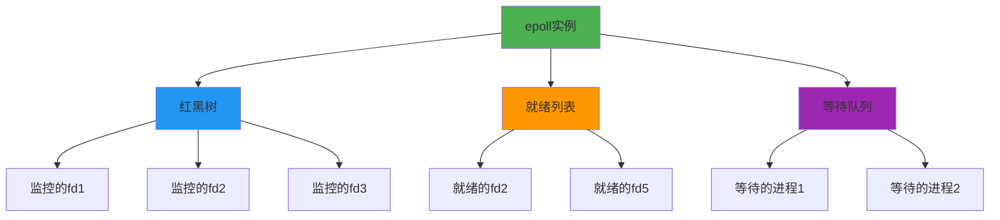
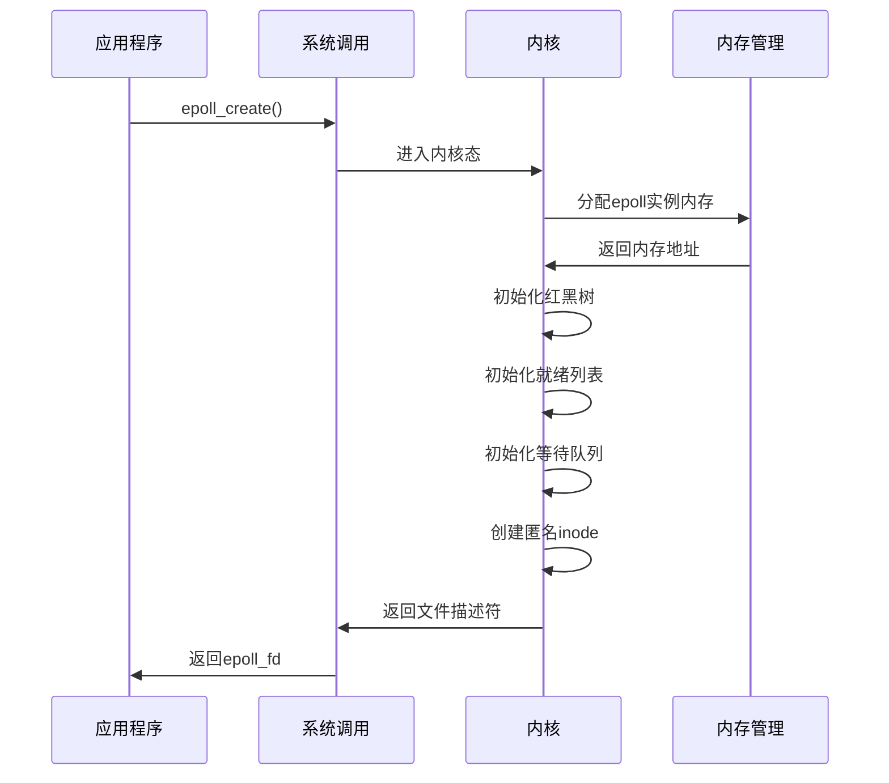
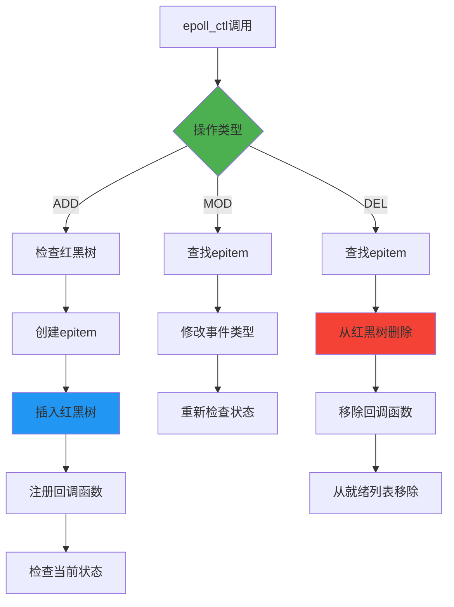
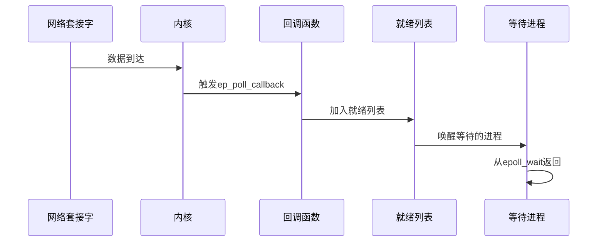
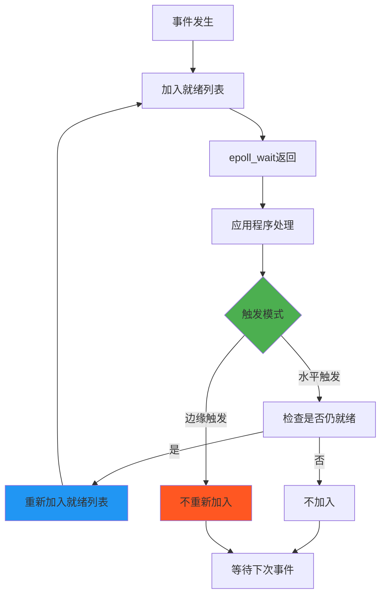

# epoll的内核实现

理解epoll的内核实现原理，有助于我们更深入地掌握这个强大的I/O多路复用机制。虽然我们平时只需要调用epoll的API，但了解其内部工作机制能让我们写出更高效的代码。

## epoll的内核数据结构

epoll在内核中主要使用三个关键数据结构：

**红黑树（RB-Tree）**：用于存储所有被监控的文件描述符。红黑树是一种自平衡的二叉搜索树，查找、插入、删除操作的时间复杂度都是O(log n)。

**就绪列表（Ready List）**：这是一个双向链表，存储所有已经就绪的文件描述符。当文件描述符有事件发生时，内核会将其加入到这个列表中。

**等待队列（Wait Queue）**：当应用程序调用epoll_wait时，如果没有就绪事件，进程会被加入到等待队列中睡眠。

## epoll_create的内核实现

当应用程序调用epoll_create时，内核会执行以下操作：

**分配epoll实例**：内核为新的epoll实例分配内存空间，包括上述的三个数据结构。

**创建匿名inode**：epoll实例在内核中表现为一个特殊的文件，内核会为其创建一个匿名inode。

**初始化数据结构**：初始化红黑树、就绪列表和等待队列。

**返回文件描述符**：将epoll实例包装成文件描述符返回给应用程序。

## epoll_ctl的内核实现

epoll_ctl用于管理监控的文件描述符，其内核实现根据操作类型有所不同：

**EPOLL_CTL_ADD操作**：
1. 在红黑树中查找是否已存在该文件描述符
2. 如果不存在，创建新的epitem结构体
3. 将epitem插入红黑树
4. 向目标文件描述符的等待队列注册回调函数
5. 如果文件描述符当前就绪，立即加入就绪列表

**EPOLL_CTL_MOD操作**：
1. 在红黑树中查找对应的epitem
2. 修改监控的事件类型
3. 重新检查文件描述符状态

**EPOLL_CTL_DEL操作**：
1. 从红黑树中删除对应的epitem
2. 从目标文件描述符的等待队列中移除回调函数
3. 如果该文件描述符在就绪列表中，也将其移除

## 事件通知机制

epoll的高效性很大程度上来自于其事件通知机制。当文件描述符有事件发生时：

**回调函数触发**：内核会调用之前注册的回调函数ep_poll_callback。

**加入就绪列表**：回调函数将对应的epitem加入到就绪列表中。

**唤醒等待进程**：如果有进程在epoll_wait中等待，内核会唤醒这些进程。

**避免重复添加**：如果epitem已经在就绪列表中，不会重复添加。

## epoll_wait的内核实现

epoll_wait是获取就绪事件的接口，其内核实现逻辑：

**检查就绪列表**：首先检查就绪列表是否为空。

**立即返回**：如果就绪列表不为空，将就绪事件复制到用户空间并返回。

**进入等待**：如果就绪列表为空且设置了超时时间，进程进入睡眠状态。

**超时处理**：如果超时时间到达仍无事件，返回0。

**事件复制**：当有事件就绪时，将事件信息从内核空间复制到用户空间。

## 水平触发与边缘触发的实现差异

两种触发模式在内核实现上有重要差异：

**水平触发（LT）**：
- 事件处理后，如果文件描述符仍然就绪，会重新加入就绪列表
- 这确保了只要条件满足，事件就会持续触发

**边缘触发（ET）**：
- 事件处理后，不会自动重新加入就绪列表
- 只有当文件描述符状态发生变化时，才会再次触发

## 性能优化的内核机制

epoll在内核层面有多个性能优化机制：

**批量事件处理**：epoll_wait可以一次返回多个就绪事件，减少系统调用次数。

**内存映射优化**：在某些实现中，就绪事件列表可能使用内存映射技术，减少数据复制。

**锁优化**：内核使用细粒度的锁机制，减少锁竞争。

**缓存友好**：数据结构设计考虑了CPU缓存的特性。

## 与其他I/O机制的内核对比

从内核实现角度看，epoll相比select和poll的优势：

**select/poll**：每次调用都需要遍历所有文件描述符，时间复杂度O(n)。

**epoll**：使用事件驱动机制，只处理就绪的文件描述符，时间复杂度O(1)。

**内存使用**：epoll在内核中维护状态，避免了重复的数据传输。

理解epoll的内核实现原理，不仅能帮助我们更好地使用这个工具，还能让我们在设计高性能网络应用时做出更明智的选择。这些底层的实现细节虽然复杂，但正是这些精巧的设计让epoll成为了Linux平台上最高效的I/O多路复用机制。

---

*本文档为《网络101》系列的一部分*
