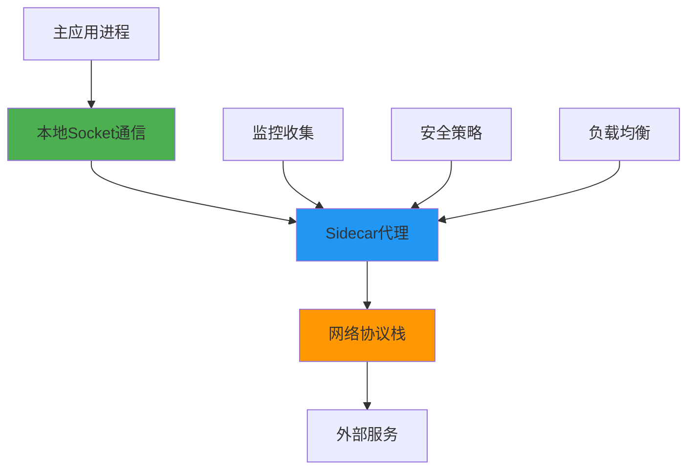
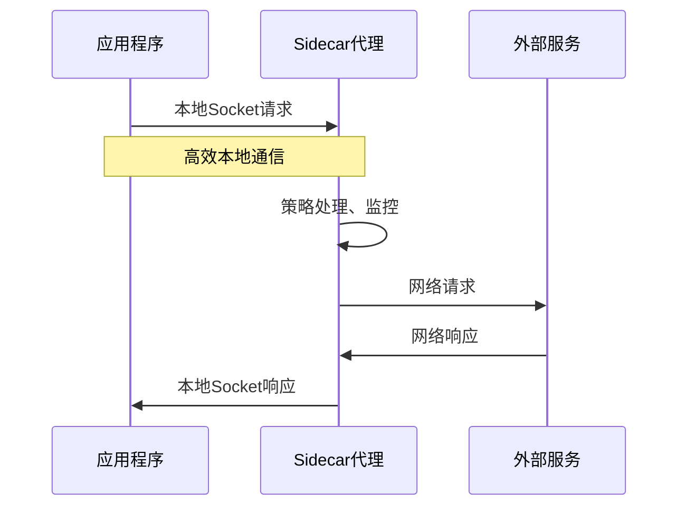
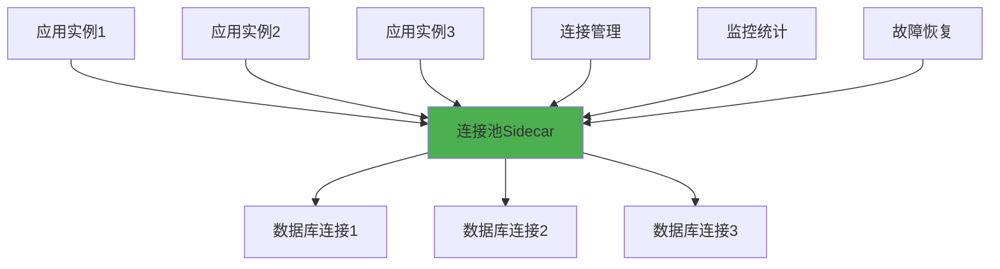
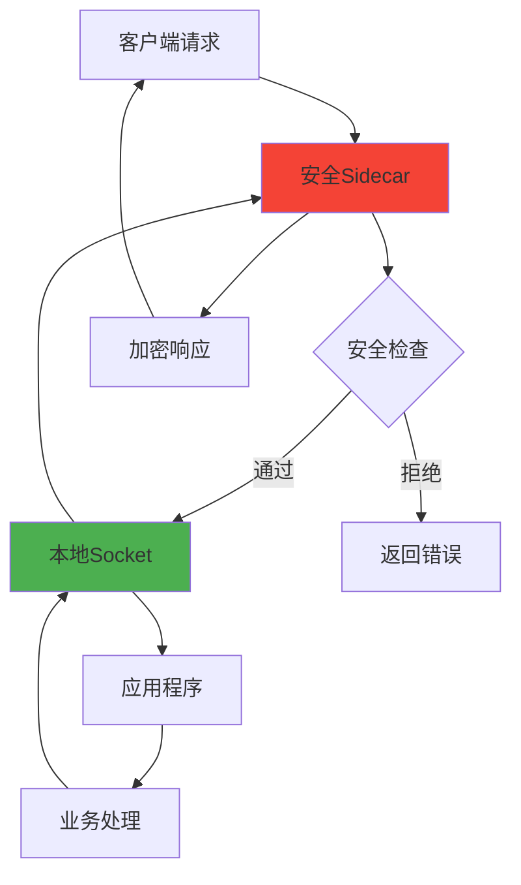

# 5.3.1 基于sidecar的服务架构

在现代微服务架构中，sidecar模式已经成为一种重要的设计模式。这种架构模式恰好展示了socket通信不一定要走完整网络协议栈的典型应用场景。通过sidecar代理，我们可以看到本地高效通信的实际价值。

## sidecar模式的基本概念

sidecar模式是一种将应用程序的功能分解为独立进程的架构模式，就像摩托车的边车一样，sidecar进程与主应用进程并行运行，为其提供辅助功能。

**核心设计思想**：将横切关注点（如网络代理、监控、安全等）从主业务逻辑中分离出来，放到独立的sidecar进程中处理。

**通信模式**：主应用与sidecar之间通常通过本地socket进行通信，而sidecar负责与外部服务的网络通信。

**部署特点**：sidecar通常与主应用部署在同一个节点上，甚至在同一个容器或Pod中。

## 服务网格中的sidecar应用

在服务网格（Service Mesh）架构中，sidecar模式得到了广泛应用，典型的实现包括Istio、Linkerd等。

**Envoy代理的工作模式**：Envoy作为sidecar代理，与应用程序部署在同一个Pod中。应用程序通过本地socket与Envoy通信，Envoy负责处理所有的网络流量。

**流量拦截机制**：通过iptables规则或其他机制，将应用程序的网络流量重定向到sidecar代理，实现透明的流量管理。

**本地通信优化**：应用程序与sidecar之间的通信通常使用Unix Domain Socket或本地TCP连接，避免了网络协议栈的完整处理。

## 数据库连接池的sidecar实现

数据库连接池是sidecar模式的另一个典型应用场景，它展示了本地高效通信的重要性。

**连接池代理**：将数据库连接池逻辑独立成sidecar进程，应用程序通过本地socket与连接池代理通信。

**连接复用优化**：sidecar可以在多个应用实例之间共享数据库连接，提高连接利用率。

**协议转换**：sidecar可以处理不同的数据库协议，为应用程序提供统一的接口。

**性能优势**：本地socket通信的低延迟特性对于频繁的数据库查询操作特别重要。

## 缓存代理的sidecar架构

缓存系统也经常采用sidecar模式，利用本地通信的高性能特性。

**本地缓存代理**：将缓存逻辑独立成sidecar进程，应用程序通过本地socket访问缓存。

**多级缓存策略**：sidecar可以实现本地缓存和远程缓存的多级策略，对应用程序透明。

**缓存一致性管理**：sidecar负责处理缓存的一致性问题，简化应用程序的逻辑。

**热点数据优化**：通过本地socket的高效通信，可以实现对热点数据的快速访问。

## 安全代理的sidecar实现

安全功能的sidecar化也是一个重要的应用场景。

**TLS终止**：sidecar负责处理TLS加密解密，应用程序只需要处理明文数据。

**身份认证**：将身份认证逻辑放到sidecar中，应用程序通过本地socket获取认证结果。

**访问控制**：sidecar实现细粒度的访问控制策略，保护应用程序的安全。

**审计日志**：所有的安全相关操作都在sidecar中记录，便于审计和监控。

## 监控和可观测性sidecar

监控数据收集也是sidecar模式的重要应用。

**指标收集**：sidecar收集应用程序的各种指标，通过本地socket获取数据。

**日志聚合**：将日志处理逻辑独立到sidecar中，减少主应用的负担。

**链路追踪**：sidecar负责生成和传播分布式追踪信息。

**性能分析**：通过本地socket的低开销通信，可以实现细粒度的性能监控。

## sidecar模式的优势分析

sidecar模式结合本地socket通信带来了多个优势：

**关注点分离**：业务逻辑与基础设施逻辑完全分离，提高了代码的可维护性。

**技术栈独立**：sidecar可以使用不同的技术栈实现，不受主应用技术选择的限制。

**升级独立性**：可以独立升级sidecar功能，不影响主应用的运行。

**资源优化**：通过本地socket的高效通信，减少了网络开销和延迟。

**运维简化**：统一的sidecar管理简化了运维复杂度。

## 实施考虑和挑战

虽然sidecar模式有很多优势，但也需要考虑一些挑战：

**复杂性增加**：系统的整体复杂性会增加，需要管理更多的进程。

**资源消耗**：每个sidecar都会消耗额外的内存和CPU资源。

**故障隔离**：需要考虑sidecar故障对主应用的影响。

**通信协议设计**：需要设计高效的本地通信协议。

sidecar模式完美地展示了socket通信不一定要走完整网络协议栈的实际应用价值。通过本地socket的高效通信，sidecar架构能够在保持功能分离的同时，实现高性能的数据传输。这种模式已经成为现代云原生应用架构的重要组成部分。

---

*本文档为《网络101》系列的一部分*
