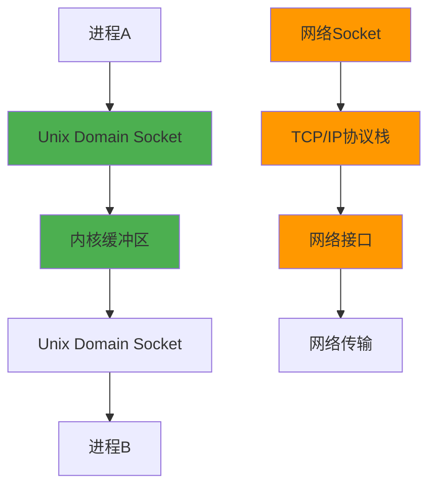
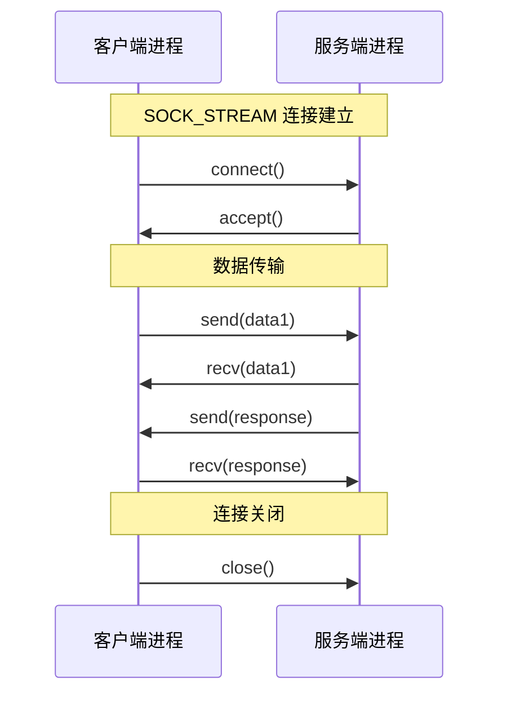
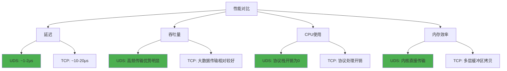
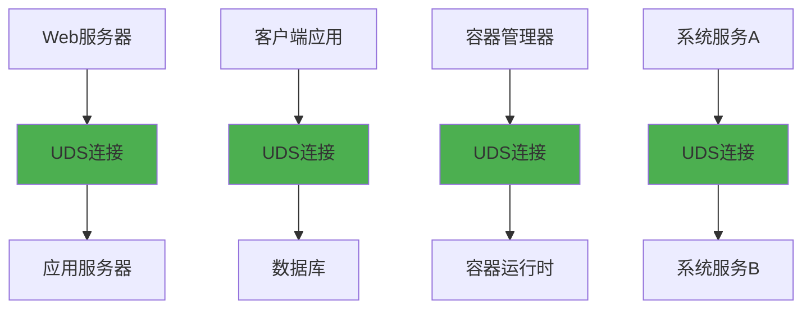
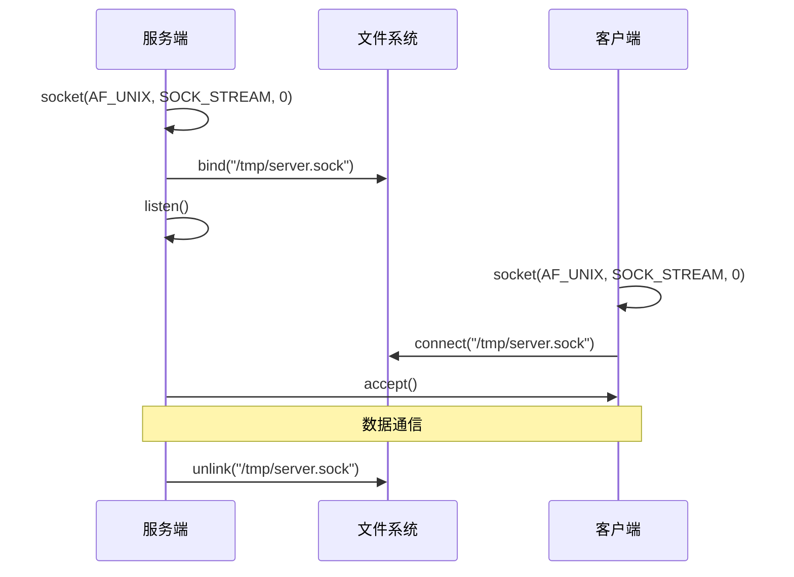

# 5.3.2 unix domain socket是什么

Unix Domain Socket（UDS）是一种特殊的socket类型，它专门用于同一台机器上的进程间通信。与网络socket不同，UDS完全绕过了网络协议栈，直接在内核中进行数据传输，这正是socket通信不一定要走网络协议栈的最佳例证。

## Unix Domain Socket的基本概念

Unix Domain Socket是一种基于文件系统的进程间通信机制，它使用文件系统中的路径作为地址标识。

**地址表示**：UDS使用文件系统路径作为地址，例如`/tmp/my_socket`或`/var/run/app.sock`。

**通信范围**：只能在同一台机器上的进程之间通信，无法跨网络使用。

**协议栈绕过**：数据传输完全在内核内存中进行，不经过TCP/IP协议栈处理。

**文件系统可见性**：socket文件在文件系统中可见，可以通过文件权限控制访问。

## UDS的两种类型

Unix Domain Socket支持两种主要的通信类型，对应不同的使用场景。

**SOCK_STREAM类型**：提供可靠的、有序的、双向的字节流通信，类似于TCP的特性但没有网络开销。

**SOCK_DGRAM类型**：提供无连接的数据报通信，类似于UDP的特性但保证在本地不会丢包。

**性能差异**：STREAM类型提供更强的可靠性保证，DGRAM类型提供更低的延迟。

**使用选择**：大多数应用场景选择STREAM类型，因为它提供了更好的数据完整性保证。

## 与网络socket的性能对比

UDS相比网络socket有显著的性能优势，这些优势来自于绕过网络协议栈的设计。

**延迟对比**：UDS的延迟通常比本地TCP连接低50-80%，因为避免了协议栈的处理开销。

**吞吐量优势**：在高频小数据传输场景下，UDS的吞吐量可以比TCP高2-3倍。

**CPU使用率**：UDS消耗的CPU资源明显更少，因为没有协议处理和校验开销。

**内存效率**：数据在内核中直接传输，减少了多次内存拷贝。

## 实际应用场景

UDS在很多实际应用中都有重要作用，特别是在需要高性能本地通信的场景。

**数据库连接**：PostgreSQL、MySQL等数据库都支持通过UDS连接，提供比TCP连接更好的性能。

**Web服务器通信**：Nginx与PHP-FPM、uWSGI等后端服务的通信经常使用UDS。

**容器运行时**：Docker daemon与容器之间的通信大量使用UDS。

**系统服务**：systemd、dbus等系统服务广泛使用UDS进行进程间通信。

**微服务架构**：在同一节点上的微服务之间可以使用UDS进行高效通信。

## 文件权限和安全性

UDS的安全性主要通过文件系统权限来控制，这提供了灵活的访问控制机制。

**文件权限控制**：可以通过chmod设置socket文件的访问权限，控制哪些用户和组可以连接。

**目录权限**：socket文件所在目录的权限也会影响访问控制。

**用户身份验证**：内核可以提供连接进程的用户ID和组ID信息，支持身份验证。

**进程凭据传递**：UDS支持传递进程凭据（PID、UID、GID），增强安全性。

**文件描述符传递**：UDS还支持在进程间传递文件描述符，这是网络socket无法实现的功能。

## 编程接口和使用方法

UDS的编程接口与网络socket非常相似，但有一些特殊的地方。

**地址结构**：使用`struct sockaddr_un`结构体，包含地址族和文件路径。

**创建socket**：使用`socket(AF_UNIX, SOCK_STREAM, 0)`创建UDS。

**绑定地址**：服务端需要bind到一个文件路径，客户端connect到同一路径。

**文件清理**：服务端退出时需要unlink socket文件，避免文件残留。

**抽象命名空间**：Linux支持抽象命名空间，使用以'\0'开头的路径，不在文件系统中创建实际文件。

## 限制和注意事项

虽然UDS有很多优势，但也有一些限制需要注意。

**本地限制**：只能在同一台机器上使用，无法跨网络通信。

**路径长度限制**：socket路径有长度限制（通常是108字节），需要注意路径设计。

**文件系统依赖**：依赖文件系统，在某些特殊环境下可能有限制。

**权限管理复杂性**：需要正确管理文件权限，避免安全问题。

**清理责任**：服务端需要负责清理socket文件，避免文件残留。

**平台差异**：不同操作系统的UDS实现可能有细微差异。

## 性能优化技巧

为了充分发挥UDS的性能优势，有一些优化技巧值得注意。

**缓冲区大小调优**：合理设置socket缓冲区大小，平衡内存使用和性能。

**批量传输**：尽量批量传输数据，减少系统调用次数。

**非阻塞I/O**：结合epoll等机制使用非阻塞I/O，提高并发性能。

**连接池**：对于频繁通信的场景，可以使用连接池减少连接建立开销。

**数据序列化优化**：选择高效的数据序列化格式，减少数据处理开销。

Unix Domain Socket作为绕过网络协议栈的典型代表，在现代系统架构中发挥着重要作用。它不仅提供了高性能的本地通信能力，还通过文件系统权限提供了灵活的安全控制机制。理解和掌握UDS的特性，对于构建高性能的本地通信系统具有重要意义。

---

*本文档为《网络101》系列的一部分*
