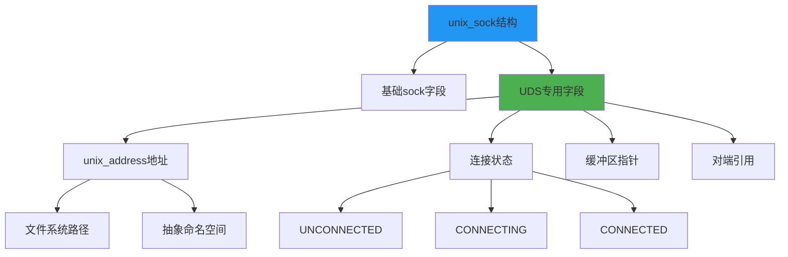
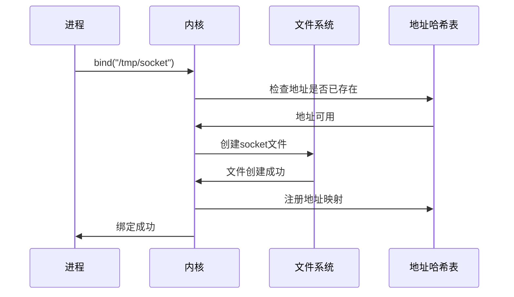
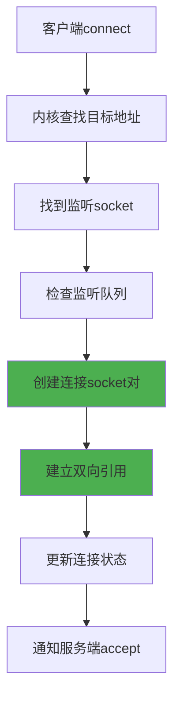
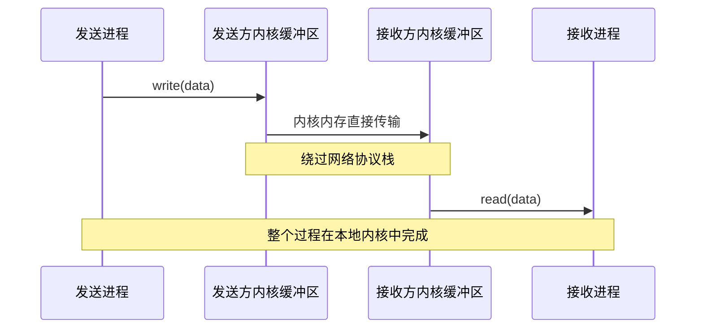
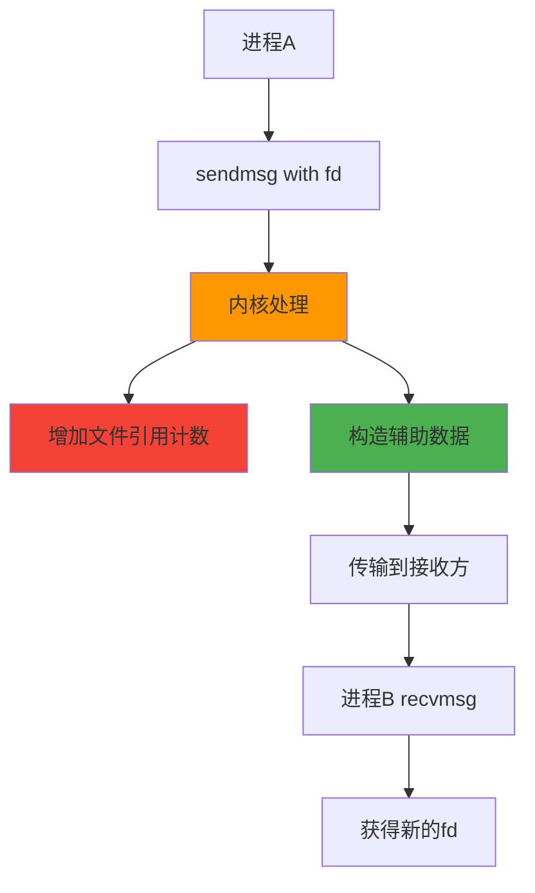
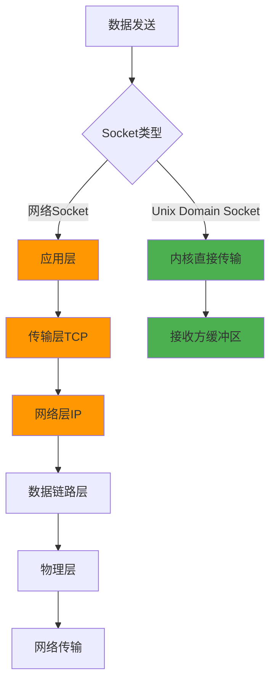

# 5.3.3 unix domain socket内核实现

要真正理解Unix Domain Socket为什么能够绕过网络协议栈，我们需要深入内核层面，看看它的实现机制。UDS的内核实现展示了一种完全不同于网络socket的数据传输路径，这种设计是高性能本地通信的关键所在。

## 内核数据结构设计

UDS在内核中有着独特的数据结构设计，这些结构专门为本地通信优化。

**unix_sock结构**：这是UDS在内核中的核心数据结构，继承自通用的sock结构，但添加了专门用于本地通信的字段。

**地址管理**：UDS使用unix_address结构来管理文件系统路径，支持普通路径和抽象命名空间两种模式。

**连接状态管理**：通过unix_sock中的状态字段来跟踪连接的建立、数据传输和关闭过程。

**缓冲区管理**：UDS使用专门的缓冲区管理机制，直接在内核内存中进行数据传输。

## 地址绑定和查找机制

UDS的地址绑定机制与网络socket完全不同，它直接与文件系统交互。

**文件系统绑定**：当UDS绑定到一个路径时，内核会在文件系统中创建一个特殊的socket文件。

**全局哈希表**：内核维护一个全局的哈希表来快速查找已绑定的UDS地址。

**抽象命名空间**：对于抽象命名空间的socket，内核使用单独的哈希表管理，不涉及文件系统操作。

**地址冲突检测**：内核在绑定时会检查地址是否已被使用，确保地址的唯一性。

**权限检查**：绑定过程中会进行文件系统权限检查，确保进程有权限在指定位置创建socket文件。

## 连接建立过程

UDS的连接建立过程完全在内核中完成，不涉及网络协议栈的三次握手。

**客户端连接请求**：客户端调用connect时，内核通过地址哈希表找到目标socket。

**服务端监听队列**：服务端的监听socket维护一个连接请求队列，类似于TCP的SYN队列但更简单。

**连接建立**：一旦匹配成功，内核直接建立两个socket之间的连接，无需网络协议处理。

**双向引用**：连接建立后，两个socket会相互引用，形成双向的通信通道。

**状态同步**：连接建立过程中，两端的socket状态会同步更新。

## 数据传输机制

UDS的数据传输是其高性能的核心，完全绕过了网络协议栈的处理。

**直接内存传输**：数据直接在内核内存中从发送方的缓冲区传输到接收方的缓冲区。

**零拷贝优化**：在某些情况下，UDS可以实现零拷贝传输，直接共享内存页面。

**流控制机制**：虽然没有网络协议栈，但UDS仍然实现了简单的流控制，防止接收方缓冲区溢出。

**原子性保证**：对于SOCK_DGRAM类型，UDS保证消息的原子性传输。

**顺序保证**：对于SOCK_STREAM类型，UDS保证数据的顺序传输。

## 文件描述符传递实现

UDS支持文件描述符传递，这是一个独特的功能，需要特殊的内核实现。

**辅助数据机制**：通过sendmsg和recvmsg的辅助数据（ancillary data）机制传递文件描述符。

**引用计数管理**：传递文件描述符时，内核需要正确管理文件对象的引用计数。

**权限继承**：接收方获得的文件描述符会继承原有的权限和属性。

**跨进程共享**：这种机制允许不相关的进程共享文件描述符，实现资源共享。

**安全考虑**：内核需要确保文件描述符传递的安全性，防止权限泄露。

## 内存管理和缓冲区设计

UDS的内存管理针对本地通信进行了专门优化。

**专用缓冲区**：UDS使用专门设计的缓冲区，不同于网络socket的sk_buff结构。

**动态调整**：缓冲区大小可以根据数据传输需求动态调整。

**内存池管理**：内核使用内存池来管理UDS缓冲区，提高分配效率。

**垃圾回收**：当连接关闭时，内核会及时回收相关的内存资源。

**内存映射优化**：对于大数据传输，UDS可以使用内存映射技术提高效率。

## 与网络协议栈的对比

通过对比UDS和网络socket的内核实现，可以清楚地看到性能差异的根源。

**协议处理**：网络socket需要经过TCP/IP协议栈的多层处理，而UDS直接在内核中传输数据。

**数据拷贝次数**：网络socket通常需要多次数据拷贝，UDS可以减少拷贝次数。

**中断处理**：网络socket需要处理网络中断，UDS不需要中断处理。

**错误检测**：网络socket需要复杂的错误检测和重传机制，UDS的错误处理更简单。

**状态管理**：网络socket的状态机更复杂，UDS的状态管理相对简单。

## 性能优化的内核机制

UDS在内核层面实现了多种性能优化机制。

**批量传输优化**：内核可以将多个小的数据包合并成一个大的传输操作。

**CPU亲和性**：UDS可以利用CPU亲和性，在同一CPU核心上处理相关的操作。

**缓存友好设计**：数据结构设计考虑了CPU缓存的特性，提高访问效率。

**锁优化**：使用细粒度的锁机制，减少锁竞争。

**无锁数据结构**：在某些场景下使用无锁数据结构，进一步提高性能。

## 调试和监控支持

内核为UDS提供了丰富的调试和监控支持。

**proc文件系统**：通过/proc/net/unix可以查看系统中所有的UDS连接信息。

**统计信息**：内核维护详细的UDS使用统计信息。

**调试接口**：提供专门的调试接口，帮助开发者分析UDS的行为。

**性能计数器**：内核级别的性能计数器可以帮助分析UDS的性能特征。

**错误日志**：详细的错误日志帮助诊断UDS相关的问题。

UDS的内核实现展示了一种完全不同于网络通信的设计思路。通过绕过网络协议栈，直接在内核中进行数据传输，UDS实现了高性能的本地进程间通信。这种设计不仅提供了优异的性能，还保持了socket编程接口的一致性，使得开发者可以轻松地在网络通信和本地通信之间切换。理解UDS的内核实现机制，对于深入理解操作系统的进程间通信和网络子系统具有重要意义。

---

*本文档为《网络101》系列的一部分*
