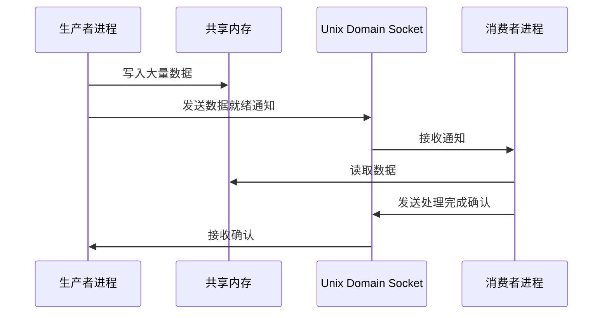
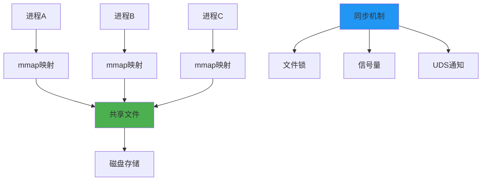
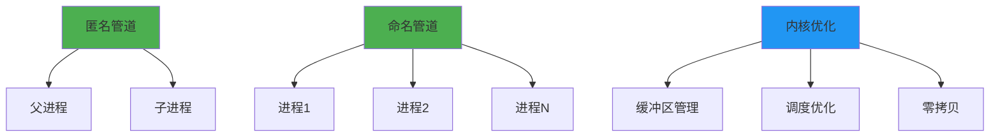
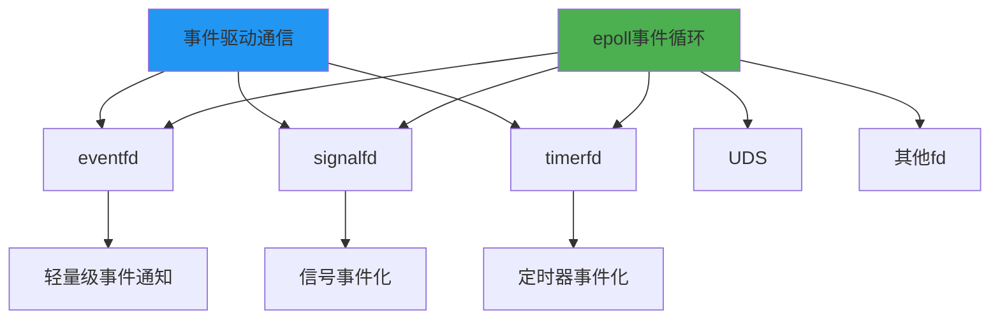
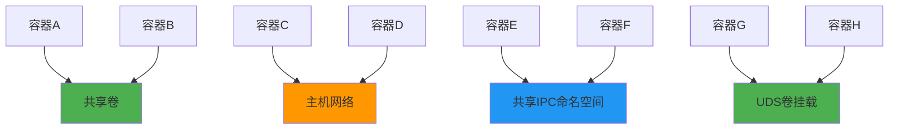
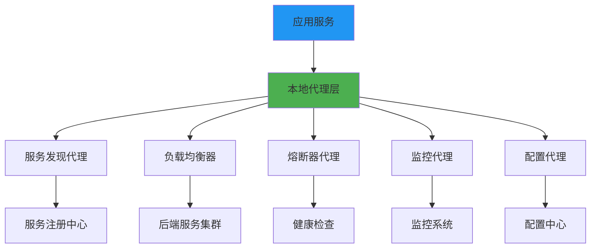

# 5.3.4 还有哪些使用场景

除了我们已经讨论的sidecar架构和Unix Domain Socket，还有许多其他场景展示了socket通信可以绕过或优化网络协议栈的处理。这些场景在现代系统架构中越来越重要，它们共同构成了高性能本地通信的完整图景。

## 共享内存结合socket通知

共享内存是最高效的进程间通信方式，但它需要同步机制。将共享内存与socket通知结合，可以实现既高效又可靠的通信模式。

**基本工作原理**：大量数据通过共享内存传输，而控制信息和同步信号通过UDS传递。

**性能优势**：避免了大数据的拷贝开销，同时保持了良好的同步机制。

**应用场景**：高频交易系统、实时音视频处理、大数据分析等对性能要求极高的场景。

**实现模式**：生产者将数据写入共享内存后，通过UDS发送通知；消费者收到通知后从共享内存读取数据。

## 内存映射文件通信

内存映射文件（mmap）提供了另一种绕过传统网络协议栈的通信方式。

**文件映射机制**：多个进程将同一个文件映射到各自的地址空间，实现数据共享。

**同步控制**：通过文件锁、信号量或UDS进行同步控制。

**持久化优势**：数据可以持久化到磁盘，提供了比纯内存通信更好的可靠性。

**跨语言支持**：不同编程语言的进程都可以通过mmap进行通信。

**性能特点**：对于大文件的随机访问，mmap比传统的read/write更高效。

## 管道和命名管道优化

传统的管道通信也可以通过优化实现高性能的本地通信。

**匿名管道**：父子进程间的高效通信，完全在内核中处理。

**命名管道（FIFO）**：不相关进程间的通信，通过文件系统路径标识。

**内核优化**：现代内核对管道进行了大量优化，包括缓冲区管理和调度优化。

**零拷贝支持**：某些情况下，管道可以实现零拷贝数据传输。

**批量传输**：通过调整管道缓冲区大小，可以优化批量数据传输的性能。

## 信号量和消息队列结合

System V IPC机制虽然古老，但在某些场景下仍然有其价值。

**消息队列**：提供了结构化的消息传递机制，支持优先级和类型过滤。

**信号量集合**：提供了复杂的同步控制机制，支持原子操作。

**共享内存段**：System V共享内存提供了标准化的共享内存接口。

**组合使用**：将这些机制组合使用，可以构建复杂的进程间通信系统。

**现代替代**：POSIX IPC提供了更现代的替代方案，性能和可移植性更好。

## 事件驱动的本地通信

基于事件的通信模式在本地通信中也有重要应用。

**eventfd机制**：Linux特有的轻量级事件通知机制，比管道更高效。

**signalfd机制**：将信号转换为文件描述符事件，便于集成到事件循环中。

**timerfd机制**：将定时器转换为文件描述符事件，支持高精度定时。

**epoll集成**：这些机制都可以与epoll集成，构建高性能的事件驱动系统。

## 容器间通信优化

在容器化环境中，有多种方式可以优化容器间的通信。

**共享卷通信**：通过共享卷实现容器间的文件共享和通信。

**主机网络模式**：容器使用主机网络栈，避免了网络虚拟化的开销。

**IPC命名空间共享**：容器共享IPC命名空间，可以使用System V IPC机制通信。

**UDS卷挂载**：将UDS文件通过卷挂载的方式在容器间共享。

**内存卷优化**：使用内存文件系统（tmpfs）作为共享卷，提高I/O性能。

## 数据库连接优化场景

数据库连接是本地高性能通信的重要应用场景。

**连接池代理**：使用本地socket连接到连接池代理，代理管理实际的数据库连接。

**本地缓存层**：在应用和数据库之间插入本地缓存层，通过UDS通信。

**读写分离代理**：本地代理根据SQL类型将请求路由到不同的数据库实例。

**事务协调器**：分布式事务的本地协调器，通过高性能本地通信协调事务状态。

**查询结果缓存**：将查询结果缓存在本地，通过UDS提供快速访问。

## 微服务网格优化

在微服务架构中，本地通信优化变得越来越重要。

**服务发现代理**：本地服务发现代理缓存服务注册信息，通过UDS提供查询服务。

**负载均衡器**：本地负载均衡器根据实时状态进行请求分发。

**熔断器代理**：本地熔断器监控服务健康状态，提供快速失败机制。

**监控数据收集**：本地监控代理收集应用指标，通过高效的本地通信传输数据。

**配置管理代理**：本地配置代理缓存配置信息，提供快速的配置查询服务。

## 实时系统中的应用

在实时系统中，本地高性能通信具有特殊的重要性。

**实时数据处理**：传感器数据通过共享内存快速传递给处理进程。

**控制系统通信**：控制器与执行器之间的通信需要极低的延迟。

**实时监控**：系统状态监控需要高频率的数据采集和传输。

**故障检测**：实时故障检测系统需要快速的进程间通信。

**时间同步**：精确的时间同步需要高性能的本地通信机制。

## 性能监控和调优

为了充分发挥这些通信机制的性能，需要有效的监控和调优。

**性能指标监控**：延迟、吞吐量、CPU使用率、内存使用率等关键指标。

**瓶颈识别**：通过性能分析工具识别通信瓶颈。

**参数调优**：缓冲区大小、进程调度策略、CPU亲和性等参数的优化。

**负载测试**：模拟高负载场景，验证通信机制的性能表现。

**故障诊断**：当通信出现问题时，快速定位和解决问题的能力。

这些多样化的使用场景展示了绕过或优化网络协议栈的巨大价值。在现代系统架构中，合理选择和组合这些通信机制，可以显著提升系统的整体性能。关键是要根据具体的应用场景、性能要求和系统约束，选择最适合的通信方式。随着系统复杂性的增加，这种本地高性能通信的重要性只会越来越突出。

---

*本文档为《网络101》系列的一部分*
