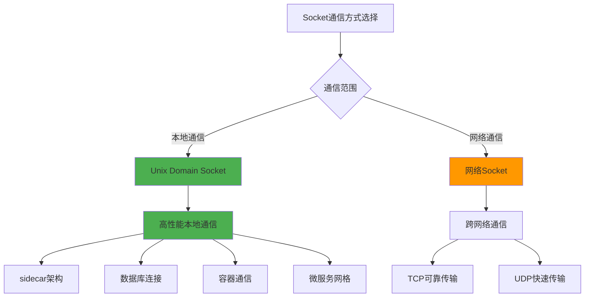

# 5.3.5 小结

通过本章的深入探讨，我们彻底颠覆了"使用socket就一定要走网络协议栈"的传统认知。从sidecar架构到Unix Domain Socket，从内核实现机制到丰富的应用场景，我们看到了一个完整的本地高性能通信生态系统。

## 核心发现总结

我们的探索揭示了几个重要的技术事实。首先，socket作为一个通用的通信抽象，并不仅仅局限于网络通信。Unix Domain Socket完全绕过了网络协议栈，直接在内核中进行数据传输，这种设计带来了显著的性能优势。其次，现代系统架构中大量使用了本地高性能通信机制，从微服务的sidecar模式到数据库的本地连接，这些应用场景都证明了绕过网络协议栈的实际价值。

**性能优势的根源**在于减少了不必要的协议处理开销。网络协议栈虽然为跨网络通信提供了可靠性保证，但在本地通信场景下，这些保证变成了性能负担。通过直接的内核内存传输，UDS可以实现比TCP连接低50-80%的延迟，在高频小数据传输场景下吞吐量提升2-3倍。

**编程接口的一致性**是这些技术成功的关键因素。无论是网络socket还是Unix Domain Socket，它们都使用相同的编程接口，这使得开发者可以轻松地在不同的通信方式之间切换，根据实际需求选择最优的解决方案。

## 技术选择的指导原则

在实际应用中，选择合适的通信机制需要考虑多个维度的因素。

**通信范围**是首要考虑因素。如果通信双方在同一台机器上，Unix Domain Socket几乎总是更好的选择。如果需要跨网络通信，则必须使用网络socket。

**性能要求**决定了具体的实现方式。对于高频率、低延迟的通信需求，应该优先考虑UDS或共享内存结合socket通知的方案。对于大数据传输，可以考虑内存映射文件或共享内存的方案。

**安全性需求**也是重要的考虑因素。UDS通过文件系统权限提供了灵活的访问控制，而网络socket需要考虑更复杂的网络安全问题。

**可维护性和复杂性**需要平衡。虽然本地高性能通信可以带来性能优势，但也会增加系统的复杂性。需要根据团队的技术能力和维护成本来做出权衡。

## 现代架构中的应用模式

在现代系统架构中，我们看到了几种典型的应用模式正在成为主流。

**分层代理模式**将复杂的网络功能抽象到独立的代理进程中，应用程序通过高性能的本地通信与代理交互。这种模式在服务网格、数据库连接池、缓存系统中都有广泛应用。

**混合通信模式**根据不同的通信需求选择不同的机制。控制信息通过UDS传递，大数据通过共享内存传输，这种组合方式可以充分发挥各种机制的优势。

**事件驱动模式**将各种通信机制统一到事件循环中，通过epoll等机制实现高并发的处理能力。这种模式特别适合需要处理大量并发连接的场景。

## 性能优化的最佳实践

基于我们的分析，可以总结出一些性能优化的最佳实践。

**合理选择通信机制**是性能优化的基础。不要盲目使用网络socket，要根据实际的通信需求选择最合适的机制。

**优化缓冲区配置**可以显著影响性能。合理设置socket缓冲区大小，使用批量传输减少系统调用次数。

**利用零拷贝技术**在可能的情况下减少数据拷贝次数。sendfile、splice等系统调用可以在某些场景下实现零拷贝传输。

**考虑CPU亲和性**将相关的进程绑定到同一CPU核心或同一NUMA节点，可以提高缓存命中率和减少内存访问延迟。

## 未来发展趋势

随着技术的发展，本地高性能通信的重要性还会继续增加。

**容器化和微服务**的普及使得同一节点上的服务间通信变得更加重要。优化这些通信路径可以显著提升整体系统性能。

**边缘计算**的兴起对本地通信性能提出了更高的要求。在资源受限的边缘设备上，高效的本地通信机制变得至关重要。

**实时系统**的需求推动了对超低延迟通信的探索。未来可能会出现更多专门针对实时场景优化的通信机制。

**硬件加速**技术的发展可能会为本地通信带来新的优化机会。RDMA、智能网卡等技术的普及可能会改变本地通信的实现方式。

## 学习和实践建议

对于希望深入掌握这些技术的开发者，我们提供一些学习建议。

**理论基础**很重要，需要深入理解操作系统的进程间通信机制、内核的网络子系统实现、以及各种通信机制的优缺点。

**实践经验**同样关键，建议通过实际项目来体验不同通信机制的性能差异。可以编写简单的性能测试程序，对比不同机制在各种场景下的表现。

**性能分析技能**是必备的，需要掌握各种性能分析工具，能够识别通信瓶颈并进行针对性优化。

**系统思维**最为重要，要从整体系统的角度来考虑通信机制的选择，而不是孤立地看待某个技术点。

通过本章的学习，我们不仅了解了socket通信的多样性，更重要的是建立了正确的技术选择思维。在面对具体的系统设计问题时，我们应该根据实际需求来选择最合适的通信机制，而不是被传统的认知所束缚。这种灵活的技术思维，正是现代系统架构师应该具备的核心能力。

---

*本文档为《网络101》系列的一部分*
