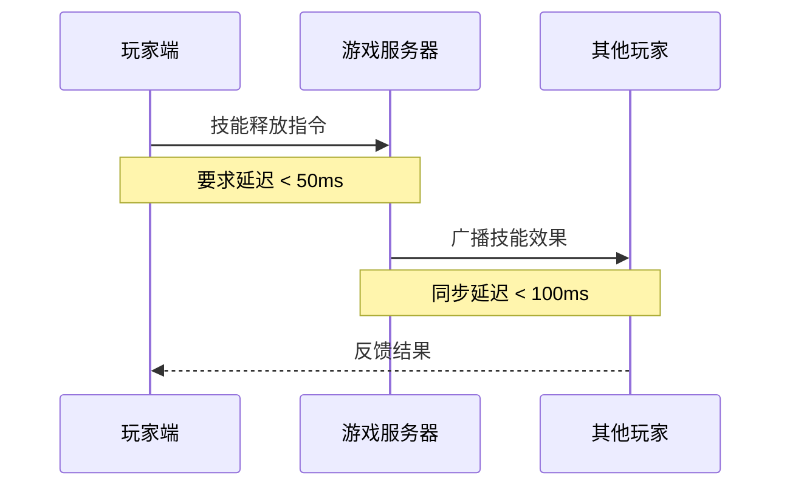
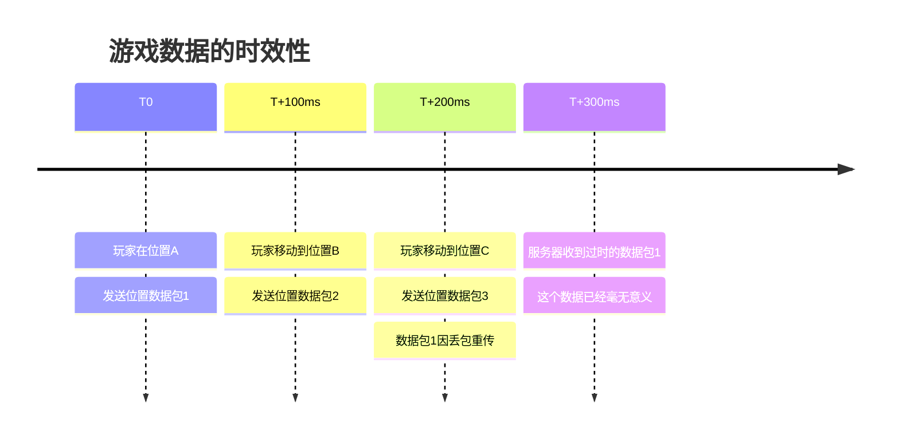
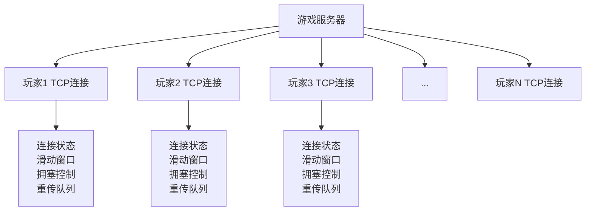

# 为什么要用UDP而不是TCP

当我们讨论网络游戏的协议选择时，经常会听到一个看似反直觉的结论：大多数实时网络游戏都选择UDP而非TCP。这个选择背后有着深刻的技术考量。要理解为什么游戏开发者会"放弃"TCP的可靠性保证，我们需要从游戏通信的特殊需求说起。

## 实时性：游戏的生命线

想象一下，你正在《原神》中与朋友组队挑战深渊螺旋。当你按下技能键的那一刻，这个操作需要立即传输到服务器，并同步给组队的其他玩家。如果有任何延迟，可能导致技能释放时机错失，影响整个队伍的配合。

在这种场景下，网络通信的实时性要求极为苛刻：

TCP的问题在于它的"完美主义"。当网络出现丢包时，TCP会停下来等待重传，直到确保所有数据都正确到达。这种机制对于文件下载很好，但对于游戏来说却是灾难性的。一个丢失的数据包可能让整个TCP连接停滞数百毫秒，而在游戏中，这几百毫秒足以决定胜负。

## 过时数据的无价值性

游戏数据有一个重要特点：具有强烈的时效性。比如玩家角色的位置信息，如果200毫秒前的位置数据现在才到达，它基本上已经没有价值了——玩家早就移动到新的位置了。

在这种情况下，TCP的可靠传输反而成了累赘。我们宁愿丢掉过时的数据，也不愿意为了等待重传而影响新数据的传输。

## 连接状态的复杂性

TCP是面向连接的协议，需要维护复杂的连接状态：

- **连接建立**：三次握手的开销
- **状态维护**：滑动窗口、拥塞控制等机制
- **连接清理**：四次挥手的过程

对于游戏服务器来说，需要同时处理成千上万的玩家连接。每个TCP连接都需要维护大量的状态信息，这对服务器的内存和CPU都是巨大的负担。

相比之下，UDP是无连接的。服务器只需要知道数据来自哪个IP地址和端口，不需要维护复杂的连接状态，这大大降低了服务器的负担。

## 带宽效率考量

TCP的头部开销相对较大（20字节），而且为了保证可靠性，还有各种确认机制。对于游戏中频繁发送的小数据包（比如玩家位置、状态变化等），这些开销占比相当大。

假设游戏每秒需要发送20次位置更新，每次数据只有10字节：

- **使用TCP**：(20字节头部 + 10字节数据) × 20次 = 600字节/秒 额外开销
- **使用UDP**：(8字节头部 + 10字节数据) × 20次 = 360字节/秒 额外开销

看起来差异不大，但考虑到TCP还有确认包、重传等额外流量，实际的带宽消耗可能是UDP的2-3倍。

## 控制权的重要性

选择UDP的另一个重要原因是控制权。使用UDP时，所有的可靠性机制都可以在应用层实现，开发者可以根据游戏的具体需求来定制：

- 对于关键数据（如游戏结果、道具获得），可以实现可靠传输
- 对于实时数据（如位置、动画），可以选择不可靠但快速的传输
- 可以实现优化的重传机制，比如只重传最新的数据

这种灵活性是TCP无法提供的。TCP的可靠性是"一刀切"的——要么全部可靠，要么就不要用TCP。

## 实际的选择策略

当然，这并不意味着游戏完全抛弃了可靠性。现代游戏通常采用混合策略：

1. **关键数据使用可靠传输**：登录验证、交易确认、重要状态变更
2. **实时数据使用不可靠传输**：位置同步、动画状态、临时效果
3. **在应用层实现定制的可靠性机制**

这就是为什么会有像KCP这样的协议出现——它试图在UDP的基础上，提供比TCP更适合游戏场景的可靠传输机制。

## 总结

游戏选择UDP而非TCP，本质上是在可靠性和实时性之间做出的权衡。对于游戏这种对延迟极度敏感的应用来说，实时性往往比完美的可靠性更重要。通过UDP，游戏开发者获得了完全的控制权，可以根据不同类型的数据实现不同的传输策略，这种灵活性正是现代网络游戏能够提供流畅体验的关键所在。

---

*本文档为《网络101》系列的一部分*