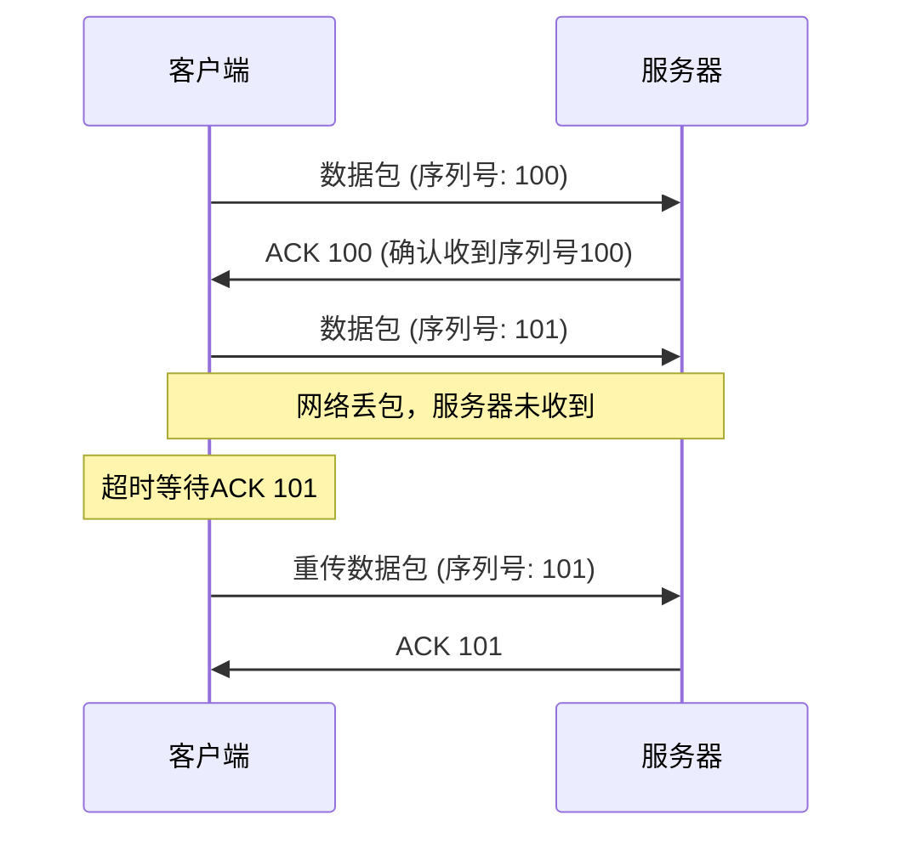
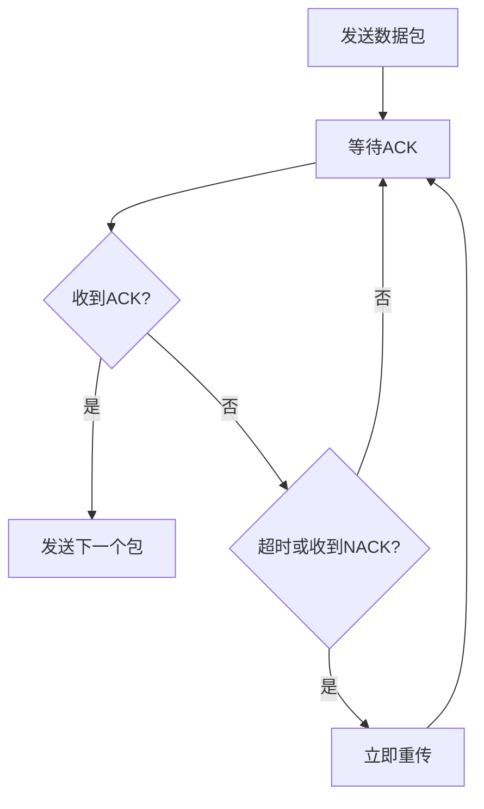
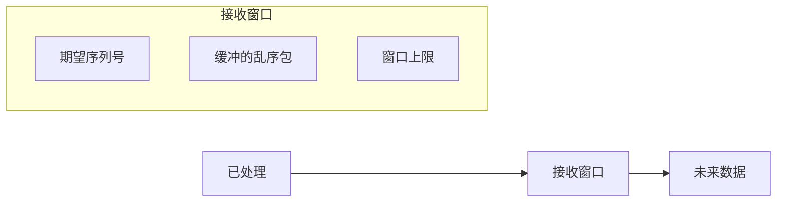
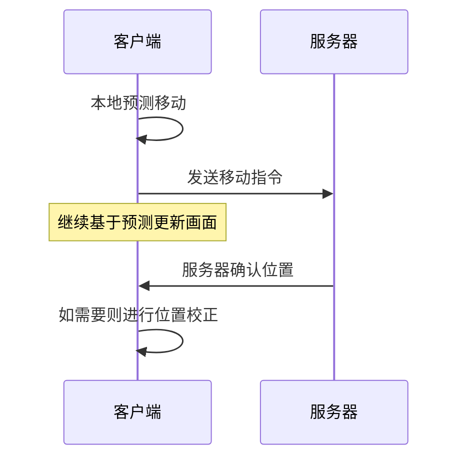

# UDP如何变得可靠

前面我们了解了为什么游戏倾向于选择UDP而非TCP，但UDP的不可靠性也带来了新的挑战。如何在保持UDP高效特性的同时，为需要的数据提供可靠性保证？这就需要在应用层构建自己的可靠传输机制。

## 应用层可靠性的基本思路

在UDP之上实现可靠性，本质上是要解决三个核心问题：

1. **如何确认数据已到达**（确认机制）
2. **如何处理数据丢失**（重传机制）
3. **如何保证数据顺序**（序列号机制）

这些机制的设计需要根据游戏的具体需求来权衡效率和可靠性。

## 确认机制（ACK）

最基础的可靠性保证是确认机制。发送方发出数据后，接收方需要发回确认消息：



但游戏场景下的确认机制需要优化：

### 1. 选择性确认

不是所有数据都需要确认。游戏可以根据数据重要性分级：

```python
# 伪代码示例
class GamePacket:
    def __init__(self, data, reliable=False):
        self.data = data
        self.reliable = reliable  # 是否需要可靠传输
        self.seq_id = generate_seq_id()

# 关键数据需要确认
login_packet = GamePacket(login_data, reliable=True)

# 位置更新不需要确认
position_packet = GamePacket(position_data, reliable=False)
```

### 2. 批量确认

为了减少网络开销，可以在一个ACK中确认多个数据包：

```
ACK: [100, 101, 102, 105, 106]  # 确认收到这些序列号的包
缺失: [103, 104]                # 隐含这些包需要重传
```

## 重传机制

当检测到数据丢失时，需要进行重传。但游戏的重传策略与传统TCP有很大不同：

### 1. 快速重传

不等待超时，一旦检测到丢包就立即重传：



### 2. 数据过期策略

对于有时效性的数据，如果重传延迟过长，直接丢弃：

```python
class ReliableUDP:
    def __init__(self):
        self.pending_packets = {}  # 等待确认的包

    def send_packet(self, packet):
        packet.send_time = current_time()
        packet.expire_time = current_time() + packet.ttl

        self.pending_packets[packet.seq_id] = packet
        self.network_send(packet)

    def check_retransmit(self):
        current = current_time()
        for seq_id, packet in list(self.pending_packets.items()):
            if current > packet.expire_time:
                # 数据已过期，不再重传
                del self.pending_packets[seq_id]
            elif current > packet.send_time + packet.retransmit_timeout:
                # 需要重传
                packet.send_time = current
                self.network_send(packet)
```

## 顺序保证

UDP不保证数据包的顺序，但某些游戏数据需要按顺序处理。可以通过序列号来实现：

### 1. 接收缓冲区

```python
class OrderedReceiver:
    def __init__(self):
        self.expected_seq = 0
        self.buffer = {}  # 乱序数据包缓冲区

    def receive_packet(self, packet):
        if packet.seq_id == self.expected_seq:
            # 按序到达，立即处理
            self.process_packet(packet)
            self.expected_seq += 1

            # 检查缓冲区中是否有后续包
            while self.expected_seq in self.buffer:
                self.process_packet(self.buffer[self.expected_seq])
                del self.buffer[self.expected_seq]
                self.expected_seq += 1
        else:
            # 乱序到达，暂存
            self.buffer[packet.seq_id] = packet
```

### 2. 滑动窗口

限制乱序包的缓冲范围，避免内存无限增长：



## 流量控制

虽然UDP本身没有流量控制，但应用层可以实现：

### 1. 发送速率控制

```python
class RateLimiter:
    def __init__(self, max_packets_per_second):
        self.max_rate = max_packets_per_second
        self.last_send_time = 0
        self.sent_count = 0

    def can_send(self):
        current = current_time()
        if current - self.last_send_time >= 1.0:  # 每秒重置
            self.sent_count = 0
            self.last_send_time = current

        return self.sent_count < self.max_rate

    def record_send(self):
        self.sent_count += 1
```

### 2. 拥塞控制

检测网络拥塞并调整发送速率：

```python
class CongestionControl:
    def __init__(self):
        self.rtt_samples = []
        self.packet_loss_rate = 0
        self.send_rate = 100  # 初始发送速率

    def update_on_ack(self, rtt):
        self.rtt_samples.append(rtt)
        if len(self.rtt_samples) > 10:
            self.rtt_samples.pop(0)

        # RTT增加可能表示网络拥塞
        if self.get_avg_rtt() > self.threshold:
            self.reduce_rate()

    def update_on_loss(self):
        self.packet_loss_rate += 0.1
        self.reduce_rate()

    def reduce_rate(self):
        self.send_rate = max(10, self.send_rate * 0.8)
```

## 游戏特定的优化

### 1. 状态同步优化

对于游戏状态，可以只发送变化的部分：

```python
class GameStateSync:
    def __init__(self):
        self.last_state = {}

    def sync_state(self, current_state):
        diff = {}
        for key, value in current_state.items():
            if key not in self.last_state or self.last_state[key] != value:
                diff[key] = value

        if diff:
            self.send_reliable(diff)  # 只发送变化的数据
            self.last_state.update(diff)
```

### 2. 预测和补偿

结合客户端预测来减少对可靠性的依赖：



## 实际应用策略

在实际游戏中，通常会根据数据类型采用不同的可靠性策略：

| 数据类型 | 可靠性策略 | 原因 |
|---------|------------|------|
| 用户登录 | 强可靠性，多次重传 | 必须确保成功 |
| 游戏操作 | 中等可靠性，有限重传 | 重要但有时效性 |
| 位置同步 | 无可靠性，最新优先 | 实时性最重要 |
| 聊天消息 | 强可靠性，持久化 | 用户体验要求 |

## 总结

在UDP基础上构建可靠性，关键是找到效率和可靠性的平衡点。与TCP的"一刀切"不同，应用层的可靠性机制可以根据不同数据的重要性和时效性需求，实现精细化的控制。这种灵活性让游戏能够在保证关键数据可靠传输的同时，最大化实时数据的传输效率。

通过合理的确认机制、智能的重传策略、适度的顺序保证和有效的流量控制，UDP完全可以在游戏场景下提供既可靠又高效的数据传输服务。这正是现代网络游戏能够同时支持海量玩家和流畅体验的技术基础。

---

*本文档为《网络101》系列的一部分*