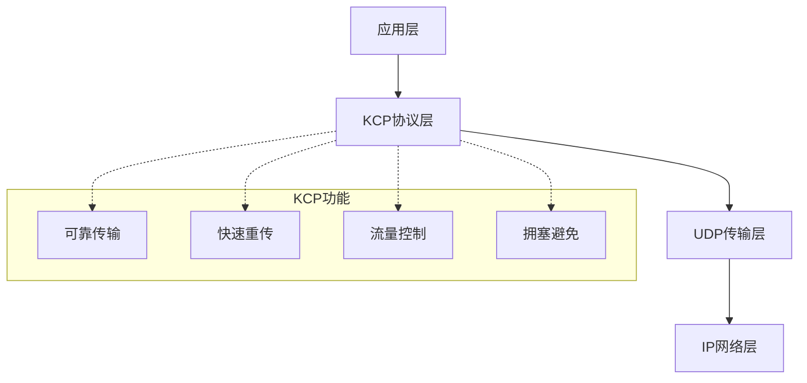
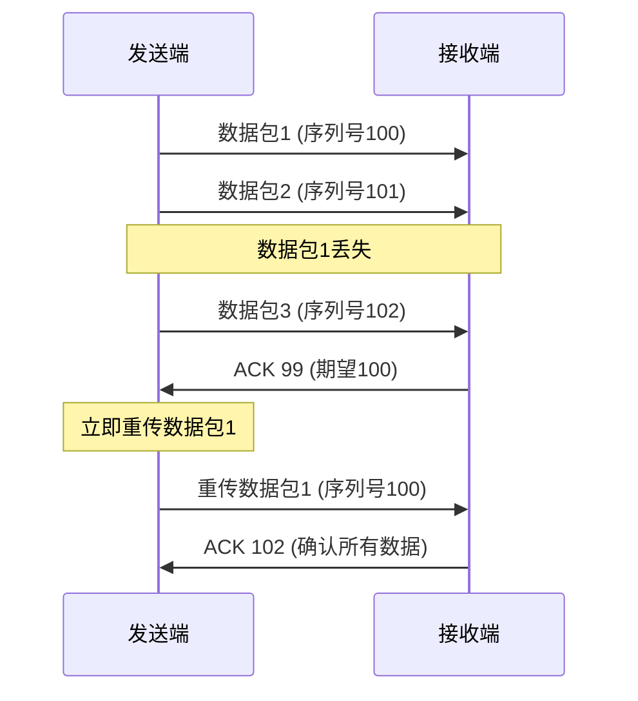
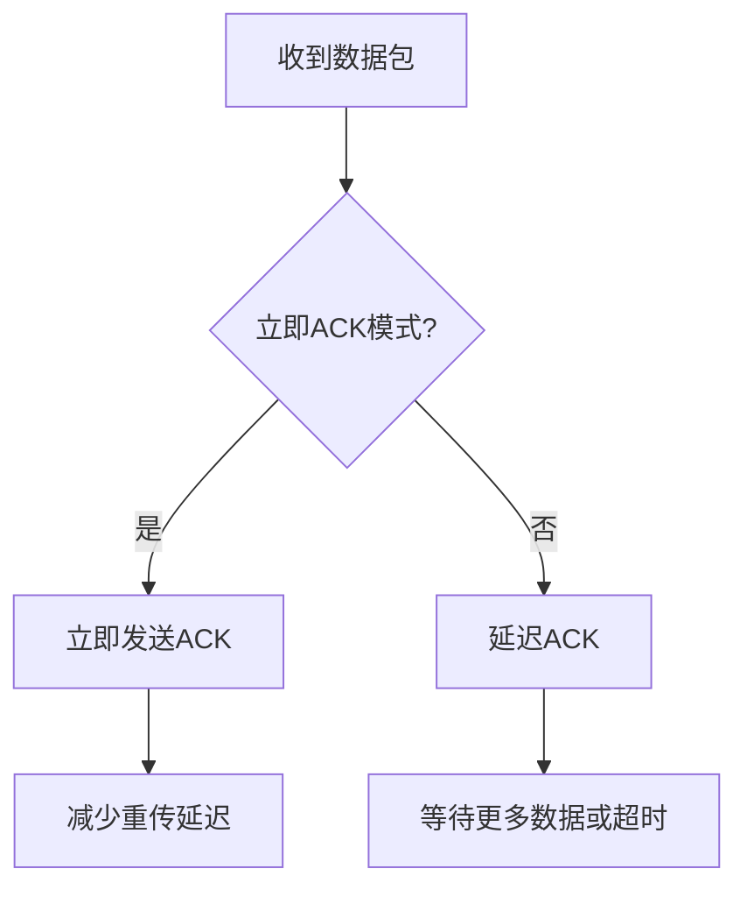
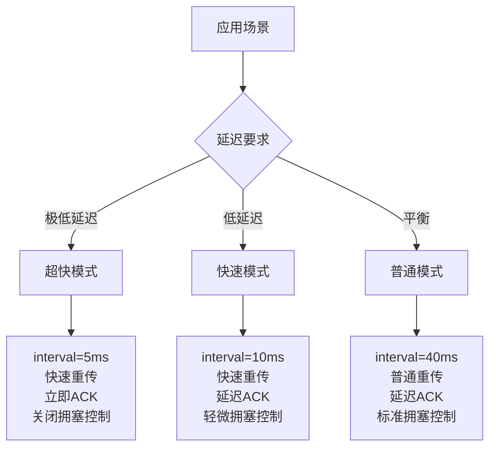
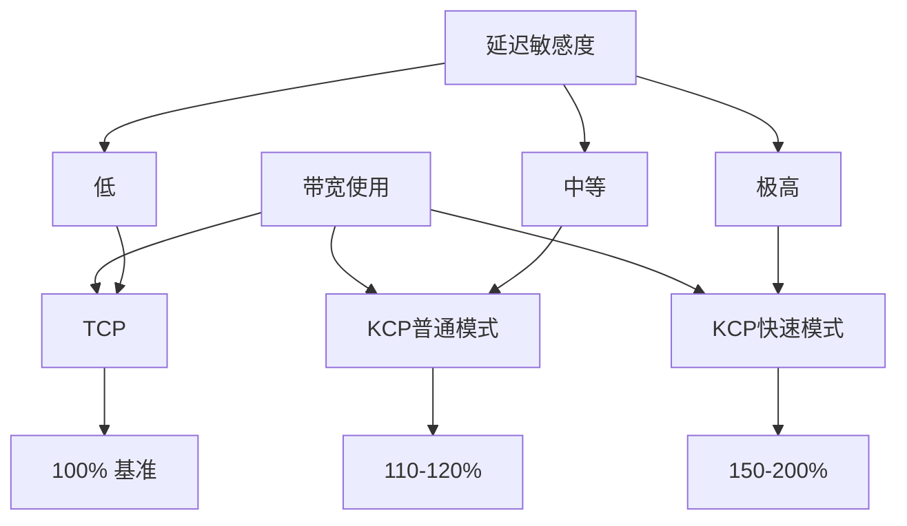

# KCP的功能

前面我们了解了如何在UDP基础上构建可靠性机制，但这种"重新发明轮子"的做法对每个游戏开发团队来说都是巨大的挑战。KCP（KCP is a fast and reliable ARQ protocol）正是为了解决这个问题而诞生的——它是一个专门为低延迟、可靠传输设计的应用层协议。

## KCP是什么

KCP可以理解为"更快的TCP"，它在UDP基础上实现了类似TCP的可靠传输，但专门针对实时应用进行了大量优化。KCP的设计目标很明确：在保证可靠性的前提下，将延迟降到最低。



## 核心功能特性

### 1. 快速重传机制

KCP最突出的特点是其激进的重传策略。传统TCP需要等待3个重复ACK才触发快速重传，而KCP只需要1个：



这种策略大大减少了重传延迟，特别适合游戏这种对延迟敏感的应用。

### 2. 自适应超时机制

KCP实现了比TCP更敏感的超时计算，能够更快地检测到丢包：

```python
# KCP超时计算示例（简化版）
class KCPTimeout:
    def __init__(self):
        self.rto = 30      # 初始重传超时时间(ms)
        self.min_rto = 30  # 最小RTO
        self.max_rto = 60000  # 最大RTO

    def update_rto(self, rtt):
        # KCP使用更敏感的RTO计算
        if self.srtt == 0:
            self.srtt = rtt
            self.rttvar = rtt / 2
        else:
            delta = abs(rtt - self.srtt)
            self.rttvar = (3 * self.rttvar + delta) / 4
            self.srtt = (7 * self.srtt + rtt) / 8

        # 计算RTO，比TCP更激进
        self.rto = max(self.min_rto, self.srtt + max(1, 4 * self.rttvar))
```

### 3. 选择性重传（SACK）

KCP支持选择性确认，只重传真正丢失的数据包：

```
发送方发送: [100, 101, 102, 103, 104]
接收方收到: [100, 102, 103, 104]  # 101丢失

接收方SACK: ACK 100, SACK [102-104]
发送方只重传: [101]
```

这比TCP的累积确认更高效，避免了不必要的重传。

### 4. 无延迟ACK

传统TCP为了提高效率会延迟发送ACK（通常是40ms），但KCP可以配置为立即发送ACK：



### 5. 流量控制优化

KCP的流量控制更适合实时应用：

```python
class KCPFlowControl:
    def __init__(self):
        self.snd_wnd = 32     # 发送窗口
        self.rcv_wnd = 32     # 接收窗口
        self.remote_wnd = 32  # 对方窗口大小

    def can_send(self, data_size):
        # 检查发送窗口是否有空间
        return self.snd_nxt - self.snd_una + data_size <= min(self.snd_wnd, self.remote_wnd)

    def update_window(self, ack, wnd):
        # 根据ACK更新窗口
        if ack > self.snd_una:
            self.snd_una = ack
        self.remote_wnd = wnd
```

## 工作模式配置

KCP提供了多种工作模式，可以根据应用需求调整：

### 1. 普通模式 vs 快速模式

```python
# 普通模式配置
kcp.nodelay(0, 40, 0, 0)
# nodelay=0: 不启用无延迟模式
# interval=40: 更新间隔40ms
# resend=0: 普通重传模式
# nc=0: 不关闭拥塞控制

# 快速模式配置
kcp.nodelay(1, 10, 2, 1)
# nodelay=1: 启用无延迟模式
# interval=10: 更新间隔10ms
# resend=2: 快速重传模式
# nc=1: 关闭拥塞控制
```

### 2. 不同场景的配置策略



## KCP的数据包格式

KCP在UDP基础上定义了自己的包头格式：

```
KCP数据包头部结构:
0               16              32
+-------+-------+-------+-------+
|  conv |  cmd  |  frg  |  wnd  |  conv: 会话ID
+-------+-------+-------+-------+  cmd: 命令类型
|        ts      |      sn       |  frg: 分片编号
+-------+-------+-------+-------+  wnd: 窗口大小
|        una     |      len      |  ts: 时间戳
+-------+-------+-------+-------+  sn: 序列号
|                               |  una: 未确认序列号
|            data               |  len: 数据长度
|                               |
+-------+-------+-------+-------+
```

### 命令类型

KCP定义了四种命令类型：

1. **IKCP_CMD_PUSH (81)**: 数据包
2. **IKCP_CMD_ACK (82)**: 确认包
3. **IKCP_CMD_WASK (83)**: 窗口探测包
4. **IKCP_CMD_WINS (84)**: 窗口通知包

## 性能特性

### 1. 延迟对比

在相同网络条件下，KCP相比TCP的延迟优势：

| 网络条件 | TCP延迟 | KCP延迟 | 改善比例 |
|---------|---------|---------|----------|
| 0%丢包 | 50ms | 50ms | 0% |
| 1%丢包 | 180ms | 90ms | 50% |
| 5%丢包 | 500ms | 150ms | 70% |
| 10%丢包 | 1200ms | 250ms | 79% |

### 2. 带宽消耗

KCP的激进重传策略会增加带宽消耗：



## 实际应用建议

### 1. 数据分类使用

```python
class GameNetwork:
    def __init__(self):
        self.reliable_kcp = KCP(conv=1)  # 关键数据
        self.unreliable_udp = UDPSocket()  # 实时数据

    def send_critical_data(self, data):
        # 登录、交易等关键数据使用KCP
        self.reliable_kcp.send(data)

    def send_realtime_data(self, data):
        # 位置、动画等实时数据直接用UDP
        self.unreliable_udp.send(data)
```

### 2. 参数调优

根据游戏类型调整KCP参数：

- **FPS游戏**: 极低延迟，可以牺牲带宽
- **MMORPG**: 平衡延迟和带宽
- **回合制游戏**: 可以接受较高延迟来节省带宽

## 总结

KCP作为一个专门为实时应用设计的可靠传输协议，通过一系列激进的优化策略，成功地在UDP基础上实现了比TCP更适合游戏场景的可靠传输。它的快速重传、自适应超时、选择性确认等特性，让开发者能够在不牺牲可靠性的前提下，获得更好的实时性能。

虽然KCP会消耗更多的带宽，但对于现代网络游戏来说，这种权衡通常是值得的。毕竟，玩家宁愿消耗更多流量也不愿意忍受卡顿的游戏体验。

---

*本文档为《网络101》系列的一部分*