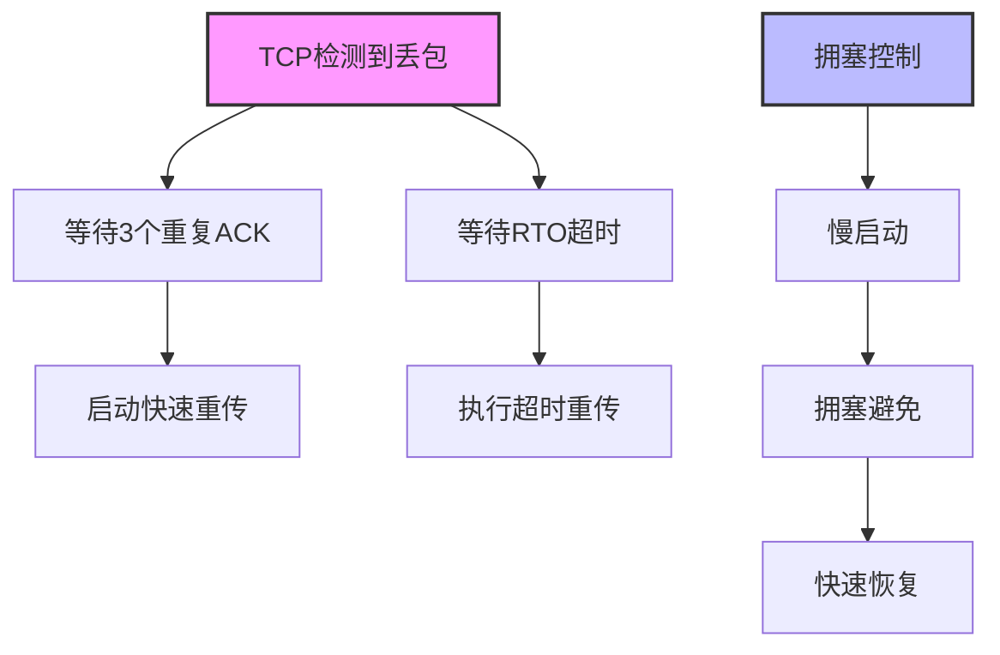
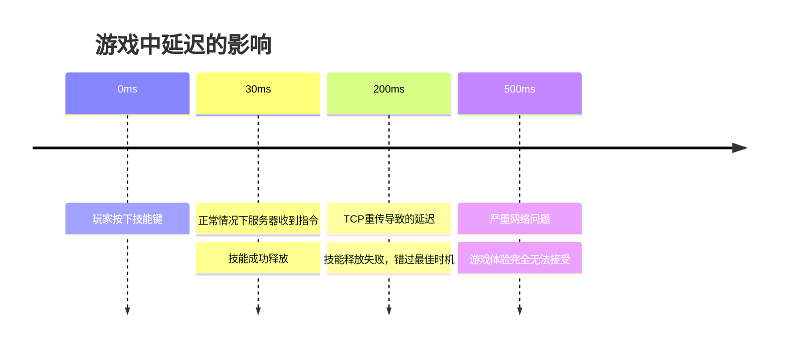
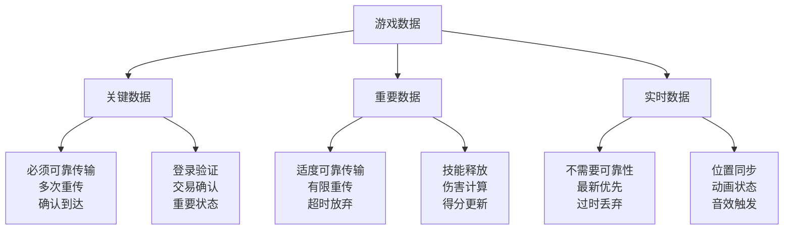
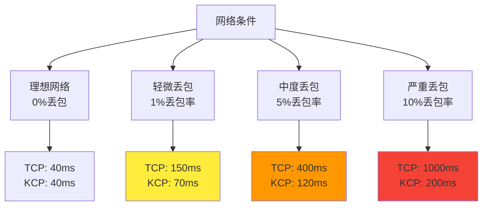
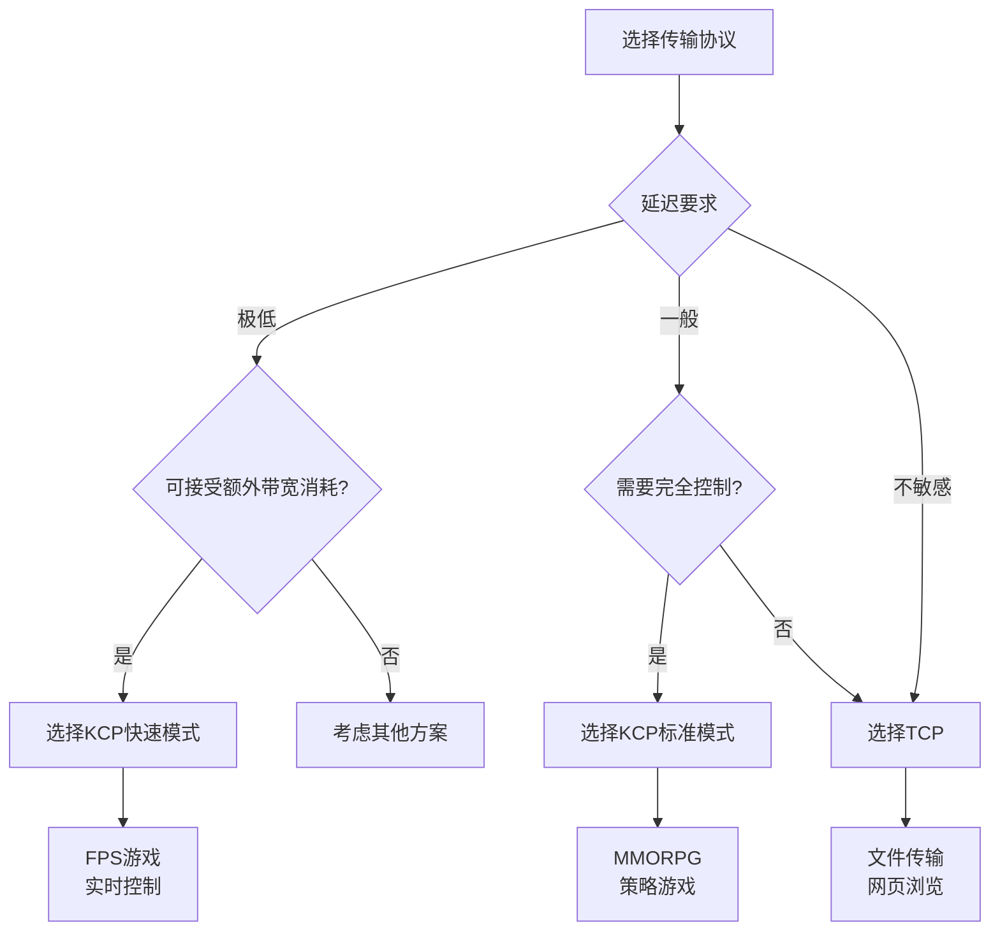

# 为什么有了TCP还要有KCP

既然TCP已经是一个成熟可靠的传输协议，为什么还要开发KCP这样的新协议？这个问题的答案并不是"KCP比TCP更好"这么简单，而是要回到应用场景的本质需求上来思考。就像工具箱里既有锤子也有螺丝刀一样，不同的工具适用于不同的场景。

## TCP的设计目标与局限性

TCP诞生于1970年代，那个时代的网络环境和应用需求与今天大不相同。TCP的设计目标是确保数据的完整性和可靠性，适合文件传输、邮件收发等对准确性要求极高的应用。

### TCP的保守策略

TCP采用的是一种"宁可慢也要稳"的策略：



这种保守策略在网络不稳定的年代是明智的，但在现代网络环境下，特别是对于实时应用来说，可能过于谨慎了。

### TCP的固化特性

TCP协议已经被写入了操作系统内核，其行为已经标准化：

1. **固定的重传策略**：无法根据应用需求调整
2. **标准化的拥塞控制**：不能针对特定应用优化
3. **累积确认机制**：即使只丢一个包也要等待重传
4. **延迟ACK机制**：为了效率而引入的额外延迟

```python
# TCP的行为是固化的，开发者无法控制
socket = socket.socket(socket.AF_INET, socket.SOCK_STREAM)
socket.send(data)  # 无法指定这个数据包的重要性
# 无法告诉TCP："这个包很重要，快速重传"
# 无法告诉TCP："这个包过时了，不要重传"
```

## 实时应用的特殊需求

现代实时应用，特别是网络游戏，有着与传统网络应用截然不同的需求：

### 1. 延迟敏感性

对于游戏玩家来说，50ms的延迟差异可能决定胜负：



### 2. 数据时效性

游戏中的很多数据都有强烈的时效性：

```python
# 游戏数据的时效性分析
class GameData:
    def __init__(self, data_type, ttl):
        self.data_type = data_type
        self.ttl = ttl  # 生存时间
        self.timestamp = current_time()

    def is_expired(self):
        return current_time() - self.timestamp > self.ttl

# 不同类型数据的时效性
position_data = GameData("position", ttl=100)    # 位置数据100ms内有效
animation_data = GameData("animation", ttl=50)   # 动画数据50ms内有效
chat_message = GameData("chat", ttl=float('inf')) # 聊天消息不过期
```

### 3. 可控的可靠性

游戏需要对不同类型的数据采用不同的可靠性策略：



## KCP的针对性优化

KCP的出现正是为了解决TCP在实时应用中的这些局限性：

### 1. 激进的重传策略

```python
# TCP vs KCP的重传对比
class TransmissionComparison:
    def tcp_fast_retransmit(self, ack_sequence):
        """TCP需要3个重复ACK才快速重传"""
        if ack_sequence.count_duplicates() >= 3:
            self.retransmit()

    def kcp_fast_retransmit(self, ack_sequence):
        """KCP只需要1个重复ACK就重传"""
        if ack_sequence.has_duplicate():
            self.retransmit()  # 立即重传

    def kcp_skip_retransmit(self, packet):
        """KCP可以跳过过时数据的重传"""
        if packet.is_expired():
            self.discard(packet)  # 直接丢弃过时数据
        else:
            self.retransmit(packet)
```

### 2. 可配置的工作模式

KCP允许开发者根据应用需求调整协议行为：

```python
# KCP的灵活配置
class KCPConfig:
    def configure_for_fps_game(self, kcp):
        """为FPS游戏优化：极低延迟"""
        kcp.nodelay(1, 5, 2, 1)  # 最激进的设置
        kcp.setmtu(1400)
        kcp.wndsize(256, 256)

    def configure_for_mmorpg(self, kcp):
        """为MMORPG优化：平衡延迟和带宽"""
        kcp.nodelay(1, 20, 2, 0)  # 适中的设置
        kcp.setmtu(1400)
        kcp.wndsize(128, 128)

    def configure_for_turn_based(self, kcp):
        """为回合制游戏优化：节省带宽"""
        kcp.nodelay(0, 40, 0, 0)  # 保守的设置
        kcp.setmtu(1400)
        kcp.wndsize(64, 64)
```

### 3. 应用层控制

KCP在应用层实现，给了开发者完全的控制权：

```python
class GameNetworkManager:
    def __init__(self):
        self.critical_kcp = KCP(conv=1)  # 关键数据通道
        self.normal_kcp = KCP(conv=2)    # 普通数据通道
        self.realtime_udp = UDPSocket()  # 实时数据通道

    def send_data(self, data, priority):
        if priority == "critical":
            # 关键数据：最高可靠性
            self.critical_kcp.send(data)
        elif priority == "normal":
            # 普通数据：适度可靠性
            self.normal_kcp.send(data)
        else:
            # 实时数据：无可靠性保证
            self.realtime_udp.send(data)

    def update(self):
        # 定期更新，处理重传等逻辑
        current = current_time_ms()
        self.critical_kcp.update(current)
        self.normal_kcp.update(current)
```

## 实际性能对比

在典型的游戏网络环境下，KCP相比TCP的优势明显：

### 延迟表现



### 资源消耗

```python
# 资源消耗对比
class ResourceComparison:
    def tcp_overhead(self):
        return {
            "cpu": "低",          # 内核实现，CPU开销小
            "memory": "中等",     # 维护连接状态
            "bandwidth": "100%",  # 基准带宽消耗
            "control": "无"       # 应用层无控制权
        }

    def kcp_overhead(self):
        return {
            "cpu": "中等",        # 应用层实现，CPU开销较大
            "memory": "中等",     # 缓冲区和状态管理
            "bandwidth": "120-200%", # 激进重传增加带宽消耗
            "control": "完全"     # 应用层完全控制
        }
```

## 适用场景分析

### TCP适用场景

1. **文件传输**：完整性比速度更重要
2. **网页浏览**：HTTP连接，可接受适度延迟
3. **数据库连接**：事务完整性要求
4. **邮件传输**：必须保证数据完整

### KCP适用场景

1. **实时游戏**：延迟敏感，可接受适度丢包
2. **音视频通话**：实时性要求高
3. **远程控制**：操作反馈需要及时
4. **实时协作**：多人协同工作

### 选择决策树



## 总结

KCP的存在并不是要替代TCP，而是为了满足现代实时应用的特殊需求。TCP就像一辆安全稳重的卡车，适合运输重要货物；而KCP更像一辆灵活的跑车，适合需要快速响应的场景。

在游戏开发中，TCP和KCP往往会同时使用：TCP负责账号登录、数据同步等关键功能，KCP负责实时游戏逻辑，UDP负责高频的状态同步。这种混合策略能够在保证可靠性的同时，最大化用户体验。

选择KCP的核心理由是：**当你需要在应用层精确控制网络传输行为时，KCP给了你这个能力，而TCP不能**。这种控制能力对于追求极致体验的现代网络应用来说，是非常宝贵的。

---

*本文档为《网络101》系列的一部分*