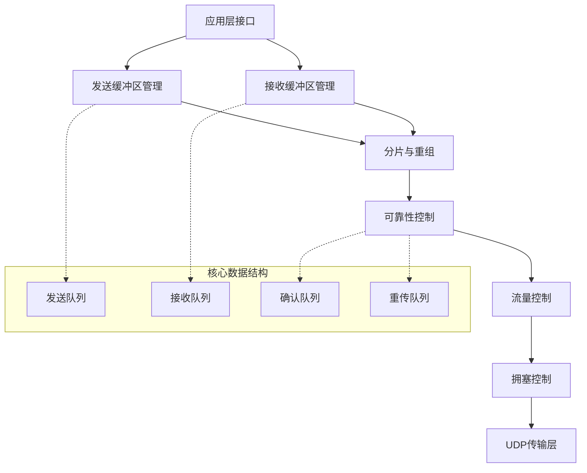

# KCP的实现

通过前面的学习，我们了解了KCP的设计理念和核心功能。现在让我们深入KCP的内部实现，理解它是如何在UDP基础上构建出高效可靠传输的。掌握KCP的实现原理，不仅能帮助我们更好地使用这个协议，也能为我们设计自己的网络协议提供宝贵的经验。

## KCP的整体架构

KCP的实现可以分为几个核心模块，每个模块负责特定的功能：



## 核心数据结构

### 1. KCP控制块（IKCPCB）

KCP的核心是一个控制块结构，包含了连接的所有状态信息：

```c
struct IKCPCB {
    // 基本参数
    IUINT32 conv;           // 会话ID
    IUINT32 mtu;            // 最大传输单元
    IUINT32 mss;            // 最大分片大小
    IUINT32 state;          // 连接状态

    // 发送相关
    IUINT32 snd_una;        // 第一个未确认的包
    IUINT32 snd_nxt;        // 下一个要发送的包序号
    IUINT32 snd_wnd;        // 发送窗口大小
    IUINT32 rmt_wnd;        // 远端窗口大小
    
    // 接收相关
    IUINT32 rcv_nxt;        // 下一个要接收的包序号
    IUINT32 rcv_wnd;        // 接收窗口大小
    
    // 队列
    struct IQUEUEHEAD snd_queue;  // 发送队列
    struct IQUEUEHEAD rcv_queue;  // 接收队列
    struct IQUEUEHEAD snd_buf;    // 发送缓冲区
    struct IQUEUEHEAD rcv_buf;    // 接收缓冲区
    
    // 时间和重传
    IUINT32 current;        // 当前时间
    IUINT32 interval;       // 内部更新间隔
    IUINT32 ts_flush;       // 下次刷新时间
    
    // 拥塞控制
    IUINT32 ssthresh;       // 慢启动阈值
    IUINT32 cwnd;           // 拥塞窗口
};
```

### 2. 数据包结构（IKCPSEG）

每个KCP数据包都有统一的头部格式：

```c
struct IKCPSEG {
    IUINT32 conv;     // 会话ID
    IUINT8  cmd;      // 命令类型
    IUINT8  frg;      // 分片编号
    IUINT16 wnd;      // 窗口大小
    IUINT32 ts;       // 时间戳
    IUINT32 sn;       // 序列号
    IUINT32 una;      // 未确认序列号
    IUINT32 len;      // 数据长度
    
    // 重传相关
    IUINT32 resendts; // 重传时间戳
    IUINT32 rto;      // 重传超时时间
    IUINT32 fastack;  // 快速重传计数
    IUINT32 xmit;     // 传输次数
    
    char data[0];     // 实际数据
};
```

## 发送流程实现

### 1. 数据发送（ikcp_send）

```c
int ikcp_send(ikcpcb *kcp, const char *buffer, int len) {
    IKCPSEG *seg;
    int count, i;

    // 检查数据长度
    if (len < 0) return -1;

    // 计算需要分片的数量
    if (len <= (int)kcp->mss) {
        count = 1;
    } else {
        count = (len + kcp->mss - 1) / kcp->mss;
    }

    // 检查分片数量限制
    if (count >= (int)IKCP_WND_RCV) return -2;

    // 创建分片
    for (i = 0; i < count; i++) {
        int size = len > (int)kcp->mss ? (int)kcp->mss : len;
        seg = ikcp_segment_new(kcp, size);
        
        // 设置分片信息
        seg->len = size;
        seg->frg = (count - i - 1);  // 逆序编号
        
        // 复制数据
        memcpy(seg->data, buffer, size);
        
        // 加入发送队列
        iqueue_add_tail(&seg->node, &kcp->snd_queue);
        
        buffer += size;
        len -= size;
    }

    return 0;
}
```

### 2. 数据刷新（ikcp_flush）

这是KCP最核心的函数，负责处理所有的发送逻辑：

```c
void ikcp_flush(ikcpcb *kcp) {
    IUINT32 current = kcp->current;
    char *buffer = kcp->buffer;
    char *ptr = buffer;
    int count, size, i;
    IUINT32 resent, cwnd;
    IUINT32 rtomin;
    struct IQUEUEHEAD *p;
    int change = 0;
    int lost = 0;
    IKCPSEG seg;

    // 更新una（第一个未确认的包）
    if (iqueue_is_empty(&kcp->snd_buf) == 0) {
        IKCPSEG *seg = iqueue_entry(kcp->snd_buf.next, IKCPSEG, node);
        kcp->snd_una = seg->sn;
    }

    // 发送ACK包
    count = kcp->ackcount;
    for (i = 0; i < count; i++) {
        size = (int)(ptr - buffer);
        if (size + (int)IKCP_OVERHEAD > (int)kcp->mtu) {
            ikcp_output(kcp, buffer, size);
            ptr = buffer;
        }
        ikcp_ack_push(kcp, ptr, kcp->acklist[i * 2], kcp->acklist[i * 2 + 1]);
        ptr += IKCP_OVERHEAD;
    }
    kcp->ackcount = 0;

    // 探测窗口大小
    if (kcp->rmt_wnd == 0) {
        if (kcp->probe_wait == 0) {
            kcp->probe_wait = IKCP_PROBE_INIT;
            kcp->ts_probe = kcp->current + kcp->probe_wait;
        } else if (itimediff(kcp->current, kcp->ts_probe) >= 0) {
            // 发送窗口探测包
            if (kcp->probe_wait < IKCP_PROBE_INIT) 
                kcp->probe_wait = IKCP_PROBE_INIT;
            kcp->probe_wait += kcp->probe_wait / 2;
            if (kcp->probe_wait > IKCP_PROBE_LIMIT)
                kcp->probe_wait = IKCP_PROBE_LIMIT;
            kcp->ts_probe = kcp->current + kcp->probe_wait;
            kcp->probe |= IKCP_ASK_SEND;
        }
    }

    // 移动发送队列到发送缓冲区
    while (iqueue_is_empty(&kcp->snd_queue) == 0) {
        IKCPSEG *newseg;
        if (itimediff(kcp->snd_nxt, kcp->snd_una + kcp->snd_wnd) >= 0)
            break;
        
        newseg = iqueue_entry(kcp->snd_queue.next, IKCPSEG, node);
        iqueue_del(&newseg->node);
        iqueue_add_tail(&newseg->node, &kcp->snd_buf);
        
        newseg->conv = kcp->conv;
        newseg->cmd = IKCP_CMD_PUSH;
        newseg->wnd = seg.wnd;
        newseg->ts = current;
        newseg->sn = kcp->snd_nxt++;
        newseg->una = kcp->rcv_nxt;
        newseg->resendts = current;
        newseg->rto = kcp->rx_rto;
        newseg->fastack = 0;
        newseg->xmit = 0;
    }

    // 计算重传
    resent = (kcp->fastresend > 0) ? (IUINT32)kcp->fastresend : 0xffffffff;
    rtomin = (kcp->nodelay == 0) ? (kcp->rx_rto >> 3) : 0;

    // 发送数据包
    for (p = kcp->snd_buf.next; p != &kcp->snd_buf; p = p->next) {
        IKCPSEG *segment = iqueue_entry(p, IKCPSEG, node);
        int needsend = 0;
        
        if (segment->xmit == 0) {
            // 首次发送
            needsend = 1;
            segment->xmit++;
            segment->rto = kcp->rx_rto;
            segment->resendts = current + segment->rto + rtomin;
        } else if (itimediff(current, segment->resendts) >= 0) {
            // 超时重传
            needsend = 1;
            segment->xmit++;
            kcp->xmit++;
            if (kcp->nodelay == 0) {
                segment->rto += _imax_(segment->rto, (IUINT32)kcp->rx_rto);
            } else {
                IINT32 step = (kcp->nodelay < 2) ? 
                    ((IINT32)(segment->rto)) : kcp->rx_rto;
                segment->rto += step / 2;
            }
            segment->resendts = current + segment->rto;
            lost = 1;
        } else if (segment->fastack >= resent) {
            // 快速重传
            if ((int)segment->xmit <= kcp->fastlimit || 
                kcp->fastlimit <= 0) {
                needsend = 1;
                segment->xmit++;
                segment->fastack = 0;
                segment->resendts = current + segment->rto;
                change++;
            }
        }

        if (needsend) {
            int need;
            segment->ts = current;
            segment->wnd = seg.wnd;
            segment->una = kcp->rcv_nxt;

            size = (int)(ptr - buffer);
            need = IKCP_OVERHEAD + segment->len;

            if (size + need > (int)kcp->mtu) {
                ikcp_output(kcp, buffer, size);
                ptr = buffer;
            }

            ptr = ikcp_encode_seg(ptr, segment);
            
            if (segment->len > 0) {
                memcpy(ptr, segment->data, segment->len);
                ptr += segment->len;
            }

            if (segment->xmit >= kcp->dead_link) {
                kcp->state = (IUINT32)-1;
            }
        }
    }

    // 发送缓冲区中的数据
    size = (int)(ptr - buffer);
    if (size > 0) {
        ikcp_output(kcp, buffer, size);
    }

    // 更新慢启动阈值
    if (change) {
        IUINT32 inflight = kcp->snd_nxt - kcp->snd_una;
        kcp->ssthresh = inflight / 2;
        if (kcp->ssthresh < IKCP_THRESH_MIN)
            kcp->ssthresh = IKCP_THRESH_MIN;
        kcp->cwnd = kcp->ssthresh + resent;
        kcp->incr = kcp->cwnd * kcp->mss;
    }

    if (lost) {
        kcp->ssthresh = cwnd / 2;
        if (kcp->ssthresh < IKCP_THRESH_MIN)
            kcp->ssthresh = IKCP_THRESH_MIN;
        kcp->cwnd = 1;
        kcp->incr = kcp->mss;
    }

    if (kcp->cwnd < 1) {
        kcp->cwnd = 1;
        kcp->incr = kcp->mss;
    }
}
```

## 接收流程实现

### 1. 数据输入（ikcp_input）

```c
int ikcp_input(ikcpcb *kcp, const char *data, long size) {
    IUINT32 prev_una = kcp->snd_una;
    IUINT32 maxack = 0, latest_ts = 0;
    int flag = 0;

    if (data == NULL || (int)size < (int)IKCP_OVERHEAD) return -1;

    while (1) {
        IUINT32 ts, sn, len, una, conv;
        IUINT16 wnd;
        IUINT8 cmd, frg;
        IKCPSEG *seg;

        if (size < (int)IKCP_OVERHEAD) break;

        // 解析包头
        data = ikcp_decode32u(data, &conv);
        if (conv != kcp->conv) return -1;

        data = ikcp_decode8u(data, &cmd);
        data = ikcp_decode8u(data, &frg);
        data = ikcp_decode16u(data, &wnd);
        data = ikcp_decode32u(data, &ts);
        data = ikcp_decode32u(data, &sn);
        data = ikcp_decode32u(data, &una);
        data = ikcp_decode32u(data, &len);

        size -= IKCP_OVERHEAD;

        if ((long)size < (long)len || (int)len < 0) return -2;

        // 处理不同类型的包
        if (cmd != IKCP_CMD_PUSH && cmd != IKCP_CMD_ACK &&
            cmd != IKCP_CMD_WASK && cmd != IKCP_CMD_WINS) 
            return -3;

        kcp->rmt_wnd = wnd;
        ikcp_parse_una(kcp, una);
        ikcp_shrink_buf(kcp);

        if (cmd == IKCP_CMD_ACK) {
            // 处理ACK包
            if (itimediff(kcp->current, ts) >= 0) {
                ikcp_update_ack(kcp, itimediff(kcp->current, ts));
            }
            ikcp_parse_ack(kcp, sn);
            ikcp_shrink_buf(kcp);
            if (flag == 0) {
                flag = 1;
                maxack = sn;
                latest_ts = ts;
            } else {
                if (itimediff(sn, maxack) > 0) {
                    maxack = sn;
                    latest_ts = ts;
                }
            }
        } else if (cmd == IKCP_CMD_PUSH) {
            // 处理数据包
            if (itimediff(sn, kcp->rcv_nxt + kcp->rcv_wnd) < 0) {
                ikcp_ack_push(kcp, sn, ts);
                if (itimediff(sn, kcp->rcv_nxt) >= 0) {
                    seg = ikcp_segment_new(kcp, len);
                    seg->conv = conv;
                    seg->cmd = cmd;
                    seg->frg = frg;
                    seg->wnd = wnd;
                    seg->ts = ts;
                    seg->sn = sn;
                    seg->una = una;
                    seg->len = len;

                    if (len > 0) {
                        memcpy(seg->data, data, len);
                    }

                    ikcp_parse_data(kcp, seg);
                }
            }
        } else if (cmd == IKCP_CMD_WASK) {
            // 窗口探测请求
            kcp->probe |= IKCP_ASK_TELL;
        } else if (cmd == IKCP_CMD_WINS) {
            // 窗口探测响应
            // 什么都不做，窗口大小已经在前面更新了
        } else {
            return -3;
        }

        data += len;
        size -= len;
    }

    // 快速重传逻辑
    if (flag != 0) {
        ikcp_parse_fastack(kcp, maxack, latest_ts);
    }

    // 更新拥塞窗口
    if (itimediff(kcp->snd_una, prev_una) > 0) {
        if (kcp->cwnd < kcp->rmt_wnd) {
            IUINT32 mss = kcp->mss;
            if (kcp->cwnd < kcp->ssthresh) {
                kcp->cwnd++;
                kcp->incr += mss;
            } else {
                if (kcp->incr < mss) kcp->incr = mss;
                kcp->incr += (mss * mss) / kcp->incr + (mss / 16);
                if ((kcp->cwnd + 1) * mss <= kcp->incr) {
                    kcp->cwnd = (kcp->incr + mss - 1) / ((mss > 0) ? mss : 1);
                }
            }
            if (kcp->cwnd > kcp->rmt_wnd) {
                kcp->cwnd = kcp->rmt_wnd;
                kcp->incr = kcp->rmt_wnd * mss;
            }
        }
    }

    return 0;
}
```

## 关键算法实现

### 1. RTT计算和RTO更新

```c
void ikcp_update_ack(ikcpcb *kcp, IINT32 rtt) {
    IINT32 rto = 0;
    if (kcp->rx_srtt == 0) {
        kcp->rx_srtt = rtt;
        kcp->rx_rttvar = rtt / 2;
    } else {
        long delta = rtt - kcp->rx_srtt;
        if (delta < 0) delta = -delta;
        kcp->rx_rttvar = (3 * kcp->rx_rttvar + delta) / 4;
        kcp->rx_srtt = (7 * kcp->rx_srtt + rtt) / 8;
        if (kcp->rx_srtt < 1) kcp->rx_srtt = 1;
    }
    rto = kcp->rx_srtt + _imax_(kcp->interval, 4 * kcp->rx_rttvar);
    kcp->rx_rto = _ibound_(kcp->rx_minrto, rto, IKCP_RTO_MAX);
}
```

### 2. 快速重传检测

```c
void ikcp_parse_fastack(ikcpcb *kcp, IUINT32 sn, IUINT32 ts) {
    struct IQUEUEHEAD *p, *next;

    if (itimediff(sn, kcp->snd_una) < 0 || itimediff(sn, kcp->snd_nxt) >= 0)
        return;

    for (p = kcp->snd_buf.next; p != &kcp->snd_buf; p = next) {
        IKCPSEG *seg = iqueue_entry(p, IKCPSEG, node);
        next = p->next;
        if (itimediff(sn, seg->sn) < 0) {
            break;
        } else if (sn != seg->sn) {
            seg->fastack++;
        }
    }
}
```

## 性能优化技巧

### 1. 内存池管理

KCP使用内存池来避免频繁的内存分配：

```c
// 全局内存池
static IKCPSEG* ikcp_segment_pool = NULL;
static int ikcp_segment_pool_size = 0;

IKCPSEG* ikcp_segment_new(ikcpcb *kcp, int size) {
    IKCPSEG *seg;
    
    if (ikcp_segment_pool != NULL) {
        // 从内存池获取
        seg = ikcp_segment_pool;
        ikcp_segment_pool = seg->next;
        ikcp_segment_pool_size--;
    } else {
        // 分配新内存
        seg = (IKCPSEG*)ikcp_malloc(sizeof(IKCPSEG) + size);
    }
    
    if (seg) {
        seg->next = NULL;
        seg->len = size;
    }
    return seg;
}

void ikcp_segment_delete(ikcpcb *kcp, IKCPSEG *seg) {
    if (ikcp_segment_pool_size < 128) {
        // 回收到内存池
        seg->next = ikcp_segment_pool;
        ikcp_segment_pool = seg;
        ikcp_segment_pool_size++;
    } else {
        // 直接释放
        ikcp_free(seg);
    }
}
```

### 2. 批量处理

KCP通过批量处理来减少系统调用次数：

```c
void ikcp_flush_acks(ikcpcb *kcp) {
    char buffer[1400];
    char *ptr = buffer;
    int count = kcp->ackcount;
    int i;

    // 批量发送ACK
    for (i = 0; i < count && ptr - buffer + IKCP_OVERHEAD <= 1400; i++) {
        ptr = ikcp_encode_seg(ptr, &ack_seg);
    }
    
    if (ptr > buffer) {
        ikcp_output(kcp, buffer, ptr - buffer);
    }
}
```

## 总结

KCP的实现展现了在UDP基础上构建可靠传输协议的精妙设计。通过精心设计的数据结构、高效的算法实现和各种性能优化技巧，KCP成功地在保持UDP高效性的同时，提供了比TCP更适合实时应用的可靠传输机制。

理解KCP的实现原理，不仅能帮助我们更好地使用这个协议，也为我们设计自己的网络协议提供了宝贵的参考。在实际应用中，我们可以根据具体需求，借鉴KCP的设计思想来优化我们的网络通信方案。

---

*本文档为《网络101》系列的一部分*
