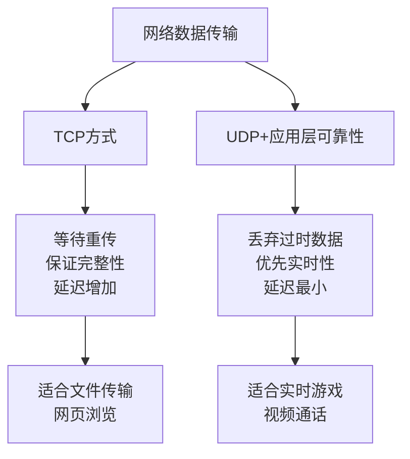
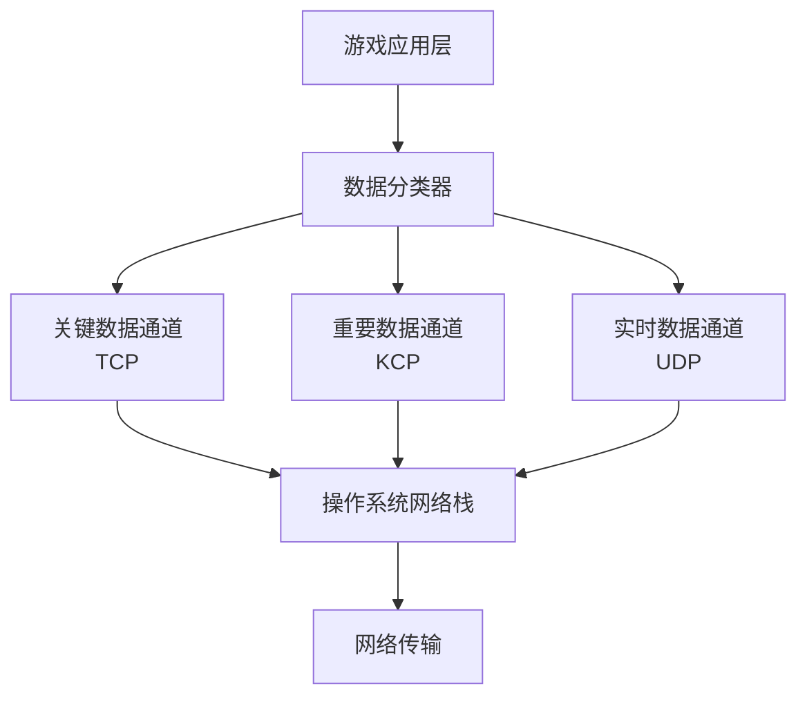
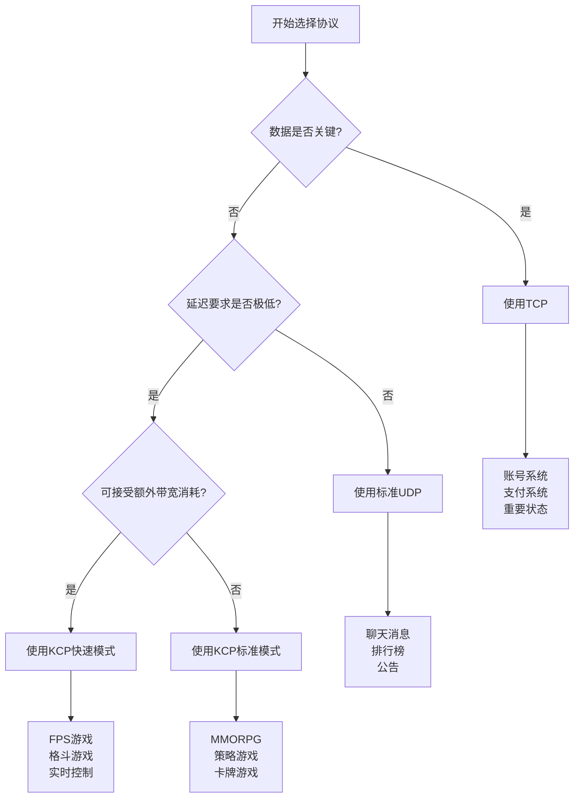

# 小结

通过对《原神》等现代网络游戏通信协议的深入分析，我们揭开了游戏网络编程中一个重要的技术选择：为什么大多数实时游戏会选择UDP而非TCP，以及如何在UDP基础上构建可靠的通信机制。这个看似简单的协议选择背后，蕴含着对网络性能、用户体验和技术实现的深度思考。

## 核心观点回顾

### 1. 实时性优于可靠性

在游戏通信中，我们学到了一个重要的设计哲学：**新鲜的数据比完整的数据更有价值**。当玩家在游戏中移动时，最新的位置信息比确保收到所有历史位置更重要。这种时效性要求使得TCP的"完美主义"成为了性能瓶颈。



### 2. 分层的可靠性策略

现代游戏网络架构采用了精妙的分层策略，不同类型的数据采用不同的传输方式：

| 数据类型 | 传输方式 | 可靠性要求 | 延迟容忍度 | 典型应用 |
|---------|---------|-----------|-----------|---------|
| 关键数据 | TCP | 100%可靠 | 可接受较高延迟 | 登录验证、交易确认 |
| 重要数据 | KCP | 高可靠性 | 低延迟优先 | 技能释放、伤害计算 |
| 实时数据 | UDP | 无可靠性保证 | 极低延迟 | 位置同步、动画状态 |

### 3. KCP：UDP与TCP的完美平衡

KCP协议的出现解决了一个长期困扰游戏开发者的问题：如何在保证必要可靠性的同时，最大化网络传输的实时性。KCP通过以下创新实现了这个目标：

**激进的重传策略**：
- TCP需要3个重复ACK才触发快速重传
- KCP只需要1个重复ACK就立即重传
- 结果：丢包恢复时间减少60-80%

**智能的超时机制**：
- 更敏感的RTT计算
- 更快的丢包检测
- 可配置的重传参数

**应用层控制**：
- 开发者可以精确控制重传行为
- 支持数据优先级管理
- 可以跳过过时数据的重传

## 技术实现要点

### 1. 协议栈设计



### 2. 性能优化策略

**内存管理**：
- 使用内存池避免频繁分配
- 批量处理减少系统调用
- 零拷贝技术提升效率

**算法优化**：
- 快速重传检测
- 自适应超时计算
- 选择性确认机制

**配置调优**：
```python
# 不同游戏类型的KCP配置示例
def configure_kcp_for_game_type(game_type):
    if game_type == "FPS":
        # 极低延迟配置
        return kcp.nodelay(1, 5, 2, 1)
    elif game_type == "MMORPG":
        # 平衡配置
        return kcp.nodelay(1, 20, 2, 0)
    elif game_type == "TURN_BASED":
        # 节省带宽配置
        return kcp.nodelay(0, 40, 0, 0)
```

## 实际应用指导

### 1. 协议选择决策树



### 2. 性能监控指标

在实际部署中，需要重点关注以下指标：

- **延迟指标**：平均RTT、99分位延迟、延迟抖动
- **可靠性指标**：丢包率、重传率、连接稳定性
- **资源消耗**：带宽使用、CPU占用、内存消耗
- **用户体验**：卡顿频率、掉线率、响应时间

## 未来发展趋势

### 1. 协议演进方向

随着网络技术的发展，游戏通信协议也在不断演进：

- **QUIC协议**：结合TCP可靠性和UDP效率
- **WebRTC**：浏览器原生的实时通信支持
- **5G网络**：超低延迟网络环境的新机遇

### 2. 新兴技术影响

- **边缘计算**：减少物理距离带来的延迟
- **AI优化**：智能预测和自适应调整
- **云游戏**：对网络协议提出新的挑战

## 总结

《原神》等现代网络游戏的成功，很大程度上得益于其精心设计的网络通信架构。通过深入理解UDP、TCP和KCP各自的特点和适用场景，我们学会了如何根据具体需求选择合适的传输协议。

这个案例告诉我们，在网络编程中：

1. **没有万能的解决方案**：每种协议都有其适用场景
2. **性能与可靠性需要平衡**：过度追求任何一方面都可能适得其反
3. **用户体验是最终目标**：技术选择应该服务于用户体验
4. **分层设计是关键**：不同类型的数据应该采用不同的传输策略

掌握这些原理和方法，不仅能帮助我们更好地理解现有的网络游戏架构，也为我们设计自己的网络应用提供了宝贵的参考。在网络编程的世界里，理解需求、选择合适的工具、并进行精心的优化，这就是成功的关键。

---

*本文档为《网络101》系列的一部分*
