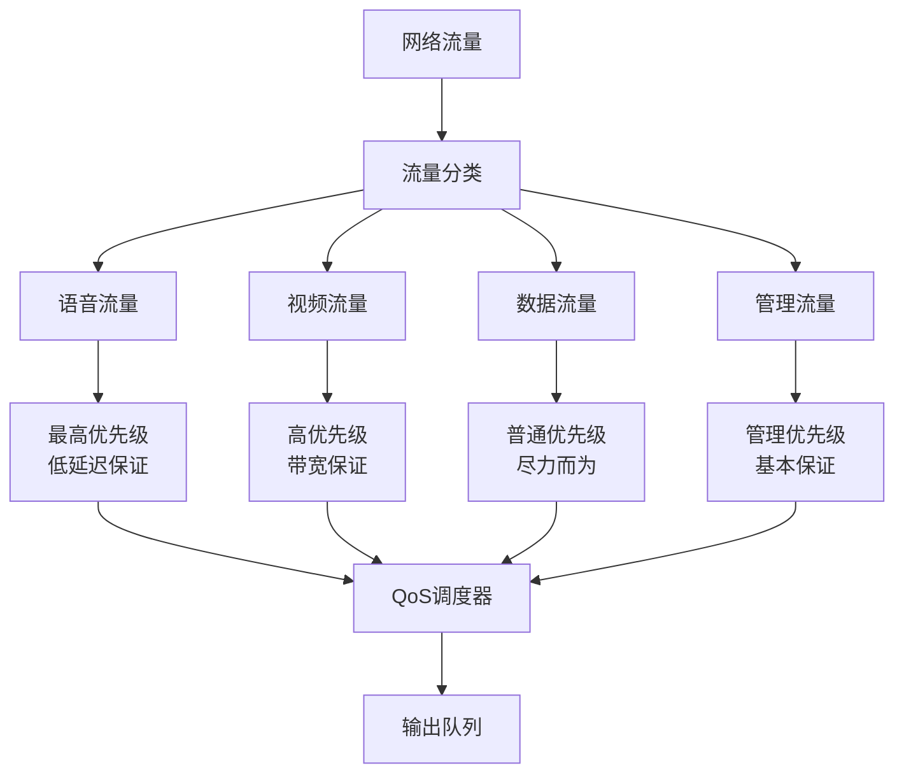
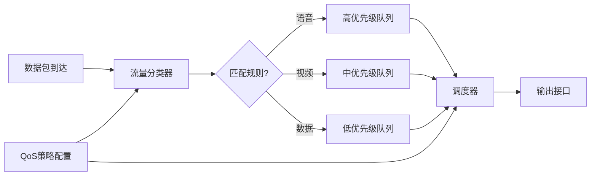
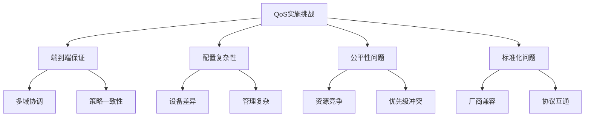

# 5.5.1 QoS是什么

QoS，全称Quality of Service（服务质量），是网络管理中的一个核心概念。简单来说，QoS就是网络设备用来保证不同类型流量获得相应服务质量的一套机制。就像医院的分诊制度一样，急诊病人会优先得到治疗，而普通门诊则需要排队等候。

## QoS的基本原理

在没有QoS的网络中，所有数据包都是"先来先服务"，这种公平看似合理，但在实际应用中却会带来问题。想象一下，如果视频会议的数据包和文件下载的数据包享受同等待遇，那么当网络拥塞时，视频会议可能会因为延迟过高而无法正常进行。

QoS机制通过对不同类型的流量进行分类和优先级管理，确保关键业务能够获得所需的网络资源。它主要关注四个方面的服务质量指标：带宽（Bandwidth）、延迟（Latency）、抖动（Jitter）和丢包率（Packet Loss）。

## QoS的实现机制

QoS的实现通常包含三个关键步骤：分类、标记和调度。

首先是流量分类，网络设备需要识别不同类型的流量。这可以基于多种标准，比如源IP地址、目标端口号、协议类型，或者应用层的特征。现代的深度包检测（DPI）技术甚至能够识别具体的应用程序。

接下来是流量标记，被分类的流量会被打上相应的标记。在IP网络中，常用的标记方式包括IP头部的DSCP（Differentiated Services Code Point）字段，以及以太网帧头的CoS（Class of Service）字段。

最后是流量调度，这是QoS机制的核心。网络设备根据流量的标记和配置的策略，决定如何处理不同的数据包。常见的调度算法包括优先级队列（Priority Queuing）、加权公平队列（Weighted Fair Queuing）和基于类的加权公平队列（Class-Based Weighted Fair Queuing）。

## QoS在不同网络层次的应用

QoS机制在网络的不同层次都有相应的实现。在企业网络中，交换机和路由器通过配置不同的QoS策略来保证关键业务的网络质量。在运营商网络中，QoS更是确保SLA（Service Level Agreement）的重要手段。

在无线网络中，QoS的重要性更加突出。由于无线信道的共享特性和不稳定性，合理的QoS策略能够显著改善用户体验。WiFi网络中的WMM（WiFi Multimedia）标准就是专门为无线环境设计的QoS机制。

云计算环境中的QoS则更加复杂，需要考虑虚拟化层面的资源分配。软件定义网络（SDN）的出现为QoS的实现提供了更大的灵活性，允许网络管理员通过编程的方式动态调整QoS策略。

## QoS的挑战和局限性

尽管QoS机制在理论上很完美，但在实际部署中却面临诸多挑战。首先是端到端的QoS保证问题，数据包在传输路径上可能经过多个不同的网络域，每个域都有自己的QoS策略，如何确保端到端的服务质量是一个复杂的问题。

其次是QoS策略的配置和管理复杂性。不同厂商的设备可能有不同的QoS实现方式，这给统一管理带来了困难。而且，QoS策略的配置需要深入了解网络拓扑和业务需求，这对网络管理员提出了很高的要求。

最后是QoS与网络公平性之间的矛盾。QoS机制本质上是一种"不公平"的资源分配方式，它优先保证某些流量的服务质量，这可能会影响其他流量的性能。如何在保证关键业务质量的同时，维护网络的整体公平性，是QoS设计中需要仔细权衡的问题。

理解QoS的这些特点和局限性，对于我们后续分析KCP与QoS之间的冲突具有重要意义。QoS机制的存在是为了维护网络的整体稳定性和公平性，但这种"善意"的管理却可能成为高性能协议如KCP发挥作用的障碍。

---

*本文档为《网络101》系列的一部分*
