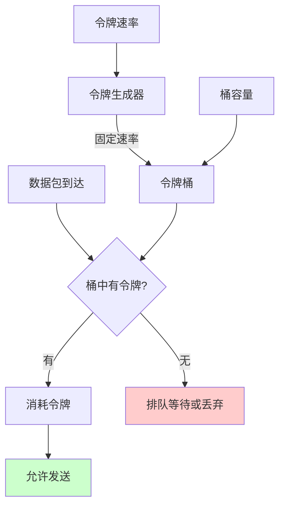
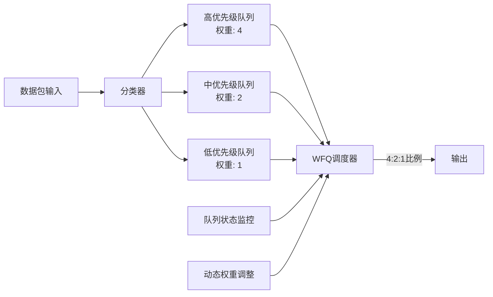
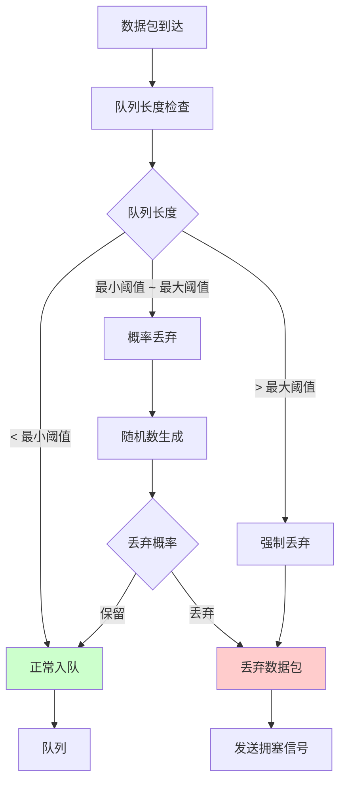
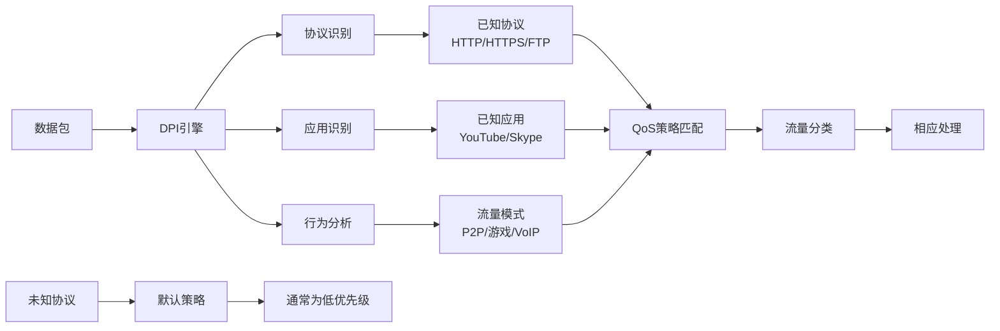

# 5.5.2 控制QoS的原理

要理解KCP与QoS的冲突，我们需要深入了解QoS控制的具体原理。QoS控制不是简单的"优先级排序"，而是一套复杂的流量管理机制，涉及流量整形、拥塞控制、缓冲区管理等多个方面。

## 流量整形和令牌桶算法

流量整形是QoS控制的核心机制之一，它的目标是将不规则的流量"整形"成符合预期模式的流量。最常用的流量整形算法是令牌桶算法（Token Bucket Algorithm）。

令牌桶算法的工作原理很像一个水桶接水的过程。系统以固定的速率向桶中投放令牌，每个数据包的发送都需要消耗相应数量的令牌。当桶中没有足够的令牌时，数据包就必须等待或被丢弃。这种机制既允许短时间的突发流量（桶中积累的令牌），又能保证长期的平均速率不超过设定值。

## 队列管理和调度算法

QoS系统中的队列管理是另一个关键环节。不同的调度算法决定了在网络拥塞时如何处理不同优先级的流量。

优先级队列（Priority Queuing）是最直观的调度方式，高优先级队列中的所有数据包都会在低优先级队列之前被处理。但这种方式可能导致低优先级流量完全被饿死。

加权公平队列（Weighted Fair Queuing，WFQ）则试图在保证优先级的同时维护一定的公平性。每个队列都有一个权重值，调度器会根据权重比例分配处理时间。这样既保证了高优先级流量的优势，又避免了低优先级流量完全被忽略。

## 拥塞检测和主动队列管理

现代QoS系统不仅仅是被动地处理已经到达的数据包，还会主动地检测和预防网络拥塞。主动队列管理（Active Queue Management，AQM）算法如RED（Random Early Detection）会在队列长度接近满载之前就开始随机丢弃数据包，以此向发送端发出拥塞信号。

这种主动丢包的策略看似浪费，实际上却能有效防止网络进入严重拥塞状态。当TCP连接检测到丢包时，会主动降低发送速率，从而缓解网络压力。但这种机制对于KCP这样的自定义协议来说，可能会产生意想不到的效果。

## 带宽分配和速率限制

QoS系统需要在有限的带宽资源中为不同的流量类型分配合适的份额。这通常通过分层的带宽管理来实现，每个流量类别都有自己的带宽保证和上限。

在企业网络中，管理员可能会为关键业务应用分配60%的带宽，为一般办公应用分配30%，为个人娱乐应用分配10%。当某个类别的流量超过其分配份额时，QoS系统会对其进行限制，确保其他类别的流量不受影响。

这种带宽分配机制对于传统的应用来说工作得很好，但对于KCP这样试图最大化利用可用带宽的协议来说，就可能成为性能瓶颈。KCP的快速重传和冗余发送机制可能会被QoS系统误判为"带宽滥用"，从而受到限制。

## 深度包检测和应用识别

现代QoS系统越来越依赖深度包检测（Deep Packet Inspection，DPI）技术来识别不同的应用和协议。DPI不仅仅检查数据包的头部信息，还会分析载荷内容，识别应用层协议的特征。

这种技术能够准确识别各种应用，包括P2P下载、视频流媒体、VoIP通话等，并为它们应用相应的QoS策略。但是，对于KCP这样的自定义协议，DPI系统可能无法正确识别，或者将其误分类为其他类型的流量。

## QoS策略的动态调整

高级的QoS系统还具备动态调整策略的能力。它们会持续监控网络状况和应用性能，根据实际情况调整QoS参数。例如，当检测到网络拥塞时，系统可能会临时提高某些关键应用的优先级，或者调整带宽分配比例。

这种动态调整机制增加了QoS系统的复杂性，也使得应用程序更难预测自己的网络行为。对于KCP这样需要精确控制传输行为的协议来说，这种不确定性可能会影响其性能优化效果。

理解了QoS控制的这些原理，我们就能更好地理解为什么KCP会与QoS系统产生冲突。KCP的设计目标是最大化单个连接的性能，而QoS的目标是优化整个网络的资源利用。这种根本性的目标差异，注定了两者之间会存在矛盾。

---

*本文档为《网络101》系列的一部分*
