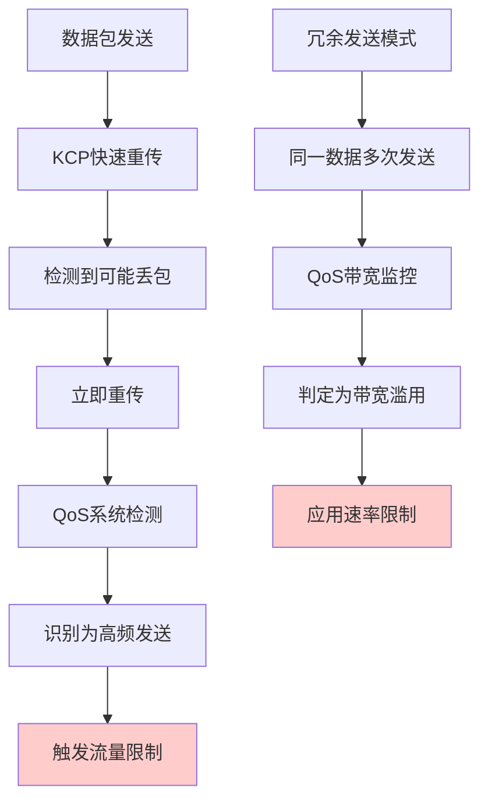
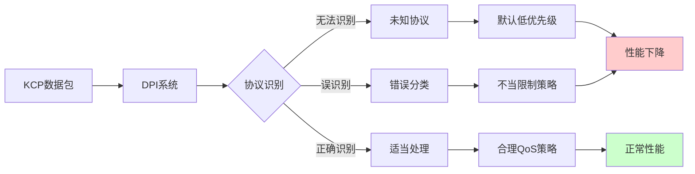
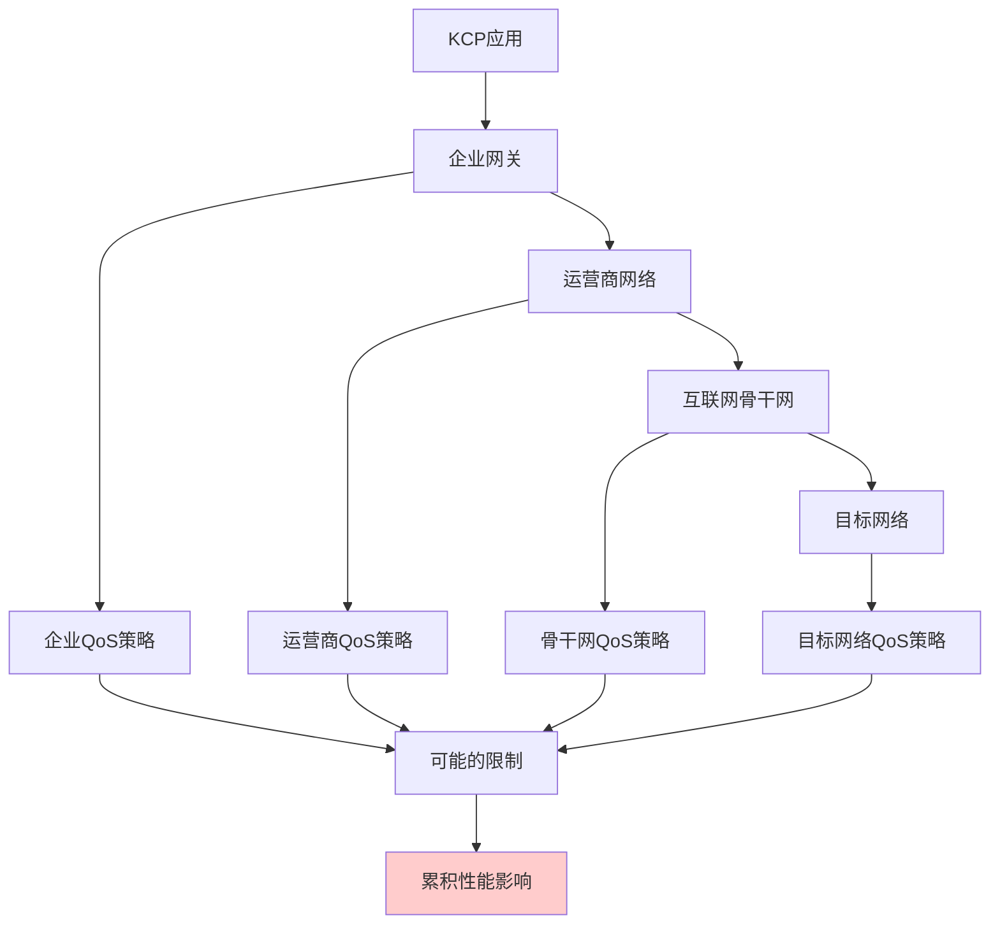

# 5.5.3 KCP为什么会有QoS问题

KCP协议的设计初衷是在保证可靠性的前提下最大化传输性能，但这种"激进"的设计理念却与QoS系统的管理目标产生了根本性的冲突。要理解这种冲突的本质，我们需要深入分析KCP的行为特征以及它们如何触发QoS系统的限制机制。

## KCP的激进传输策略

KCP最显著的特点是其激进的重传策略。与TCP的保守重传不同，KCP采用了更加主动的方式来处理丢包。当检测到可能的丢包时，KCP会立即进行重传，而不是等待超时。这种策略在网络状况良好时能够显著降低延迟，但在QoS系统看来，这种行为可能被解释为"过度使用网络资源"。

更进一步，KCP还支持冗余发送模式，即同一个数据包可能会被发送多次以确保到达。这种机制在高丢包率的网络环境中非常有效，但对于QoS系统来说，这种"浪费"带宽的行为是不被鼓励的。

## 突发流量模式的冲突

KCP的另一个特征是其突发性的流量模式。为了最大化利用可用带宽，KCP会在检测到网络状况良好时快速发送大量数据包。这种突发传输模式能够有效利用网络的空闲时段，但却与QoS系统的流量整形机制产生冲突。

大多数QoS系统使用令牌桶算法来控制流量的突发性。当KCP产生大量突发流量时，很快就会耗尽令牌桶中的令牌，导致后续的数据包被延迟或丢弃。这种限制不仅影响了KCP的性能，还可能触发KCP的重传机制，进一步加剧问题。

## 协议识别的困难

QoS系统依赖于准确的协议识别来应用相应的策略，但KCP作为一个相对较新的自定义协议，很多QoS设备并不能正确识别它。这导致了两种可能的问题：

首先，KCP流量可能被归类为"未知协议"，从而被分配到默认的低优先级队列中。这种分类显然不符合KCP作为实时传输协议的需求，会严重影响其性能表现。

其次，更糟糕的情况是KCP流量被误识别为其他类型的协议。例如，由于KCP基于UDP，一些简单的DPI系统可能将其识别为普通的UDP流量，甚至是P2P下载流量，从而应用更加严格的限制策略。

## 拥塞控制算法的差异

TCP的拥塞控制算法经过了几十年的发展和优化，与现有的QoS系统形成了良好的协作关系。TCP的慢启动、拥塞避免等机制能够与QoS系统的主动队列管理算法很好地配合，形成一个相对稳定的生态系统。

但KCP使用的是自己的拥塞控制算法，这些算法的行为模式与QoS系统的预期可能不匹配。例如，当QoS系统通过丢包来发出拥塞信号时，KCP可能不会像TCP那样大幅降低发送速率，而是采用更加温和的调整策略。这种"不合作"的行为可能导致QoS系统认为KCP没有响应拥塞信号，从而采用更加严厉的限制措施。

## 端口和标记的问题

传统的QoS配置通常基于已知的端口号来识别不同的应用。例如，HTTP流量使用80端口，HTTPS使用443端口，这些都是QoS系统能够轻易识别的。但KCP应用通常使用自定义的端口号，这使得基于端口的QoS策略无法正确应用。

此外，KCP数据包通常不会携带标准的QoS标记（如DSCP字段），这进一步增加了QoS系统正确处理KCP流量的难度。即使应用程序试图设置这些标记，也可能因为权限限制或系统配置问题而无法生效。

## 网络中间设备的影响

在实际的网络环境中，KCP数据包可能需要经过多个中间设备，包括企业防火墙、运营商的流量管理设备、CDN节点等。每个设备都可能有自己的QoS策略，这些策略的叠加效应可能对KCP造成严重影响。

特别是在移动网络环境中，运营商通常会对不同类型的流量实施差异化的QoS策略。由于KCP的特殊性，它可能无法享受到为实时应用预留的优质网络资源，反而被当作普通数据流量处理。

## 动态网络环境的挑战

现代网络环境是高度动态的，网络状况、路由路径、QoS策略都可能随时发生变化。KCP的自适应算法虽然能够应对网络状况的变化，但却难以适应QoS策略的动态调整。

当网络管理员调整QoS策略时，KCP可能需要一段时间才能适应新的网络行为模式。在这个适应期内，KCP的性能可能会出现显著波动，甚至可能触发更严格的QoS限制，形成恶性循环。

理解了KCP与QoS冲突的这些根本原因，我们就能更好地制定相应的解决策略。这些冲突不是简单的技术问题，而是两种不同设计理念之间的根本性矛盾。解决这些问题需要在协议设计、网络配置和应用部署等多个层面进行综合考虑。

---

*本文档为《网络101》系列的一部分*
