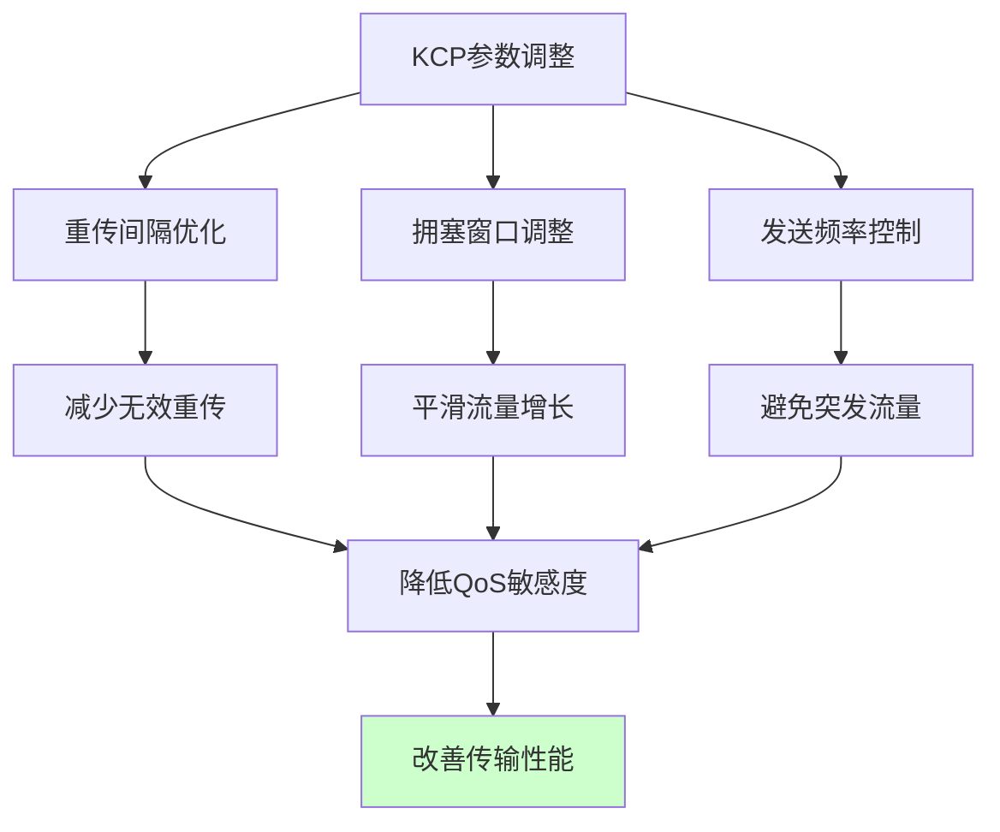
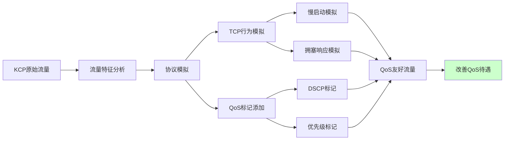
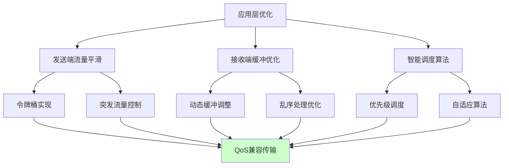

# 5.5.4 KCP如何应对QoS导致的丢包问题

面对QoS系统带来的挑战，KCP并非束手无策。通过合理的配置调整、协议优化和部署策略，我们可以在很大程度上缓解QoS对KCP性能的负面影响。关键在于理解QoS系统的工作机制，并相应地调整KCP的行为模式。

## 调整KCP的传输参数

KCP提供了丰富的参数配置选项，通过合理调整这些参数，可以使KCP的行为更加"QoS友好"。最重要的调整是降低KCP的激进程度，让其传输行为更接近QoS系统的预期。

首先是调整重传间隔（RTO）参数。默认情况下，KCP的重传间隔相对较短，这虽然能够快速响应丢包，但也容易触发QoS系统的流量限制。通过适当增加重传间隔，可以减少不必要的重传，降低对网络资源的占用。

其次是调整拥塞窗口的增长策略。KCP默认采用较为激进的窗口增长算法，在检测到网络状况良好时会快速增加发送速率。在QoS环境中，可以采用更加保守的增长策略，避免突然的流量激增触发QoS限制。

## 实现自适应的QoS检测

一个更加智能的解决方案是让KCP具备检测QoS限制的能力。通过分析网络行为的特征模式，KCP可以判断当前是否受到QoS系统的影响，并相应地调整自己的传输策略。

QoS限制通常表现为特定的丢包模式或延迟特征。例如，如果丢包主要发生在流量突发期间，而且丢包率与发送速率呈现明显的相关性，那么很可能是受到了流量整形的影响。通过识别这些模式，KCP可以主动调整自己的行为。

当检测到QoS限制时，KCP可以切换到"QoS兼容模式"，采用更加保守的传输策略。这种模式下，KCP会主动限制自己的发送速率，避免触发QoS系统的限制机制。虽然这可能会牺牲一些性能，但能够避免更严重的性能下降。

## 流量伪装和协议模拟

在某些情况下，可以通过流量伪装的方式来改善KCP的QoS待遇。这种方法的核心思想是让KCP流量看起来像其他更受QoS系统青睐的协议。

最常见的做法是模拟TCP的行为模式。通过调整KCP的发送模式，使其流量特征更接近TCP，可以让QoS系统将其识别为TCP流量，从而获得更好的处理。这包括模拟TCP的慢启动过程、拥塞避免算法，以及对丢包的响应模式。

另一种方法是在KCP数据包中添加适当的QoS标记。虽然这需要应用程序具有相应的权限，但如果能够成功设置DSCP字段或其他QoS标记，就能够让QoS系统正确识别KCP流量的类型和优先级。

## 多路径和负载均衡策略

当单一路径受到QoS限制时，可以考虑使用多路径传输来分散流量压力。通过将KCP流量分散到多个网络路径上，可以避免在单一路径上触发QoS限制。

这种策略需要应用程序能够建立多个网络连接，并智能地在这些连接之间分配流量。理想情况下，每个连接的流量都保持在QoS系统的限制阈值之下，从而避免触发限制机制。

负载均衡策略还可以结合路径质量监测，动态调整不同路径上的流量分配。当检测到某个路径开始受到QoS限制时，可以将更多流量转移到其他路径上，实现动态的负载均衡。

## 应用层的缓冲和调度优化

在应用层实现智能的缓冲和调度机制，也是应对QoS问题的有效方法。通过在发送端实现流量平滑化，可以避免产生容易触发QoS限制的突发流量。

这种方法的核心是实现一个应用层的令牌桶算法，主动控制KCP的发送速率。虽然这可能会增加一些延迟，但能够确保流量模式符合QoS系统的预期，从而获得更稳定的传输性能。

接收端的缓冲优化同样重要。通过实现智能的接收缓冲管理，可以更好地处理由于QoS限制导致的数据包延迟和乱序问题。这包括动态调整缓冲区大小、优化数据包重组算法等。

## 网络环境感知和自适应调整

最先进的解决方案是实现网络环境感知功能，让KCP能够自动检测和适应不同的网络环境。这包括识别当前网络是否部署了QoS系统，以及这些系统的具体配置和行为模式。

通过持续监测网络性能指标，如延迟变化、丢包模式、带宽利用率等，KCP可以建立对当前网络环境的准确认知。基于这些信息，KCP可以动态调整自己的传输参数，实现最优的性能表现。

这种自适应机制还可以学习和记忆不同网络环境的特征，建立一个网络环境数据库。当再次遇到相似的网络环境时，KCP可以快速应用之前学习到的最优配置，减少适应时间。

## 与网络管理的协作

在企业环境中，最理想的解决方案是与网络管理团队协作，为KCP应用配置专门的QoS策略。这需要网络管理员了解KCP的特性和需求，并相应地调整QoS配置。

这种协作可能包括为KCP应用分配专门的端口范围，配置相应的QoS规则，或者在DPI系统中添加KCP协议的识别规则。虽然这种方法需要额外的协调工作，但能够从根本上解决KCP与QoS的冲突问题。

通过这些综合性的解决策略，KCP可以在QoS环境中获得更好的性能表现。关键在于根据具体的网络环境和应用需求，选择合适的优化策略组合，实现性能和兼容性的最佳平衡。

---

*本文档为《网络101》系列的一部分*
