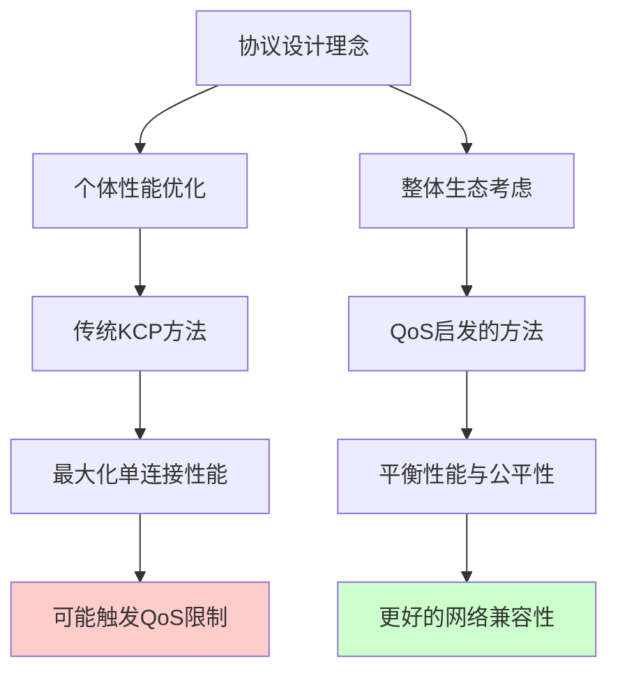
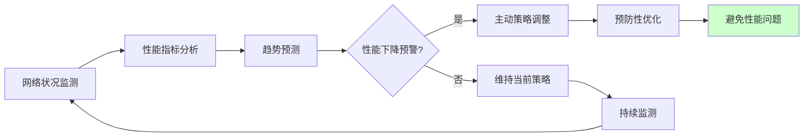
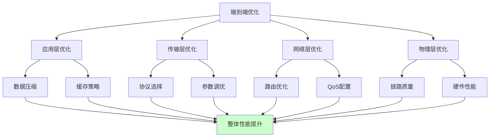

# 5.5.5 QoS的设计有哪些地方值得借鉴

虽然QoS系统可能会对KCP等高性能协议造成限制，但QoS的设计理念和实现机制中有许多值得我们学习和借鉴的地方。理解这些设计思想，不仅能帮助我们更好地应对QoS挑战，还能启发我们在协议设计和网络应用开发中采用更加智能和高效的方法。

## 公平性与效率的平衡艺术

QoS系统最值得学习的地方是它在公平性与效率之间寻求平衡的设计理念。QoS不是简单地追求某个单一指标的最优化，而是试图在保证整体网络性能的前提下，为不同类型的应用提供差异化的服务质量。

这种平衡思想在协议设计中同样适用。一个优秀的传输协议不应该只考虑自身的性能最大化，还应该考虑对网络生态系统的影响。KCP在追求低延迟的同时，也可以借鉴QoS的思想，实现更加"网络友好"的行为模式。

例如，KCP可以实现动态的"礼让机制"，当检测到网络拥塞时主动降低自己的激进程度，为其他流量让出资源。这种设计不仅能够改善与QoS系统的兼容性，还能提升整个网络的稳定性。

## 分层管理和模块化设计

QoS系统采用了分层的管理架构，从流量分类、标记到调度，每个层次都有明确的职责和接口。这种模块化的设计使得QoS系统能够灵活地适应不同的网络环境和需求。

在网络应用开发中，我们也可以采用类似的分层设计思想。将传输控制、拥塞管理、错误恢复等功能模块化，不仅能够提高代码的可维护性，还能够根据不同的网络环境动态调整各个模块的行为。

这种设计还有利于实现自适应的网络行为。就像QoS系统可以根据网络状况动态调整策略一样，我们的应用也可以根据检测到的网络特征，动态选择最适合的传输策略组合。

## 主动式的资源管理

QoS系统的另一个重要特点是主动式的资源管理。它不是被动地等待问题发生，而是通过持续监控和预测来主动预防问题。例如，主动队列管理算法会在队列真正满载之前就开始丢包，以避免更严重的拥塞。

这种主动管理的思想在应用层同样有价值。我们可以实现主动的网络状况监测，在网络性能开始下降之前就调整传输策略。这种预防性的方法往往比事后补救更加有效。

## 智能化的流量识别和分类

现代QoS系统在流量识别方面的技术非常先进，能够准确识别各种应用和协议。这种智能化的识别能力值得我们在应用设计中借鉴。

我们可以在应用中实现类似的智能识别机制，用于识别不同类型的数据流。例如，在一个多媒体应用中，可以自动识别音频流、视频流和控制信令，并为它们应用不同的传输策略。

这种分类思想还可以扩展到用户行为分析。通过分析用户的使用模式，应用可以预测用户的需求，并提前优化相应的网络资源分配。

## 动态适应和学习能力

高级的QoS系统具备学习和适应能力，能够根据历史数据和当前状况动态调整策略。这种自适应能力是现代网络管理的重要特征。

在协议设计中，我们也可以实现类似的学习机制。协议可以记录在不同网络环境下的性能表现，建立一个经验数据库。当遇到相似的网络环境时，协议可以快速应用之前学习到的最优配置。

这种学习能力还可以扩展到用户个性化服务。通过学习用户的使用习惯和偏好，应用可以为不同用户提供个性化的网络优化策略。

## 端到端的服务质量保证

QoS系统追求的是端到端的服务质量保证，这需要网络中的各个节点协同工作。虽然在实际部署中很难实现完美的端到端QoS，但这种设计目标值得我们学习。

在分布式应用设计中，我们也应该考虑端到端的性能优化。这不仅包括网络传输层面的优化，还包括应用层、中间件层等各个层次的协同优化。

## 可观测性和监控体系

QoS系统通常具备完善的监控和可观测性功能，能够提供详细的性能指标和分析报告。这种可观测性设计对于网络应用开发同样重要。

我们应该在应用中内置丰富的监控和诊断功能，不仅要监控基本的性能指标，还要能够分析性能问题的根本原因。这种可观测性不仅有助于问题诊断，还能为性能优化提供数据支持。

## 标准化和互操作性

QoS系统的成功很大程度上得益于其标准化程度。通过制定统一的标准和接口，不同厂商的设备能够协同工作，形成一个完整的QoS生态系统。

在协议设计和应用开发中，我们也应该重视标准化和互操作性。即使是自定义的协议，也应该考虑与现有标准的兼容性，以及未来的扩展性。

通过学习和借鉴QoS系统的这些设计理念，我们可以开发出更加智能、高效和网络友好的应用。关键在于不要将QoS视为障碍，而是将其作为学习的对象，从中汲取有价值的设计思想和实现经验。

---

*本文档为《网络101》系列的一部分*
