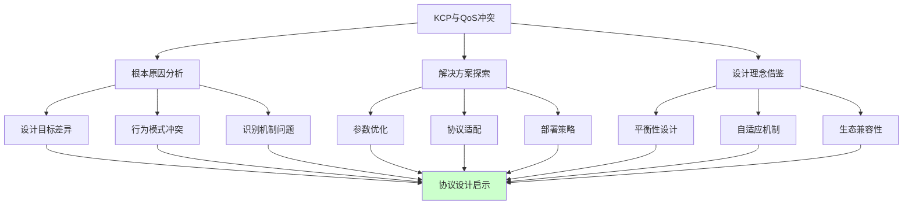

# 5.5.6 小结

通过本章的深入探讨，我们全面分析了KCP协议与QoS系统之间的复杂关系。这个看似技术性的问题，实际上反映了网络协议设计中的一个根本性矛盾：个体性能优化与整体资源管理之间的平衡。

## 核心问题的本质

KCP与QoS的冲突并非偶然，而是两种不同设计理念的必然碰撞。KCP追求的是单个连接的极致性能，通过激进的重传策略、突发流量模式和快速响应机制来最小化延迟。而QoS系统关注的是整个网络的公平性和稳定性，通过流量整形、优先级管理和资源分配来维护网络秩序。

这种矛盾在现代网络环境中尤为突出。随着网络应用的多样化和复杂化，单纯追求个体性能最优的协议设计已经不能满足复杂网络环境的需求。我们需要在性能和兼容性之间找到新的平衡点。

## 技术解决方案的启示

我们探讨的各种技术解决方案，从参数调整到协议模拟，从多路径传输到应用层优化，每一种方法都有其适用场景和局限性。这些方案的共同特点是试图让KCP的行为更加"网络友好"，减少与QoS系统的冲突。

最有效的解决方案往往是多种技术的组合应用。单一的优化手段很难完全解决复杂的网络兼容性问题，需要在协议层、应用层和部署层面进行综合考虑。这种系统性的优化思路，对于其他网络协议的设计和优化同样具有参考价值。

## 设计理念的演进

QoS系统的设计理念为我们提供了宝贵的启示。公平性与效率的平衡、分层管理的架构、主动式的资源管理、智能化的流量识别，这些设计思想都值得在协议设计中借鉴和应用。

未来的网络协议设计应该更加注重生态兼容性。一个优秀的协议不仅要在理想环境中表现出色，还要能够在复杂的现实网络环境中稳定工作。这需要协议设计者具备更加全面的视野，不仅要考虑技术性能，还要考虑部署环境、管理需求和生态影响。

## 实践应用的指导

对于实际的网络应用开发，本章的分析提供了几个重要的指导原则。首先，在选择传输协议时，不能仅仅考虑理论性能，还要评估在目标部署环境中的实际表现。其次，协议的配置和优化需要根据具体的网络环境进行调整，没有一成不变的最优配置。

最后，网络应用的设计应该具备足够的灵活性和适应性。通过实现多种传输策略和自适应机制，应用可以在不同的网络环境中都获得良好的性能表现。

## 未来发展的思考

随着网络技术的不断发展，KCP与QoS的关系也在发生变化。新一代的QoS系统开始支持更加灵活的策略配置，能够更好地识别和处理各种自定义协议。同时，KCP等高性能协议也在不断演进，增强与现有网络基础设施的兼容性。

软件定义网络（SDN）和网络功能虚拟化（NFV）等新技术为解决这类兼容性问题提供了新的可能性。通过可编程的网络基础设施，我们可以为不同的应用和协议定制专门的网络行为，实现更加精细化的网络管理。

边缘计算和5G网络的发展也为高性能传输协议带来了新的机遇。在这些新的网络环境中，对低延迟和高可靠性的需求更加迫切，KCP等协议的优势将得到更好的发挥。

## 学习和实践建议

对于网络编程的学习者和实践者，建议从以下几个方面深入理解本章的内容。首先，通过实际的网络测试来体验KCP在不同环境中的性能表现，特别是在有QoS限制的网络中的行为。

其次，尝试实现本章讨论的各种优化策略，通过实践来理解这些方法的效果和局限性。这种动手实践不仅能加深理解，还能培养解决实际问题的能力。

最后，关注网络技术的发展趋势，了解新的协议、标准和技术如何影响网络传输的性能和兼容性。网络技术是一个快速发展的领域，保持学习和更新知识是非常重要的。

通过本章的学习，我们不仅了解了KCP与QoS冲突的具体问题和解决方案，更重要的是理解了网络协议设计中的权衡艺术。这种理解将帮助我们在面对类似问题时，能够更加全面和深入地分析问题，找到最适合的解决方案。

---

*本文档为《网络101》系列的一部分*
